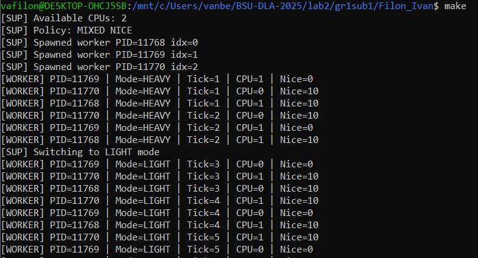
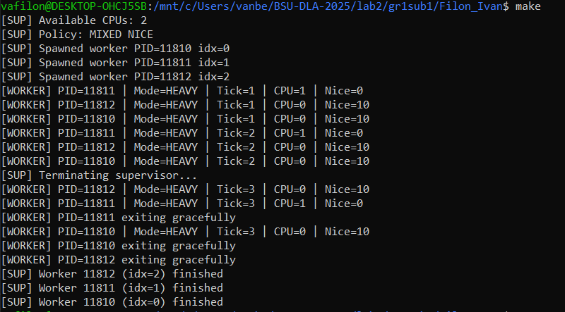
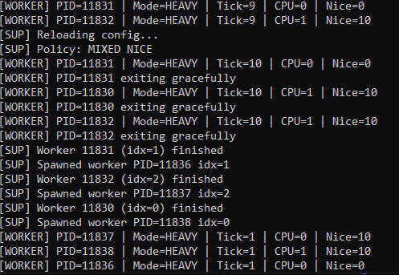
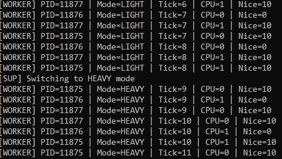
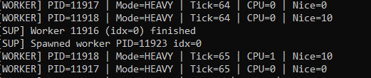
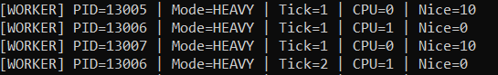
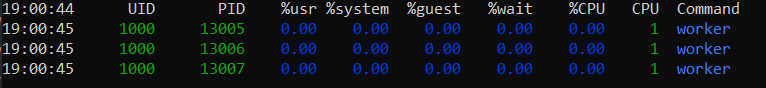
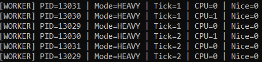
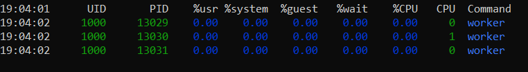

# Лабораторная 2 — Продвинутые процессы Linux: сигналы, планирование, ресурсы, /proc
## Цели
- Научиться уверенно работать с жизненным циклом процессов: запуск, рестарт, корректное завершение.
- Реализовать обработку сигналов и протокол «graceful shutdown / reload».
- Изучить управление планированием: nice/приоритеты, CPU‑аффинити.
- Научиться снимать и интерпретировать метрики из `/proc` и системных утилит.
- Получить опыт исследования влияния ограничений ресурсов (rlimits, опционально cgroup v2).

### Задание A. Мини‑супервизор с воркерами
#### Цель
Реализовать процесс‑родителя (супервизор), который:
- Порождает N воркеров (N ≥ 2), отслеживает их состояние через `SIGCHLD`, корректно «подбирает» зомби.
- Поддерживает сигналы:
    - `SIGTERM`/`SIGINT`: корректное завершение — послать воркерам «стоп» и дождаться их выхода (graceful shutdown ≤ 5 секунд).
    - `SIGHUP`: «graceful reload» — перечитать конфиг и «мягко» перезапустить воркеров без потери работы (допускается короткая пауза).
    - `SIGUSR1`: широковещательно переключить воркеров в «лёгкий» режим нагрузки, `SIGUSR2` — обратно в «тяжёлый».
- При аварийном выходе воркера — перезапускает его (ограничить частоту рестартов, например не более 5 за 30 секунд).

#### Замечание
Используется wsl ubuntu, а для компиляции исходных кодов из файлов .cpp требуется компилятор c++17
#### Шаги/команды
Для сборки спецаильно есть Makefile, поэтому достаточно выполнить в bash
>   make clean \
>   make

Также прямо в Makefile готовы команды, чтобы отправить различные сигналы и протестировать, например make term/int/reload/light-mode/heavy-mode/clean, которые надо ввести просто в другом окне bash

#### Результаты выполнения
#### Переключение режима с помощью make light-mode

#### Прерывание мини-супервизора с помощью make term

#### Перезагрузка контекста

#### Переключение режима с помощью make heavy-mode

#### Убиваем воркера по PID с помощью 
>   kill -9 11916

11916 - PID воркера

#### Вывод
Таким образом, реализован мини-супервизор, который заупскает 3 воркеров(можно изменить время сна и кол-во в конфиге), который управляет жизеннным циклом данных воркеров, например, управляет запуском воркеров, прерыванием, перезагрузкой, сменой режима работы с light, который создает меньше нагрузки, на heavy, который тяжелее

### Задание B. Планирование: nice и CPU‑аффинити
#### Цель
Добавить управление планированием для воркеров:
- Установить разный `nice` для поднабора воркеров (например, половине `+10`, остальным `0`). Сравнить распределение CPU.
- Установить CPU‑аффинити (через `sched_setaffinity` или `taskset`) для разных воркеров: например, часть закрепить на 0‑м ядре, часть — на 1‑м.
- Снять метрики `pidstat -u 1 10` и показать, как `nice` и аффинити влияют на `%CPU`/время ожидания.

#### Шаги/команды
!!! Для выбора варианта планирования в конфиге можно выбрать 1 или 2, где 1 - nice, а 2 - CPU Affinity

Для сбора статистики выполняем команду
>    pidstat -p $(pgrep worker | tr '\n' ',' | sed 's/,$//') -u 1 10

Для nice:
Половине прсиваивается nice = 10, остальным - nice = 0

Статистика:

Для CPU Affinity:
Часть воркеров закрепим на 0 ядре, остальные - на 1

Так как у меня всего 2 ядра доступно, мы не можем для 3 воркеров явно увидеть, что каждому дается свое ядро, но в отличие от nice, где все работали на 1 ядре, мы видим, что здесь как минимум для двух воркеров разные ядра

#### Вывод
В силу того, что нагрузка как бы создается за счет сна воркеров, то реальной нагрузки на CPU нет, поэтому и в статистике мы увидеть разницу не можем, так что для дальнейшего анализа требуется нагрузить воркеров реальными задачами,а что касается прикрепления к конкретному ядру, то оно работает, но в силу того, что воркеров больше, чем самих ядер, то последовательно на каждое ядро добавляется новый воркер

### Вопросы для отчёта
1. Чем процесс отличается от потока в Linux? Где это видно в `ps` и `/proc`?
- Процесс — отдельная единица выполнения с собственным адресным пространством, таблицей открытых файлов, PID.
- Поток — легковесная единица процесса, разделяет память и ресурсы с другими потоками того же процесса, имеет TID.
- В `ps -L` видны LWP(light-weight process) для потоков; в `/proc/<pid>/task/` — отдельные директории для каждого потока.
2. Как `nice` влияет на планирование CFS? Какие есть пределы/исключения?
- `nice` задаёт приоритет процесса: меньше значение - выше шанс получить CPU.
- Диапазон: `-20` (максимальный приоритет) до `+19` (минимальный).
- Исключения: обычный пользователь не может ставить negative nice (<0); ядро учитывает нагрузку системы.
3. Что даёт CPU‑аффинити и когда она вредна?
- CPU‑аффинити закрепляет процесс за определённым ядром - уменьшает кэш‑промахи, так как используется кэш одного ядра.
- Вредно, если ядро перегружено или закреплено мало ядер - процессы конкурируют за один CPU, падает общая производительность.
4. Чем отличаются `RLIMIT_AS`, `RLIMIT_DATA`, `RLIMIT_RSS`? Почему `RLIMIT_RSS` часто игнорируется?
- `RLIMIT_AS` — лимит виртуальной памяти (адресного пространства).
- `RLIMIT_DATA` — лимит сегмента данных (heap).
- `RLIMIT_RSS` — лимит resident set size (физическая память).
- `RLIMIT_RSS` часто игнорируется ядром Linux, т.к. OS управляет paging динамически и редко останавливает процесс по RSS.
5. Почему возможны зомби и как их избежать при массовых рестартах воркеров?
- Зомби — процесс завершился, но родитель ещё не вызвал `wait()`, то есть остаётся запись в таблице процессов.
- Чтобы избежать достаточно корректно обработать `SIGCHLD` и вызвать `waitpid()` для всех дочерних процессов.
6. Чем отличается «graceful shutdown» от «graceful reload/restart»? Какие последовательности безопасны?
- Graceful shutdown — мягко завершает все процессы, освобождает ресурсы, без потери данных.
- Graceful reload/restart — перечитывает конфиг, перезапускает процессы без остановки всей системы.
- Безопасная последовательность: сначала отправить сигнал на завершение воркеров, дождаться выхода, затем перезапуск.
7. Как повлияют контейнерные лимиты (cgroup v2) на наблюдаемые метрики процесса?
- Ограничат CPU, память, IO, то есть процесс видит меньше ресурсов, %CPU может быть меньше, RSS/VSZ ограничены.
- Метрики в `/proc` и `pidstat` отражают реальное использование в пределах cgroup, не всей системы.