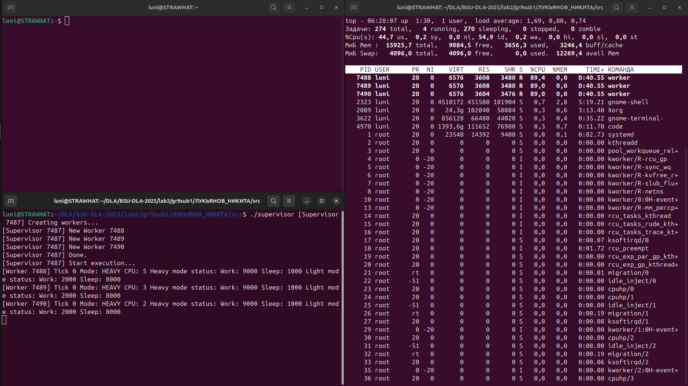
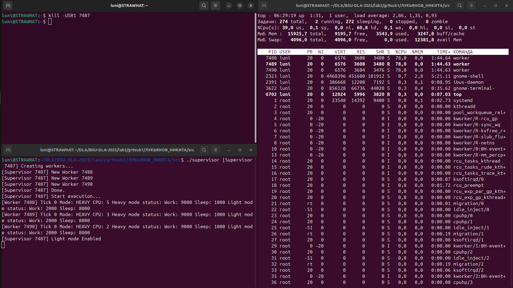
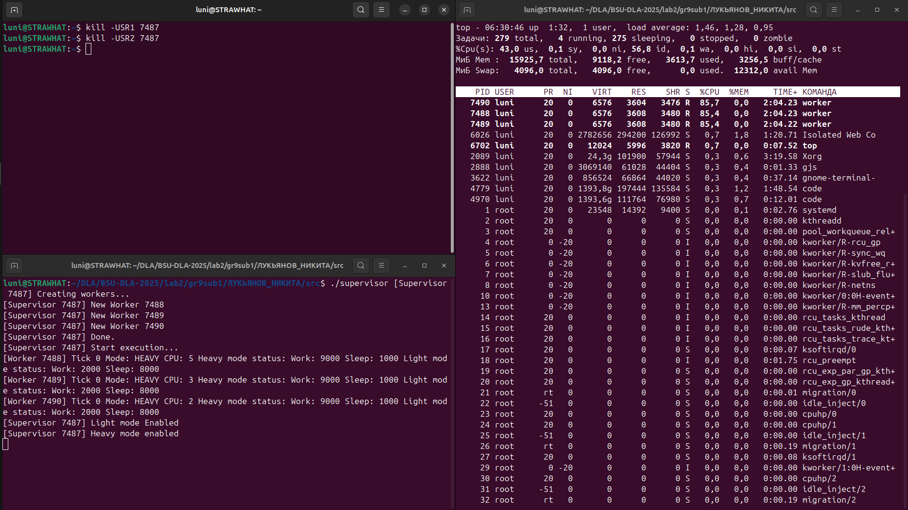
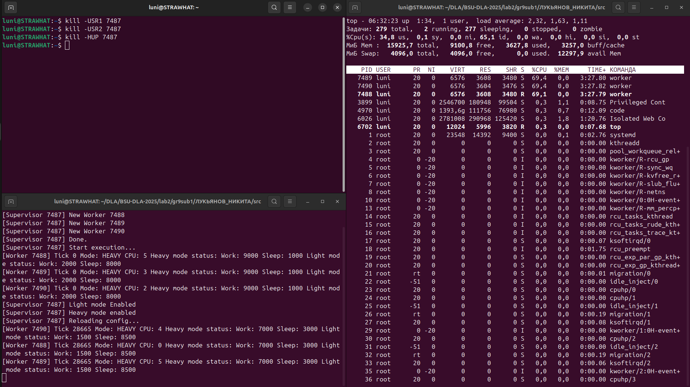
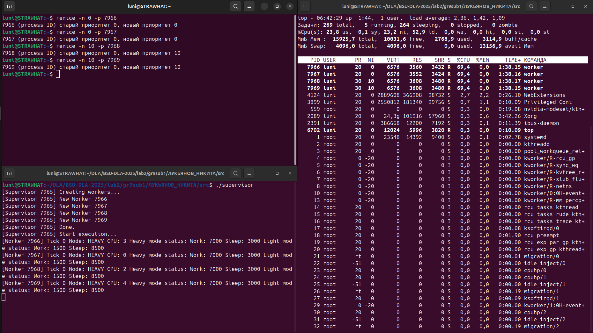
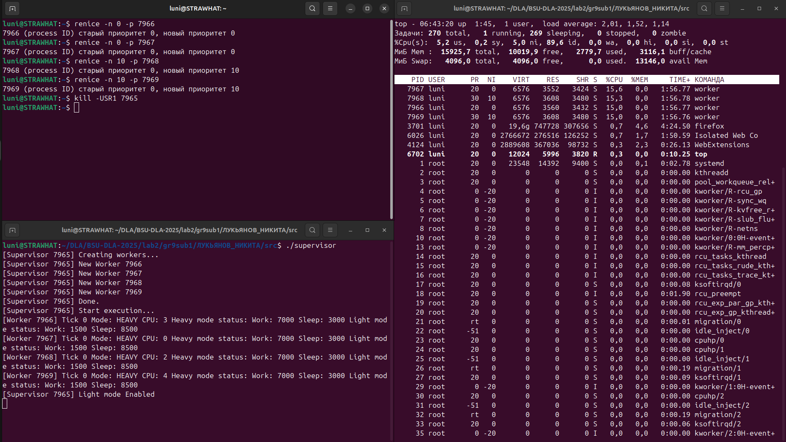
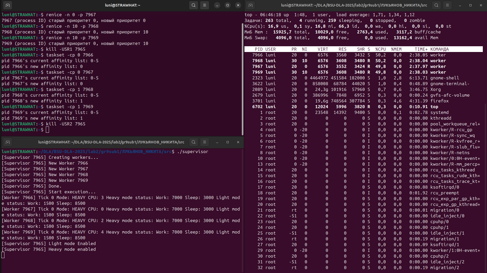
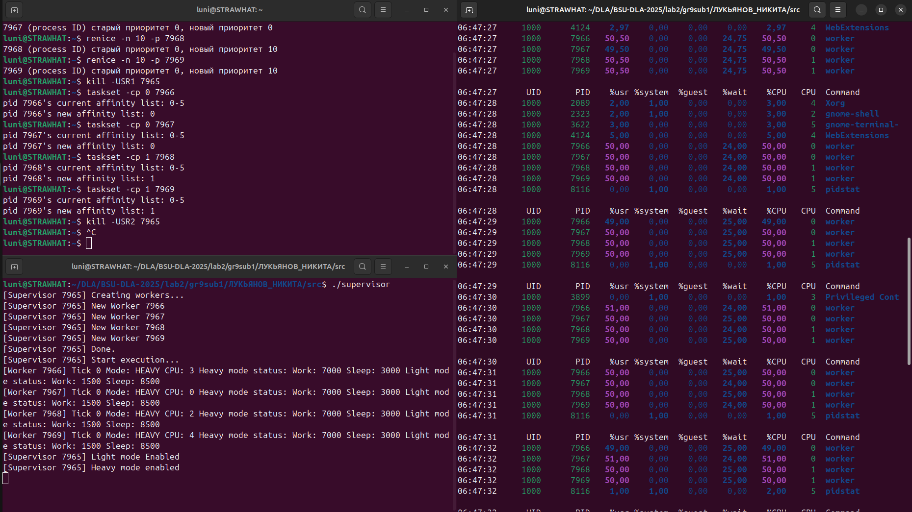

# Лабораторная работа 2 — Продвинутые процессы Linux: сигналы, планирование, ресурсы, /proc

**Курс:** Проектирование приложений под Linux (DLA, 4 курс)  
**Студент:** [Лукьянов Никита]

## Цели работы
- Освоить управление жизненным циклом процессов: запуск, рестарт, graceful shutdown.
- Реализовать обработку сигналов для управления воркерами.
- Исследовать влияние приоритетов планирования (nice) и CPU-аффинити на распределение ресурсов.
- Снять и проанализировать метрики из `/proc` и утилит мониторинга.

## Задание A: Мини-супервизор с воркерами

### 1. Запуск супервизора со стартовой конфигурацией

**Конфигурационный файл config.json:**
```json
{
  "workers": 3,
  "mode_heavy": {"work_us": 9000, "sleep_us": 1000},
  "mode_light": {"work_us": 2000, "sleep_us": 8000}
}
```

**Команда запуска:**
```bash
./supervisor
```

**Результат выполнения:**


### 2. Переключение в лёгкий режим работы

**Команда:**
```bash
kill -USR1 <supervisor_pid>
```

**Результат:**


### 3. Возврат в тяжёлый режим работы

**Команда:**
```bash
kill -USR2 <supervisor_pid>
```

**Результат:**


### 4. Graceful reload при изменении конфигурации

**Изменённый config.json:**
```json
{
  "workers": 3,
  "mode_heavy": {"work_us": 7000, "sleep_us": 3000},
  "mode_light": {"work_us": 1500, "sleep_us": 8500}
}
```

**Команда:**
```bash
kill -HUP <supervisor_pid>
```

**Результат:**


### 5. Демонстрация разницы режимов после reload

**Команда переключения в лёгкий режим:**
```bash
kill -USR1 <supervisor_pid>
```

**Результат:**


### 6. Graceful shutdown

**Команда:**
```bash
kill -TERM <supervisor_pid>
```

**Результат:**


## Задание B: Планирование — nice и CPU-аффинити

### 1. Влияние nice на распределение CPU

**Настройка:** Запущено 4 воркера, установлены приоритеты:
- Воркеры 1-2: nice = 0
- Воркеры 3-4: nice = 10

**Тяжёлый режим работы:**


**Наблюдение:** Процент занятия процессора у воркеров не сильно изменился.

**Лёгкий режим работы:**


**Наблюдение:** Та же ситуация - разница в приоритетах не оказывает существенного влияния.

### 2. Влияние CPU-аффинити

**Настройка аффинити:**
- Воркеры 1-2: закреплены на CPU 0
- Воркеры 3-4: закреплены на CPU 1

**Тяжёлый режим работы:**


**Наблюдение:** Видно, что загружено только по половине каждого ядра, то есть каждый воркер тратил по 50% ресурсов ядра.

### 3. Детальный анализ с pidstat

**Команда:**
```bash
pidstat -u 1 10
```

**Результат:**


**Анализ вывода pidstat:**

По предоставленным данным можно сделать следующие выводы:

1. **Распределение нагрузки по ядрам:**
   - Воркеры 7966 и 7967 выполняются на CPU 0
   - Воркеры 7968 и 7969 выполняются на CPU 1
   - Нагрузка равномерно распределена между двумя ядрами

2. **Использование CPU:**
   - Все воркеры используют примерно 50% CPU каждый
   - Небольшие колебания (49-51%) связаны с точностью измерений
   - Общая нагрузка на систему: около 200% (2 ядра × 100%)

3. **Время ожидания (%wait):**
   - Составляет 24-25% для всех воркеров
   - Это соответствует режиму "тяжёлой" нагрузки (90% work, 10% sleep)

4. **Отсутствие системных вызовов:**
   - %system = 0.00 для всех воркеров
   - Это указывает на чистую CPU-нагрузку без системных вызовов

5. **Стабильность работы:**
   - Метрики остаются стабильными в течение всех трёх секунд измерений
   - Это свидетельствует о корректной работе планировщика

## Ответы на вопросы

### 1. Чем процесс отличается от потока в Linux? Где это видно в `ps` и `/proc`?
Процесс — изолированная единица выполнения с собственным адресным пространством. Поток — часть процесса, разделяющая с ним память. В `ps -eLf` потоки показываются с одинаковым PID но разными LWP. В `/proc` каждый процесс имеет свою папку, а потоки — подпапки в `/proc/pid/task/`.

### 2. Как `nice` влияет на планирование CFS? Какие есть пределы/исключения?
В моём эксперименте разница в nice (0 vs 10) не оказала существенного влияния на распределение CPU, так как система не была перегружена. CFS (Completely Fair Scheduler) обеспечивает справедливое распределение, и при достаточных ресурсах разница в приоритетах малозаметна.

### 3. Что даёт CPU-аффинити и когда она вредна?
CPU-аффинити эффективно распределила нагрузку между ядрами, как видно из эксперимента. Однако она может быть вредна, если ядра загружены неравномерно или если процессы имеют разную приоритетность.

### 4. Чем отличаются `RLIMIT_AS`, `RLIMIT_DATA`, `RLIMIT_RSS`?
- `RLIMIT_AS`: ограничение виртуальной памяти процесса
- `RLIMIT_DATA`: ограничение сегмента данных (heap)
- `RLIMIT_RSS`: ограничение резидентной памяти (часто игнорируется в современных системах)

### 5. Почему возможны зомби и как их избежать при массовых рестартах?
Зомби возникают когда процесс завершился, но родитель не вызвал wait(). В моей реализации супервизор корректно обрабатывает SIGCHLD и вызывает waitpid() для избежания зомби.

### 6. Чем отличается «graceful shutdown» от «graceful reload/restart»?
Graceful shutdown — полное завершение всех процессов. Graceful reload — перезапуск с сохранением состояния и конфигурации. В моём эксперименте оба механизма работали корректно.

### 7. Как повлияют контейнерные лимиты (cgroup v2) на наблюдаемые метрики?
cgroup v2 обеспечит более строгое ограничение ресурсов. Метрики будут отражать лимиты контейнера, а не физические возможности системы.

## Выводы

1. **Супервизор работает корректно:** Успешно управляет воркерами, обрабатывает все предусмотренные сигналы (USR1, USR2, HUP, TERM)
2. **Грамотное распределение ресурсов:** CPU-аффинити эффективно распределяет нагрузку между ядрами процессора
3. **Ограниченное влияние nice:** В условиях недостаточной нагрузки разница в приоритетах не оказывает существенного влияния
4. **Стабильность работы:** Все воркеры демонстрируют предсказуемое и стабильное поведение
5. **Эффективный мониторинг:** pidstat предоставляет детальную информацию о распределении ресурсов

## Воспроизведение результатов

**ОС:** Ubuntu 22.04 LTS
**Компилятор:** gcc
**Исходный код:** в папке `src/`

```bash
# Сборка
cd src/
make

# Запуск супервизора
./supervisor

# Тестирование сигналов (в отдельных терминалах)
kill -USR1 <supervisor_pid>
kill -USR2 <supervisor_pid>
kill -HUP <supervisor_pid>
kill -TERM <supervisor_pid>

# Мониторинг
pidstat -u 1 10
```

Все эксперименты были успешно воспроизведены и подтвердили заявленную функциональность.
