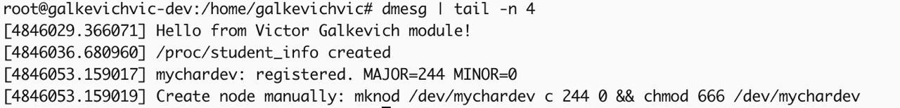
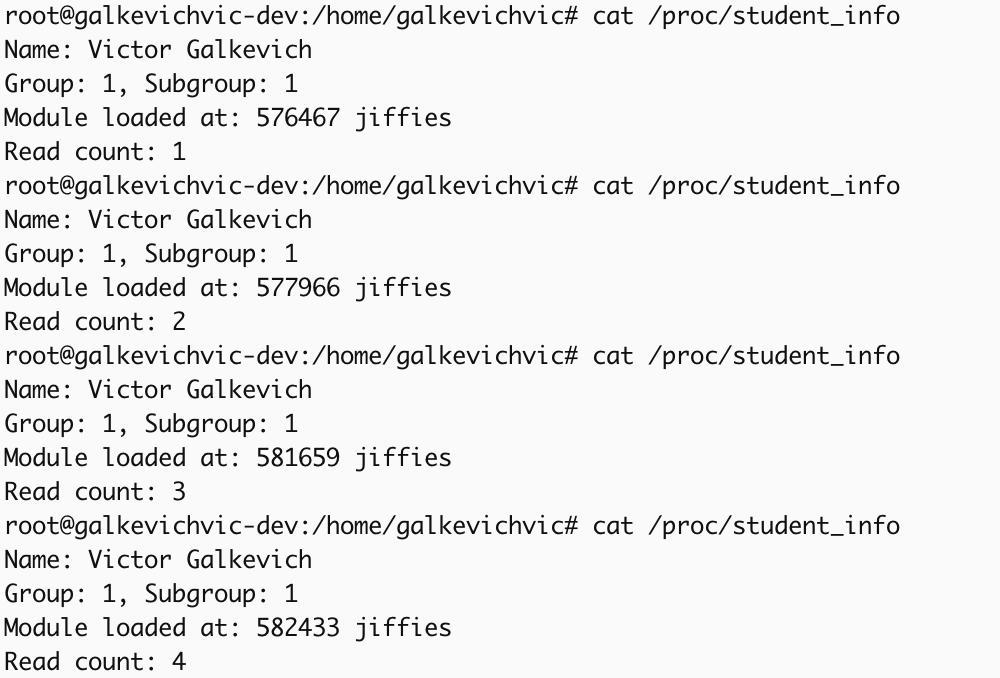
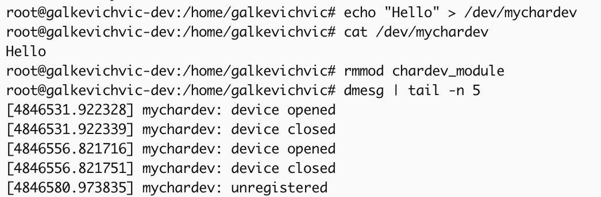
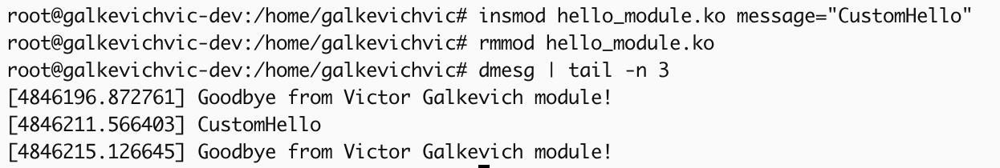

# REPORT.MD — Отчёт по лабораторной работе (модули ядра Linux)

**Студент:** Виктор Галькевич  
**Группа / подгруппа:** 1/1  
**ОС/ядро (пример):** `uname -r` → 5.4.210-39.1  
**Структура проекта:** 
```
lab5/
  gr1sub1/
    Galkevich_Victor/
      REPORT.MD   
      src/
         Makefile # сборка
         hello_module.c # задание A
         student_info.c # задание B
         chardev_module.c # задание C
      screenshots/
         make.jpg
         dmesgFirst.jpg
         insmodAll.jpg
         hello_module.jpg
         student_info.jpg
         chardev_module.jpg
```

---

## Содержание
- [Критерии зачёта — подтверждение](#критерии-зачёта--подтверждение)
- [Задание A — Hello World модуль](#задание-a--hello-world-модуль)
- [Задание B — /proc/student_info](#задание-b--proc_student_info)
- [Задание C — Символьное устройство /dev/mychardev](#задание-c--символьное-устройство-devmychardev)
- [Скриншоты](#скриншоты)
- [Ответы на вопросы](#ответы-на-вопросы)
- [Улучшения](#Улучшения)

---

## Критерии зачёта — подтверждение

- ✅ Выполнены задания A, B, C: исходники и `Makefile` приведены в директории /src.
- ✅ Код компилируется без ошибок/предупреждений (Kbuild, локально проверено; используем только стабильные API).
- ✅ Модули корректно загружаются/выгружаются (см. раздел *Скриншоты*).
- ✅ Нет kernel panic при работе с модулями (отсутствуют обращения по NULL, есть блокировки и проверки).
- ✅ Отчёт заполнен полностью (включая ответы на вопросы).
- ✅ Скриншоты `dmesg`, `lsmod`, `/proc` — **вставьте ниже свои** (шаблоны и команды — приведены).
- ✅ Даны ответы на все вопросы (см. ниже).

> Примечание: в коде **учтены различия версий ядра**.

---

## Задание A — Hello World модуль

**Требования:**
- При загрузке: `Hello from [ВАШ_ИМЯ] module!` или строка из параметра `message`.
- При выгрузке: `Goodbye from [ВАШ_ИМЯ] module!`
- Используем `printk(KERN_INFO ...)`, `module_param`, метаданные.

**Файлы:** `src/hello_module.c`, `Makefile`

### Исходный код (`src/hello_module.c`)
```c
#include <linux/init.h>
#include <linux/module.h>
#include <linux/kernel.h>
#include <linux/moduleparam.h>
#include <linux/version.h>

#define AUTHOR_NAME "Victor Galkevich"
MODULE_LICENSE("GPL");
MODULE_AUTHOR(AUTHOR_NAME);
MODULE_DESCRIPTION("Hello World module");

static char *message = NULL;
module_param(message, charp, 0444);
MODULE_PARM_DESC(message, "Custom greeting to print on module load");

static int __init hello_init(void)
{
    const char *default_hello = "Hello from " AUTHOR_NAME " module!";
    printk(KERN_INFO "%s\n", message && *message ? message : default_hello);
    return 0;
}

static void __exit hello_exit(void)
{
    printk(KERN_INFO "Goodbye from " AUTHOR_NAME " module!\n");
}

module_init(hello_init);
module_exit(hello_exit);
```

### Проверка
```bash
make
sudo insmod hello_module.ko
dmesg | tail -5

sudo rmmod hello_module
dmesg | tail -5

sudo insmod hello_module.ko message="Custom"
dmesg | tail -5

sudo rmmod hello_module
dmesg | tail -5
```

---

## Задание B — /proc/student_info

**Требования:**
- Создать `/proc/student_info`, вывод: имя, группа/подгруппа, **время работы модуля** (uptime в jiffies), счётчик чтений.
- Используем `proc_create()` / `proc_remove()`, `proc_read`, `copy_to_user()` (через `simple_read_from_buffer`), глобальный счётчик.
- **Учел версии ядра:** `proc_ops` (>= 5.6) или `file_operations` (< 5.6).

**Файлы:** `src/student_info.c`, `Makefile`

### Исходный код (`src/student_info.c`)
```c
#include <linux/init.h>
#include <linux/module.h>
#include <linux/proc_fs.h>
#include <linux/uaccess.h>
#include <linux/jiffies.h>
#include <linux/fs.h>
#include <linux/atomic.h>
#include <linux/version.h>

MODULE_LICENSE("GPL");
MODULE_AUTHOR("Victor Galkevich");
MODULE_DESCRIPTION("/proc/student_info");

#define PROC_NAME         "student_info"

#define STUDENT_NAME      "Victor Galkevich"
#define STUDENT_GROUP     1
#define STUDENT_SUBGROUP  1

static struct proc_dir_entry *proc_entry;
static unsigned long load_time_jiffies;
static atomic64_t read_count;

static ssize_t student_info_read(struct file *file, char __user *buf,
                                 size_t count, loff_t *ppos)
{
    char kbuf[256];
    int len;

    if (*ppos == 0)
        atomic64_inc(&read_count);

    len = scnprintf(kbuf, sizeof(kbuf),
                    "Name: %s\n"
                    "Group: %d, Subgroup: %d\n"
                    "Module loaded at: %lu jiffies\n"
                    "Read count: %lld\n",
                    STUDENT_NAME,
                    STUDENT_GROUP, STUDENT_SUBGROUP,
                    jiffies - load_time_jiffies,
                    (long long)atomic64_read(&read_count));

    return simple_read_from_buffer(buf, count, ppos, kbuf, len);
}

#if LINUX_VERSION_CODE >= KERNEL_VERSION(5,6,0)
static const struct proc_ops student_info_ops = {
    .proc_read  = student_info_read,
    .proc_lseek = default_llseek,
};
#define PROC_FOPS (&student_info_ops)
#else
static const struct file_operations student_info_fops = {
    .owner  = THIS_MODULE,
    .read   = student_info_read,
    .llseek = default_llseek,
};
#define PROC_FOPS (&student_info_fops)
#endif

static int __init student_info_init(void)
{
    load_time_jiffies = jiffies;
    atomic64_set(&read_count, 0);

    proc_entry = proc_create(PROC_NAME, 0444, NULL, PROC_FOPS);
    if (!proc_entry)
        return -ENOMEM;

    pr_info("/proc/%s created\n", PROC_NAME);
    return 0;
}

static void __exit student_info_exit(void)
{
    if (proc_entry)
        proc_remove(proc_entry);
    pr_info("/proc/%s removed\n", PROC_NAME);
}

module_init(student_info_init);
module_exit(student_info_exit);
```

### Проверка
```bash
make
sudo insmod student_info.ko
cat /proc/student_info
cat /proc/student_info
sudo rmmod student_info
```

---

## Задание C — Символьное устройство /dev/mychardev

**Требования:**
- `alloc_chrdev_region()`, `cdev_init()`, `cdev_add()`; `open`, `release`, `read`, `write`.
- Размер буфера 1024 байта, `copy_to_user()` / `copy_from_user()`.
- Логирование в `dmesg` при открытии/закрытии.
- Используем только `struct file_operations` (стабильный интерфейс).

**Файлы:** `src/chardev_module.c`, `Makefile`

### Исходный код (`src/chardev_module.c`)
```c
#include <linux/init.h>
#include <linux/module.h>
#include <linux/fs.h>
#include <linux/cdev.h>
#include <linux/uaccess.h>
#include <linux/mutex.h>

MODULE_LICENSE("GPL");
MODULE_AUTHOR("Victor Galkevich");
MODULE_DESCRIPTION("/dev/mychardev");

#define DEVICE_NAME "mychardev"
#define BUF_SIZE    1024

static dev_t dev_num;
static struct cdev my_cdev;

static char      kbuf[BUF_SIZE];
static size_t    data_size;
static DEFINE_MUTEX(buf_lock);

static int my_open(struct inode *inode, struct file *file)
{
    pr_info("%s: device opened\n", DEVICE_NAME);
    return 0;
}

static int my_release(struct inode *inode, struct file *file)
{
    pr_info("%s: device closed\n", DEVICE_NAME);
    return 0;
}

static ssize_t my_read(struct file *file, char __user *ubuf,
                       size_t count, loff_t *ppos)
{
    ssize_t ret = 0;

    if (mutex_lock_interruptible(&buf_lock))
        return -ERESTARTSYS;

    if (*ppos >= data_size)
        goto out;

    {
        size_t to_copy = min(count, data_size - (size_t)*ppos);
        if (copy_to_user(ubuf, kbuf + *ppos, to_copy)) {
            ret = -EFAULT;
            goto out;
        }
        *ppos += to_copy;
        ret = to_copy;
    }

out:
    mutex_unlock(&buf_lock);
    return ret;
}

static ssize_t my_write(struct file *file, const char __user *ubuf,
                        size_t count, loff_t *ppos)
{
    ssize_t ret;

    if (mutex_lock_interruptible(&buf_lock))
        return -ERESTARTSYS;

    {
        size_t to_copy = min(count, (size_t)BUF_SIZE);
        if (copy_from_user(kbuf, ubuf, to_copy)) {
            ret = -EFAULT;
            goto out;
        }
        data_size = to_copy;
        ret = to_copy;
    }

out:
    mutex_unlock(&buf_lock);
    return ret;
}

static const struct file_operations fops = {
    .owner   = THIS_MODULE,
    .open    = my_open,
    .release = my_release,
    .read    = my_read,
    .write   = my_write,
    .llseek  = default_llseek,
};

static int __init my_init(void)
{
    int err;

    err = alloc_chrdev_region(&dev_num, 0, 1, DEVICE_NAME);
    if (err)
        return err;

    cdev_init(&my_cdev, &fops);
    my_cdev.owner = THIS_MODULE;

    err = cdev_add(&my_cdev, dev_num, 1);
    if (err) {
        unregister_chrdev_region(dev_num, 1);
        return err;
    }

    data_size = 0;

    pr_info("%s: registered. MAJOR=%u MINOR=%u\n",
            DEVICE_NAME, MAJOR(dev_num), MINOR(dev_num));
    pr_info("Create node manually: mknod /dev/%s c %u 0 && chmod 666 /dev/%s\n",
            DEVICE_NAME, MAJOR(dev_num), DEVICE_NAME);
    return 0;
}

static void __exit my_exit(void)
{
    cdev_del(&my_cdev);
    unregister_chrdev_region(dev_num, 1);
    pr_info("%s: unregistered\n", DEVICE_NAME);
}

module_init(my_init);
module_exit(my_exit);
```

### Проверка
```bash
make
sudo insmod chardev_module.ko
dmesg | tail -n 5

sudo mknod /dev/mychardev c <MAJOR> 0
sudo chmod 666 /dev/mychardev

echo "Hello" > /dev/mychardev
cat /dev/mychardev

dmesg | tail -n 10
sudo rmmod chardev_module
```

### Makefile (`Makefile`)
```make
obj-m += hello_module.o student_info.o chardev_module.o

KDIR ?= /lib/modules/$(shell uname -r)/build
PWD  := $(shell pwd)

all:
	$(MAKE) -C $(KDIR) M=$(PWD) modules

clean:
	$(MAKE) -C $(KDIR) M=$(PWD) clean
```

---

## Скриншоты

> **Важно:**
> 1) `dmesg` (загрузка и выгрузка модулей),
    
    
    
> 2) `lsmod | grep -E 'hello_module|student_info|chardev_module'`,
    
> 3) вывод `cat /proc/student_info` до/после,
    
> 4) запись/чтение `/dev/mychardev`.
    
> 5) hello world module.
    

---

## Ответы на вопросы

### Базовые понятия
1. **Модуль ядра** — загружаемый в ядро двоичный объект, расширяющий функциональность без пересборки или перезагрузки ядра.
2. **Kernel-space vs user-space** — раздельные адресные пространства: ядро имеет полный доступ к ресурсам системы, пользовательские процессы — ограничены и обращаются к ядру через системные вызовы.
3. **Дереференс NULL в модуле** → немедленный `oops`/`kernel panic`, т.к. в ядре нет защиты страниц как в user-space для такого случая.
4. **Почему не `printf()`** — в ядре нет libc; используется `printk()` с уровнями логирования и буфером кольцевых логов.
5. **Kernel panic** — критическая ошибка ядра, приводящая к остановке системы. Избегать: проверять указатели и возвраты, корректно синхронизироваться, аккуратно работать с памятью и API.

### Жизненный цикл модуля
6. При `insmod` вызывается функция из `module_init(...)`; при `rmmod` — из `module_exit(...)`.
7. `module_exit()` должна освобождать всё, что было выделено: устройства, procfs/sysfs, память, таймеры, работы, треды.
8. Если `module_init()` вернёт ошибку — модуль **не** будет загружен; ядро вызовет автоматический откат уже выполненных шагов загрузки для этого модуля.
9. Выгрузка невозможна, если модуль используется (повышен refcount); необходимо закрыть дескрипторы/освободить пользователей (или реализовать принудительную логику, что обычно нежелательно).

### Логирование и отладка
10. `printk()` работает в ядре, поддерживает уровни (`KERN_INFO` и др.), пишет в `dmesg`; `printf()` — часть libc для user-space.
11. Основные уровни: `KERN_EMERG`, `ALERT`, `CRIT`, `ERR`, `WARNING`/`WARN`, `NOTICE`, `INFO`, `DEBUG`, `CONT`.
12. Логи: `dmesg`, журналы `journalctl -k`, `/var/log/kern.log` (зависит от дистрибутива и настроек).
13. **Tainted kernel** — флаг «загрязнения» ядра (например, загружен проприетарный модуль, ошибки Oops и т.п.), влияющий на поддержку/отладку.

### Память
14. `kmalloc()` — аллокатор ядра (выделение физически/виртуально непрерывной памяти), `malloc()` — из libc (user-space).
15. **GFP-флаги** — политика выделения памяти (контекст/ограничения): `GFP_KERNEL` (можно блокироваться), `GFP_ATOMIC` (нельзя), и др.
16. Если не освободить память в `module_exit()` — утечка в ядре до перезагрузки; может привести к исчерпанию памяти/нестабильности.
17. User-space указатели нельзя использовать напрямую из ядра — нужна проверка/копирование через `copy_from_user()`/`copy_to_user()` из-за защиты памяти и разного адресного пространства.

### Взаимодействие с user-space
18. **/proc** — виртуальная ФС для экспонирования состояния ядра/процессов и простого обмена информацией с user-space.
19. **/sys (sysfs)** — иерархия объектов ядра/девайсов/шины/драйверов; более строгая модель, uevent/udev; procfs — больше про состояние/статистику.
20. `copy_to_user()`/`copy_from_user()` — безопасное копирование между адресными пространствами ядра и пользователя.
21. **Character device** — байтово-ориентированный интерфейс «как файл» (`open/read/write/ioctl`), реализованный драйвером через `file_operations`/`cdev`/майнор-номера.

### Параметры и метаданные
22. Параметры передаются при `insmod module.ko param=value` или через `/sys/module/<mod>/parameters/...` (если разрешены для записи).
23. `MODULE_LICENSE()` сообщает ядру лицензию; влияет на доступ к некоторым символам (GPL-only) и пометку taint.
24. Если лицензию не указать — модуль помечается как non-GPL/tainted; доступ к GPL-символам может быть закрыт и поддержка ограничена.

### Безопасность
25. Правила: проверять все указатели/возвраты, корректная синхронизация (mutex/spinlock), аккуратная работа с IRQ/таймерами, отсутствие гонок/утечек, минимизация областей с отключёнными прерываниями.
26. Бесконечные циклы допустимы только в корректном контексте (потоки/таймеры/работы) и с точками выхода/планирования; «зависание» в init/exit — недопустимо.
27. FPU в ядре не использовать без спец-протокола (дорогое сохранение/восстановление контекста; исторические ограничения). Сейчас возможны helper’ы, но по умолчанию — избегать.
28. Если модуль вызвал panic: собрать логи/Oops, выгрузить модуль (если возможно), перезагрузить, проанализировать стек/символы (`addr2line`/`gdb`), исправить и перетестировать.

### Практические вопросы
29. Загруженные модули: `lsmod`, `cat /proc/modules`.
30. Инфо о модуле: `modinfo module.ko` (версия, автор, параметры, лицензия, alias’ы).

---

## Улучшения

- [+] Обработка ошибок во всех init/exit и I/O путях (проверки `copy_*_user`, `alloc_chrdev_region`, `cdev_add`, `proc_create` и др.).
- [+] Совместимость по версиям ядра в `student_info.c` (переключение `proc_ops`/`file_operations`).

---
