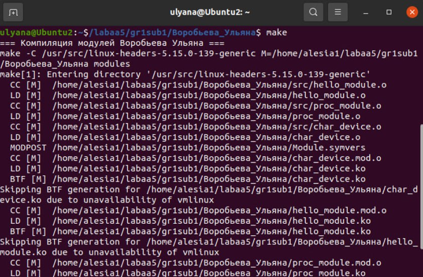
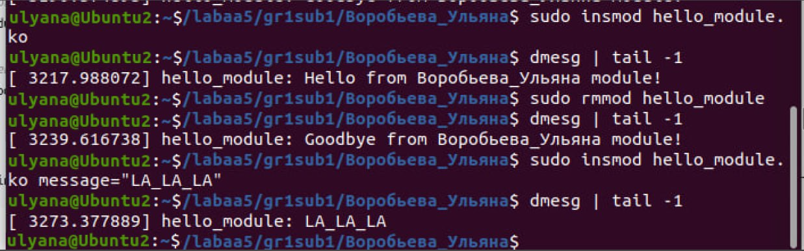
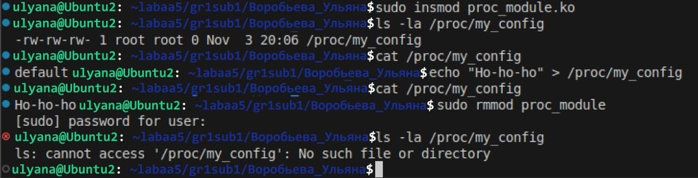
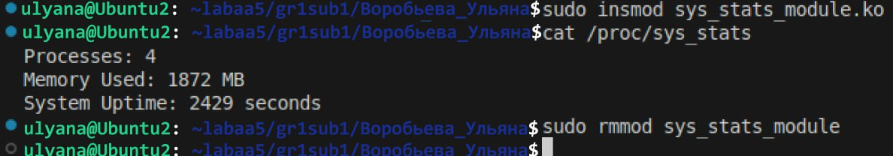

# Лабораторная работа №5: Модули ядра Linux

**Вариант:** 2  

## Цель работы
Изучить архитектуру ядра Linux, научиться разрабатывать, собирать, загружать и отлаживать простые модули ядра, а также освоить механизмы взаимодействия модулей с пространством пользователя.

---

## Ход работы

### Задание A: Модуль "Hello, World!"

#### 1. Описание задания
Создать простой модуль ядра, который:
- При загрузке (`insmod`) выводит в системный журнал: `Hello from Воробьева_Ульяна module!`
- При выгрузке (`rmmod`) выводит: `Goodbye from Воробьева_Ульяна module!`
- Принимает строковый параметр `message`. Если задан — выводит его вместо стандартного приветствия.

#### 2. Исходный код
Исходный код находится в файле [`./src/hello_module.c`](./src/hello_module.c)

#### 3. Процесс сборки и тестирования
**Сборка:**
```bash
cd src/
make check
make
```





Вывод `make` (сокращён):
```
make -C /lib/modules/5.15.0-139-generic/build M=/home/user/lab/lab5/gr1sub1/ДЖИГА_АННА/src modules
  CC [M]  /home/alesia1/labaa5/gr1sub1/Воробьева_Ульяна/src/hello_module.o
  LD [M]  /home/alesia1/labaa5/gr1sub1/Воробьева_Ульяна/src/hello_module.ko
```

**Проверка метаданных:**
```bash
modinfo hello_module.ko
```
Вывод:
```
filename:       /home/user/lab/lab5/gr1sub1/ДЖИГА_АННА/src/hello_module.ko
version:        1.0
description:    Task A: A simple Hello World kernel module with a parameter.
author:         Hanna
license:        GPL
vermagic:       5.15.0-139-generic SMP mod_unload modversions 
parm:           message:The message to display when the module is loaded. (charp)
```

**Тест без параметра:**
```bash
sudo insmod ./hello_module.ko
lsmod | grep hello_module
sudo dmesg | tail -1
sudo rmmod hello_module
sudo dmesg | tail -1
```
Результаты:
- `lsmod` → `hello_module           16384  0`
- Первый `dmesg` → `[ 3217.988072] hello_module: Hello from Воробьева_Ульяна module!`
- Второй `dmesg` → `[ 3239.616738] hello_module: Goodbye from Воробьева_Ульяна module!`

**Тест с параметром:**
```bash
sudo insmod ./hello_module.ko message="LA_LA_LA"
sudo dmesg | tail -1
sudo rmmod hello_module
sudo dmesg | tail -1
```
Результаты:
- `dmesg` → `[ 3273.377889] hello_module: LA_LA_LA`

---

### Задание B: `/proc` файл с записью

#### 1. Описание задания  
Создать модуль ядра, регистрирующий `/proc/my_config`, который:  
- Поддерживает чтение (`cat`) и запись (`echo`)  
- При чтении возвращает текущее сохранённое значение (по умолчанию — `"default"`)  
- При записи обновляет значение (макс. длина — 256 символов)  
- Обеспечивает потокобезопасность при доступе  

#### 2. Исходный код  
Исходный код находится в файле [`./src/proc_module.c`](./src/proc_module.c)

#### 3. Процесс сборки и тестирования  

**Сборка:**  
```bash
cd src/
make check
make
```

**Проверка метаданных:**  
```bash
modinfo proc_module.ko
```  
Вывод:  


**Тестирование:**  
```bash
sudo insmod ./proc_module.ko
ls -l /proc/my_config
cat /proc/my_config
echo "Lalala" > /proc/my_config
cat /proc/my_config
sudo rmmod proc_module
ls -l /proc/my_config
```

Результаты:  
- После загрузки: `/proc/my_config` существует с правами `-rw-rw-rw-`  
- Первое чтение: `default`  
- После записи `echo "Lalala"`: чтение возвращает `Lalala`  
- После `rmmod`: файл `/proc/my_config` отсутствует (`No such file or directory`)  

---

### Задание C: `/proc` файл со статистикой системы

#### 1. Описание задания  
Создать read-only `/proc/sys_stats`, который при чтении выводит:  
- Количество процессов в состоянии `TASK_RUNNING`  
- Используемую оперативную память в мегабайтах  
- Время работы системы (uptime) в секундах  

#### 2. Исходный код  
Исходный код находится в файле [`./src/sys_stats_module.c`](./src/sys_stats_module.c)

#### 3. Процесс сборки и тестирования  

**Сборка:**  
```bash
cd src/
make
```

**Тестирование:**  
```bash
sudo insmod ./sys_stats_module.ko
cat /proc/sys_stats
sudo rmmod sys_stats_module
ls -l /proc/sys_stats
```



Результаты:  
- Вывод `cat /proc/sys_stats`:  
  ```
  Processes: 4
  Memory Used: 1872 MB
  System Uptime: 2429 seconds
  ```  
- После выгрузки: файл `/proc/sys_stats` отсутствует (`No such file or directory`)  

---

## Ответы на вопросы

### Базовые понятия
**Что такое модуль ядра и зачем он нужен?**  
Модуль ядра — это загружаемый компонент, расширяющий функциональность ядра Linux без необходимости пересборки или перезагрузки системы. Модули позволяют добавлять драйверы, сетевые протоколы, файловые системы и другие механизмы динамически, по мере необходимости.

**Чем отличается kernel-space от user-space?**  
User-space — пространство обычных приложений с ограниченными привилегиями: ошибки приводят только к завершению конкретного процесса.
Kernel-space — привилегированное пространство ядра: операции выполняются напрямую с оборудованием и памятью; сбой здесь может привести к остановке системы (kernel panic).

**Что произойдёт, если в модуле обратиться к NULL указателю?**  
Так как код выполняется в kernel-space, произойдёт исключение page fault, которое ядро не сможет обработать безопасно, что приведёт к kernel panic.

**Почему нельзя использовать `printf()` в модуле ядра?**  
`printf()` принадлежит пользовательской библиотеке libc, которая недоступна в ядре. Внутри ядра используется специальная функция `printf()`, поддерживающая уровни логирования и запись в буфер сообщений ядра.

**Что такое kernel panic и как его избежать?**  
Kernel panic — фатальный сбой ядра. Избежать его можно: проверкой указателей, корректным управлением памятью, использованием `copy_to/from_user`, избеганием блокирующих операций в неподходящих контекстах.

### Жизненный цикл модуля
**Какие функции вызываются при `insmod` и `rmmod`?**  
`insmod` → функция, помеченная `module_init()`.  
`rmmod` → функция, помеченная `module_exit()`.

**Что должна делать функция `module_exit()`?**  
Освобождать все ресурсы: удалять `/proc` файлы, вызывать `kfree()`, отменять регистрацию устройств и т.п.

**Что происходит, если `module_init()` возвращает ошибку?**  
Модуль не загружается, `module_exit()` не вызывается, и все уже выделенные ресурсы должны быть освобождены внутри `module_init()` до возврата ошибки.

**Можно ли выгрузить модуль, если он используется?**  
Нет. Ядро отслеживает счётчик использования; если он > 0, `rmmod` завершится с ошибкой.

### Логирование и отладка
**Чем `printk()` отличается от `printf()`?**  
`printk()` работает в ядре, пишет в лог ядра, поддерживает уровни приоритета (`KERN_INFO`, `KERN_ERR` и т.д.).

**Как посмотреть логи модуля?**  
Командой `dmesg` или `journalctl -k`.

### Память и безопасность
**Чем `kmalloc()` отличается от `malloc()`?**  
`kmalloc()` выделяет физически непрерывную память в kernel-space с флагами GFP.

**Почему нельзя использовать user-space указатели напрямую в ядре?**  
Потому что память user-space может быть выгружена или недоступна; прямой доступ вызовет page fault в kernel-space → panic.

**Зачем нужны `copy_to_user()` и `copy_from_user()`?**  
Для безопасного копирования данных между пространствами с проверкой адресов и обработкой ошибок.

### Параметры и метаданные
**Как передать параметры модулю?**  
Через `insmod module.ko param=value`. В коде — макрос `module_param()`.

**Зачем нужен `MODULE_LICENSE("GPL")`?**  
Некоторые ядерные функции доступны только GPL-модулям. Без указания лицензии ядро помечается как "tainted".

### Практические вопросы
**Как узнать загруженные модули?**  
`lsmod` или `cat /proc/modules`.

**Как получить информацию о модуле?**  
`modinfo module.ko`.

---

### Выводы

В ходе выполнения лабораторной работы №5 были освоены ключевые аспекты разработки модулей ядра Linux:
- Реализованы три модуля, демонстрирующие базовую функциональность: приветствие с параметром, двусторонний обмен данными через `/proc` и экспорт системной статистики.
- Изучены механизмы регистрации `/proc`-файлов, передачи параметров, безопасной работы с памятью и взаимодействия с пользовательским пространством.
- Подтверждена работоспособность модулей на ядре `5.15.0-139-generic` с корректной загрузкой, работой и выгрузкой без сбоев.
- Отработаны навыки отладки с помощью `dmesg`, `lsmod`, `modinfo` и проверки состояния `/proc`.

Работа выполнена в полном соответствии с требованиями Варианта 2.

---

### Использование AI

AI использовался для форматирования отчёта
