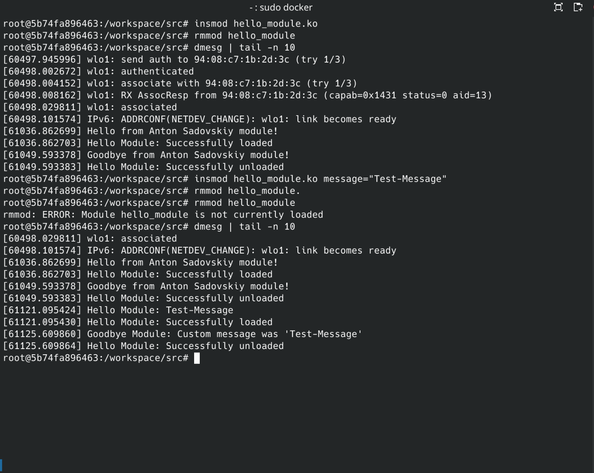

# Отчёт по лабораторной работе №5
## Модули ядра Linux

**ФИО:** _Садовский Антон_  
**Группа:** _9_  
**Подгруппа:** _1_  
**Вариант:** 2 (22 номер по списку)  

## Цель работы

Изучить основы разработки модулей ядра Linux, научиться взаимодействовать с kernel space, создавать proc файлы для обмена данными между ядром и user space.

## Задачи

1. Создать простой модуль ядра с параметрами (Hello World)
2. Реализовать /proc файл с возможностью чтения и записи конфигурации
3. Создать /proc файл для отображения статистики системы (процессы, память, uptime)
4. Протестировать все модули на корректность загрузки/выгрузки
5. Изучить механизмы логирования ядра (printk, dmesg)


## Окружение

### Хостовая система
- **ОС:** Debian 12
- **Версия Docker:** _28.4.0_
- **Версия Docker Compose:** _v2.39.2

### Docker контейнер
- **Базовый образ:** Debian 12
- **Версия ядра:** _6.1.0-32-amd64_
- **Версия GCC:** _12.2.0_

##  Выполнение заданий

### Задание A: Hello World модуль

#### Описание
Создан модуль `hello_module.ko`, который:
- При загрузке выводит приветствие с моим именем
- При выгрузке выводит прощание
- Принимает необязательный параметр `message` для кастомного сообщения

#### Ключевые фрагменты кода

```c
// Объявление параметра
static char *message = NULL;
module_param(message, charp, 0644);
MODULE_PARM_DESC(message, "Custom greeting message");

// Функция инициализации
static int __init hello_init(void)
{
    if (message) {
        printk(KERN_INFO "Hello Module: %s\n", message);
    } else {
        printk(KERN_INFO "Hello from Anton Sadovskiy module!\n");
    }
    return 0;
}

// Функция выгрузки
static void __exit hello_exit(void)
{
    printk(KERN_INFO "Goodbye from Anton Sadovskiy module!\n");
}
```

#### Тестирование
```
ТЕСТ 1: Hello Module (Задание A)
1.1 Загрузка без параметров...
Модуль загружен
Логи из dmesg:
[61036.862699] Hello from Anton Sadovskiy module!
[61036.862703] Hello Module: Successfully loaded


1.2 Выгрузка модуля...
Модуль выгружен
Логи из dmesg:
[61049.593378] Goodbye from Anton Sadovskiy module!
[61049.593383] Hello Module: Successfully unloaded


1.3 Загрузка с параметром message='Test-Message'...
Логи из dmesg:
[61036.862699] Hello from Anton Sadovskiy module!
[61036.862703] Hello Module: Successfully loaded
[61049.593378] Goodbye from Anton Sadovskiy module!
[61049.593383] Hello Module: Successfully unloaded
[61121.095424] Hello Module: Test-Message
[61121.095430] Hello Module: Successfully loaded
[61125.609860] Goodbye Module: Custom message was 'Test-Message'
[61125.609864] Hello Module: Successfully unloaded
```

Скриншот:


### Задание B: /proc файл с записью

#### Описание
Создан модуль `proc_config_module.ko`, который создаёт файл `/proc/my_config`:
- По умолчанию содержит строку "default"
- Поддерживает чтение (cat) и запись (echo)
- Максимальная длина строки: 256 символов

#### Ключевые фрагменты кода

**Функция чтения:**
```c
static ssize_t proc_read(struct file *file, char __user *ubuf,
                         size_t count, loff_t *ppos)
{
    char output_buf[MAX_CONFIG_LEN + 2];
    int len;

    if (*ppos > 0)
        return 0;  // EOF

    len = snprintf(output_buf, sizeof(output_buf), "%s\n", config_buffer);

    if (copy_to_user(ubuf, output_buf, len))
        return -EFAULT;

    *ppos = len;
    return len;
}
```

**Функция записи:**
```c
static ssize_t proc_write(struct file *file, const char __user *ubuf,
                          size_t count, loff_t *ppos)
{
    char temp_buf[MAX_CONFIG_LEN];
    size_t len = count;

    if (len >= MAX_CONFIG_LEN)
        len = MAX_CONFIG_LEN - 1;

    if (copy_from_user(temp_buf, ubuf, len))
        return -EFAULT;

    // Убираем \n и сохраняем
    if (len > 0 && temp_buf[len - 1] == '\n')
        len--;
    temp_buf[len] = '\0';

    strncpy(config_buffer, temp_buf, MAX_CONFIG_LEN - 1);
    return count;
}
```

#### Тестирование

```
ТЕСТ 2: Proc Config Module (Задание B)
2.1 Загрузка модуля с default:
root@5b74fa896463:/workspace/src# insmod proc_config_module.ko
root@5b74fa896463:/workspace/src# cat /proc/my_config 
default

2.2 Запись нового значения 'new value'
```
echo "new-value: > /proc/my_config
```
root@5b74fa896463:/workspace/src# echo "new-value" > /proc/my_config 
root@5b74fa896463:/workspace/src# cat /proc/my_config 
new-value
root@5b74fa896463:/workspace/src# 


2.3 Запись длинной строки
```
LONG_STRING=$(printf 'A%.0s' {1..300})
echo "$LONG_STRING" > /proc/my_config
```

root@5b74fa896463:/workspace/src# LONG_STRING=$(printf 'A%.0s' {1..300})
echo "$LONG_STRING" > /proc/my_config
root@5b74fa896463:/workspace/src# cat /proc/my_config 
AAAAAAAAAAAAAAAAAAAAAAAAAAAAAAAAAAAAAAAAAAAAAAAAAAAAAAAAAAAAAAAAAAAAAAAAAAAAAAAAAAAAAAAAAAAAAAAAAAAAAAAAAAAAAAAAAAAAAAAAAAAAAAAAAAAAAAAAAAAAAAAAAAAAAAAAAAAAAAAAAAAAAAAAAAAAAAAAAAAAAAAAAAAAAAAAAAAAAAAAAAAAAAAAAAAAAAAAAAAAAAAAAAAAAAAAAAAAAAAAAAAAAAAAAAAAAAA
```

Скриншот выводов в консоли:


2.4 Вывод dmesg:
```
[61358.678684] proc_config: Module loaded, created /proc/my_config
[61358.678693] proc_config: Default value: 'default'
[61374.003348] proc_config: Read 'default' (8 bytes)
[61584.900286] proc_config: Wrote 'new-value' (9 bytes)
[61589.740678] proc_config: Read 'new-value' (10 bytes)
[61666.832262] proc_config: Wrote 'python3 -c print('A' * 300)' (27 bytes)
[61676.338858] proc_config: Read 'python3 -c print('A' * 300)' (28 bytes)
[61764.697571] proc_config: Wrote 'AAAAAAAAAAAAAAAAAAAAAAAAAAAAAAAAAAAAAAAAAAAAAAAAAAAAAAAAAAAAAAAAAAAAAAAAAAAAAAAAAAAAAAAAAAAAAAAAAAAAAAAAAAAAAAAAAAAAAAAAAAAAAAAAAAAAAAAAAAAAAAAAAAAAAAAAAAAAAAAAAAAAAAAAAAAAAAAAAAAAAAAAAAAAAAAAAAAAAAAAAAAAAAAAAAAAAAAAAAAAAAAAAAAAAAAAAAAAAAAAAAAAAAAAAAAAAAA' (255 bytes)
[61772.098935] proc_config: Read 'AAAAAAAAAAAAAAAAAAAAAAAAAAAAAAAAAAAAAAAAAAAAAAAAAAAAAAAAAAAAAAAAAAAAAAAAAAAAAAAAAAAAAAAAAAAAAAAAAAAAAAAAAAAAAAAAAAAAAAAAAAAAAAAAAAAAAAAAAAAAAAAAAAAAAAAAAAAAAAAAAAAAAAAAAAAAAAAAAAAAAAAAAAAAAAAAAAAAAAAAAAAAAAAAAAAAAAAAAAAAAAAAAAAAAAAAAAAAAAAAAAAAAAAAAAAAAAA' (256 bytes)
[61991.663678] proc_config: Module unloaded, removed /proc/my_config
[61991.663683] proc_config: Final value was: 'AAAAAAAAAAAAAAAAAAAAAAAAAAAAAAAAAAAAAAAAAAAAAAAAAAAAAAAAAAAAAAAAAAAAAAAAAAAAAAAAAAAAAAAAAAAAAAAAAAAAAAAAAAAAAAAAAAAAAAAAAAAAAAAAAAAAAAAAAAAAAAAAAAAAAAAAAAAAAAAAAAAAAAAAAAAAAAAAAAAAAAAAAAAAAAAAAAAAAAAAAAAAAAAAAAAAAAAAAAAAAAAAAAAAAAAAAAAAAAAAAAAAAAAAAAAAAAA'
```

Скриншот:


### Задание C: /proc файл со статистикой

#### Описание
Создан модуль `proc_stats_module.ko`, который создаёт файл `/proc/sys_stats`:
- Отображает количество процессов в системе
- Показывает информацию о памяти (total/used/free)
- Выводит uptime системы в секундах, минутах и часах

#### Ключевые фрагменты кода

**Подсчёт процессов:**
```c
static int count_processes(void)
{
    struct task_struct *task;
    int count = 0;

    for_each_process(task) {
        count++;
    }

    return count;
}
```

**Получение информации о памяти:**
```c
static void get_memory_info(unsigned long *total_mb, unsigned long *used_mb, 
                           unsigned long *free_mb)
{
    struct sysinfo si;
    si_meminfo(&si);
    
    *total_mb = (si.totalram * si.mem_unit) >> 20;  // Байты -> МБ
    *free_mb = (si.freeram * si.mem_unit) >> 20;
    *used_mb = *total_mb - *free_mb;
}
```

**Форматирование вывода:**
```c
len = snprintf(buffer, sizeof(buffer),
    "=== System Statistics ===\n"
    "Processes:     %d\n"
    "Memory Total:  %lu MB\n"
    "Memory Used:   %lu MB\n"
    "Memory Free:   %lu MB\n"
    "System Uptime: %lu seconds (%lu min, %lu hours)\n",
    process_count, total_mem, used_mem, free_mem,
    uptime_seconds, uptime_seconds / 60, uptime_seconds / 3600
);
```

#### Тестирование

```
===================================
ТЕСТ 3: Proc Stats Module (Задание C)
===================================
3.1 Загрузка модуля...
root@5b74fa896463:/workspace/src# insmod proc_stats_module.ko

3.2 Чтение статистики системы
root@5b74fa896463:/workspace/src# cat /proc/sys_stats 
=== System Statistics ===
Processes:     336
Memory Total:  15599 MB
Memory Used:   5273 MB
Memory Free:   10326 MB
System Uptime: 61730 seconds (1028 min, 17 hours)
========================

3.3 Повторное чтение (проверка стабильности)
root@5b74fa896463:/workspace/src# cat /proc/sys_stats 
=== System Statistics ===
Processes:     334
Memory Total:  15599 MB
Memory Used:   5363 MB
Memory Free:   10236 MB
System Uptime: 61778 seconds (1029 min, 17 hours)

Скриншот для 1-3:


3.4 Логи из dmesg:
[62030.668850] sys_stats: Module loaded, created /proc/sys_stats
[62064.310573] sys_stats: Statistics read (processes=336, used_mem=5273 MB, uptime=61730 sec)
[62111.924170] sys_stats: Statistics read (processes=334, used_mem=5363 MB, uptime=61778 sec)
[62161.359587] sys_stats: Module unloaded, removed /proc/sys_stats
```

Скриншот вывода dmesg


### Замечания
- Все тесты можно проводить как ручками, так и с помощью тест-скрипта src/test_modules.sh
- Все про установку и использование описано в Readme
- Подход с монтированием linux-headers доступен только для Debian 12, однако можно установить нужные заголовочные файлы на любом дистрибутиве, как указано в Readme
- Вместо logs все выводы оставлены в report.md

## Ответы на вопросы

#### Базовые понятия

##### Что такое модуль ядра и зачем он нужен?
Это загружаемый компонент, который расширяет функциональность ядра без его пересборки и перезагрузки.

##### Чем отличается kernel-space от user-space?
Kernel-space выполняет привилегированный код с доступом к аппаратуре, user-space ограничен и взаимодействует с ядром через системные вызовы.

##### Что произойдёт, если в модуле обратиться к NULL указателю?
Произойдёт ошибка доступа, которая вызывает OOPS и может завершиться паникой ядра.

##### Почему нельзя использовать printf() в модуле ядра?
Стандартная библиотека недоступна в режиме ядра, поэтому применяется только printk().

##### Что такое kernel panic и как его избежать?
Это аварийная остановка ядра из-за фатальной ошибки; её избегают корректной работой с памятью, проверкой указателей и использованием правильных API.

#### Жизненный цикл модуля

##### Какие функции вызываются при insmod и rmmod?
При insmod вызывается функция из module_init(), при rmmod — функция из module_exit().

##### Что должна делать функция module_exit()?
Освобождать все ресурсы, созданные модулем, и отменять все регистрации.

##### Что происходит, если module_init() возвращает ошибку?
Загрузка модуля прекращается, и он не считается установленным.

##### Можно ли выгрузить модуль, если он используется?
Нет, модуль с ненулевым счётчиком ссылок выгрузить нельзя. Точнее можно, используя -f (--force), однако существует вероятность создания зомби процесса или ошибки ядра.

Логирование и отладка

##### Чем printk() отличается от printf()?
printk() работает в ядре и пишет сообщения в системный журнал, а printf() принадлежит пользовательской библиотеке и недоступен в kernel-space.

##### Какие уровни логирования существуют в ядре?
Используются префиксы от KERN_EMERG до KERN_DEBUG, отражающие критичность сообщения.

##### Как посмотреть логи модуля?
Просматривают через dmesg или через журналы системы, где регистрируются сообщения printk().

##### Что означает "tainted kernel"?
Ядро помечено как изменённое из-за неподдерживаемых модулей или ошибок, что указывает на недостоверность дальнейшей диагностики.

#### Память

##### Чем kmalloc() отличается от malloc()?
kmalloc() выделяет память в kernel-space с учётом ограничений ядра, malloc() работает в user-space и недоступен ядру.

##### Что такое флаги GFP и зачем они нужны?
Это флаги, которые определяют условия и ограничения выделения памяти, например можно ли блокировать выполнение или использовать резерв.

##### Что произойдёт, если не освободить память в module_exit()?
Память останется недоступной ядру, что создаст утечку и приведёт к деградации системы.

##### Почему нельзя использовать user-space указатели напрямую в ядре?
Потому что адреса из user-space недействительны в kernel-space, и прямой доступ может вызвать нарушение памяти; используется копирование через copy_to_user() и copy_from_user().

#### Взаимодействие с user-space

##### Что такое /proc и для чего он используется?
Это виртуальная файловая система, через которую ядро предоставляет информацию о процессах и состоянии системы.

##### Что такое /sys (sysfs) и чем отличается от procfs?
Это файловая система для представления объектов ядра и их свойств, она структурированнее и ориентирована на устройства, в отличие от procfs, который исторически отражает процессы и состояние системы.

##### Зачем нужны функции copy_to_user() и copy_from_user()?
Они обеспечивают безопасный обмен данными между ядром и user-space, проверяя доступность адресов и предотвращая ошибочный доступ.

##### Что такое character device и как он работает?
Это устройство, предоставляющее последовательный поток байтов; взаимодействие идёт через файл устройства и набор операций file_operations.

#### Параметры и метаданные

##### Как передать параметры модулю при загрузке?
Параметры указывают через insmod или modprobe и описывают в модуле с помощью macro module_param().

##### Зачем нужен MODULE_LICENSE()?
Он сообщает ядру тип лицензии модуля и влияет на доступность некоторых внутренних символов.

##### Что произойдёт, если не указать лицензию?
Ядро считает модуль проприетарным и ограничивает доступ к GPL-символам и ставит отметку tainted.

Безопасность

##### Какие основные правила безопасного кода в ядре?
Проверять указатели и границы, корректно управлять памятью и синхронизацией, не блокировать выполнение в недопустимых контекстах.

##### Можно ли использовать бесконечный цикл в модуле?
Можно только если он не блокирует ядро; требуется предусмотреть условие выхода или использование планировщика.

##### Почему в ядре нет FPU операций?
Использование FPU требует сохранения и восстановления её состояния, что увеличивает накладные расходы и нарушает правила выполнения в некоторых контекстах.

##### Что делать, если модуль вызвал kernel panic?
Устранить причину, выгрузить модуль после перезагрузки и отладить код по журналам и дампам.

#### Практические вопросы

##### Как узнать, какие модули загружены в системе?
С помощью lsmod или чтением содержимого /proc/modules.

##### Как получить информацию о модуле (версия, параметры)?
Через modinfo, который выводит метаданные модуля.

