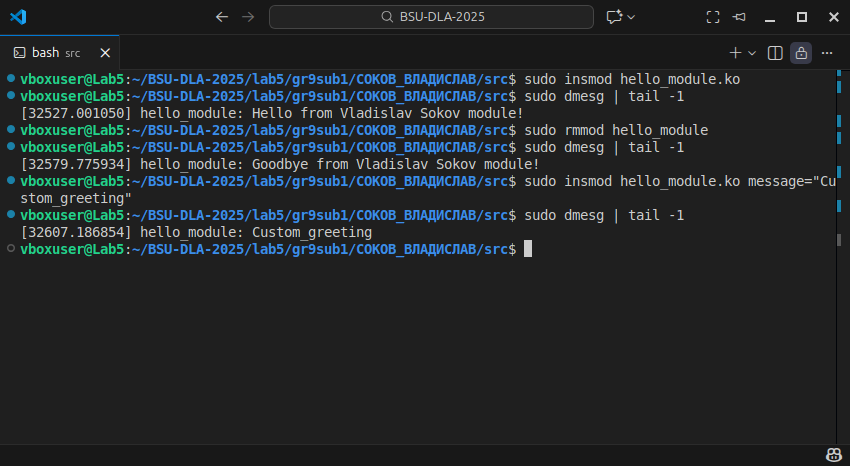
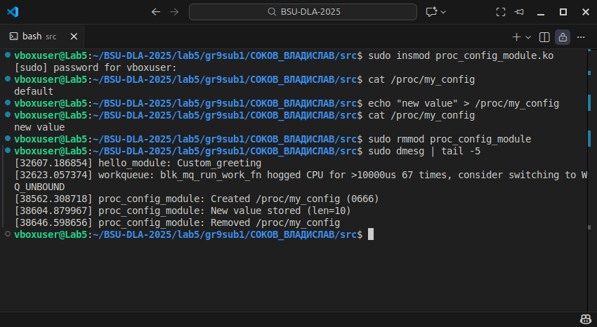
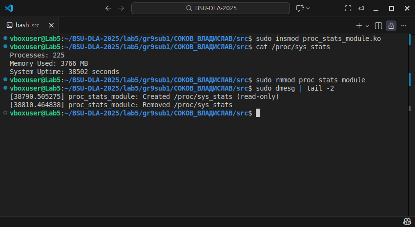

# Lab 5 — Модули ядра Linux

**Студент:** Соков Владислав  
**Операционная система:** VirtualBox (Ubuntu 24.04.3 LTS)  
**Ядро:** Linux 6.14.0-35-generic

## Содержание папки

```
lab5/
  gr9sub1/
    СОКОВ_ВЛАДИСЛАВ/
      REPORT.MD
      src/
        hello_module.c
        proc_config_module.c
        proc_stats_module.c
      Makefile
      screenshots/
        task_A.png
        task_B.png
        task_C.png
```

## Описание выполненных модулей

### Задание A — `hello_module.c`

Простой модуль-приветствие. При загрузке выводит `Hello from <имя> module!` (или переданное через параметр `message`), при выгрузке — `Goodbye from <имя> module!`.

### Задание B — `proc_config_module.c` (/proc/my_config)

Модуль создаёт файл `/proc/my_config` с правами `0666`. По умолчанию файл содержит `default`.

* Чтение (`cat /proc/my_config`) возвращает текущее значение.
* Запись (`echo "text" > /proc/my_config`) сохраняет новое значение (макс. 256 байт).
* В коде использованы `proc_create()` с `proc_ops`, `copy_from_user()` и `copy_to_user()`.

### Задание C — `proc_stats_module.c` (/proc/sys_stats)

Модуль создаёт файл `/proc/sys_stats` (только для чтения), в котором при обращении выводится:

* Количество процессов (`for_each_process` с RCU)
* Примерно используемая память (через `si_meminfo`) в мегабайтах
* Uptime системы (через `jiffies_to_msecs` -> секунды)

## Сборка

Сборка и тесты:

```bash
make
sudo insmod hello_module.ko
sudo insmod proc_config_module.ko
sudo insmod proc_stats_module.ko
# Тесты (см. ниже)
sudo rmmod proc_stats_module
sudo rmmod proc_config_module
sudo rmmod hello_module
```

## Скриншоты

**Task A — hello_module (пример dmesg):**



**Task B — proc_config_module (тест чтения/записи):**



**Task C — proc_stats_module (вывод sys_stats):**



## Примеры команд и ожидаемый вывод

**Проверка my_config:**

```bash
$ cat /proc/my_config
default
$ echo "new value" > /proc/my_config
$ cat /proc/my_config
new value
```

**Проверка sys_stats:**

```bash
$ cat /proc/sys_stats
Processes: 234
Memory Used: 2048 MB
System Uptime: 3600 seconds
```

## Ответы на вопросы

### Базовые понятия:

**1. Что такое модуль ядра и зачем он нужен?**
Модуль ядра — загружаемый объект, добавляющий функциональность ядра (драйверы, файловые системы, расширения) без перекомпиляции или перезагрузки.

**2. Чем отличается kernel-space от user-space?**
Kernel-space — привилегированная среда выполнения ядра с прямым доступом к аппаратуре и памяти. User-space — привилегированная ограниченная среда для приложений, имеющая защиту и систему вызовов для доступа к ядру.

**3. Что произойдёт, если в модуле обратиться к NULL указателю?**
Произойдёт oops/panic (kernel oops) — аварийное поведение ядра, возможна потеря устойчивости системы.

**4. Почему нельзя использовать `printf()` в модуле ядра?**
`printf()` — user-space функция. В ядре используются `printk()` и её обёртки; стандартная библиотека недоступна.

**5. Что такое kernel panic и как его избежать?**
Kernel panic — критическая ошибка ядра, приводящая к остановке системы. Избегают: проверка указателей, границ буферов, корректное освобождение ресурсов, избегание запрещённых операций в контексте (sleeping в IRQ и т.п.).

### Жизненный цикл модуля:

**6. Какие функции вызываются при `insmod` и `rmmod`?**
`insmod` вызывает функцию, помеченную `module_init` (обычно `init`), `rmmod` — функцию, помеченную `module_exit`.

**7. Что должна делать функция `module_exit()`?**
Освободить ресурсы, удалить созданные объекты (procfs, device), отменить регистрацию, вернуть систему в предыдущее состояние.

**8. Что происходит, если `module_init()` возвращает ошибку?**
Загрузка прерывается — модуль не считается загруженным, `insmod` вернёт ошибку, и `module_exit()` не вызывается.

**9. Можно ли выгрузить модуль, если он используется?**
Нет: `rmmod` вернётся с ошибкой `Device or resource busy`, если модуль помечен как используемый (refcount > 0), либо если `MOD_INUSE`.

### Логирование и отладка:

**10. Чем `printk()` отличается от `printf()`?**
`printk()` — функция ядра для логов с разными приоритетами и выводом в буфер ядра; `printf()` — user-space форматированный вывод.

**11. Какие уровни логирования существуют в ядре?**
Например: `KERN_EMERG`, `KERN_ALERT`, `KERN_CRIT`, `KERN_ERR`, `KERN_WARNING`, `KERN_NOTICE`, `KERN_INFO`, `KERN_DEBUG`.

**12. Как посмотреть логи модуля?**
Через `dmesg` или `journalctl -k` (или `tail -f /var/log/kern.log` / `syslog` в зависимости от системы).

**13. Что означает "tainted kernel"?**
Ядро помечается как tainted, если загружен модуль с непростой лицензией/несовместным кодом или при возникновении ошибок; это указывает, что поведение системы может быть не полностью поддержано.

### Память:

**14. Чем `kmalloc()` отличается от `malloc()`?**
`kmalloc()` — аллокация памяти в kernel-space с флагами GFP и требованиями по выравниванию; `malloc()` — user-space функция (glibc).

**15. Что такое флаги GFP и зачем они нужны?**
GFP-флаги (например, `GFP_KERNEL`, `GFP_ATOMIC`) описывают поведение аллокации (можно ли блокировать, может ли вызвать своп/IO).

**16. Что произойдёт, если не освободить память в `module_exit()`?**
Утечка памяти в ядре (поднятие счётчика аллокаций); со временем может привести к деградации системы.

**17. Почему нельзя использовать user-space указатели напрямую в ядре?**
Потому что адресное пространство отличается; прямой доступ может привести к OOPS/коррупции памяти. Надо использовать `copy_from_user()`/`copy_to_user()`.

### Взаимодействие с user-space:

**18. Что такое `/proc` и для чего он используется?**
Виртуальная файловая система procfs предоставляет информацию о процессе и системе и позволяет управлять некоторыми параметрами через файлы.

**19. Что такое `/sys` (sysfs) и чем отличается от procfs?**
Sysfs — интерфейс для представления объектов ядра (device model), используется для экспозиции свойств устройств; procfs — более общая информационная виртуальная FS.

**20. Зачем нужны `copy_to_user()` и `copy_from_user()`?**
Безопасный перенос данных между kernel-space и user-space с проверкой доступа и обработкой страниц.

**21. Что такое character device и как он работает?**
Character device — устройство, предоставляющее доступ через последовательный поток байт (read/write), обычно регистрируется через `register_chrdev_region`/`cdev_add`.

### Параметры и метаданные:

**22. Как передать параметры модулю при загрузке?**
Через `module_param()` и передачу `param=value` при `insmod` (или через загрузочные параметры для встроенных модулей).

**23. Зачем нужен `MODULE_LICENSE()`?**
Указывает лицензию модуля; влияет на доступность некоторых символов ядра и пометку `tainted`.

**24. Что произойдёт, если не указать лицензию?**
Ядро пометит модуль как proprietary/tainted и ограничит доступ к GPL-only символам.

### Безопасность:

**25. Какие основные правила безопасного кода в ядре?**
Проверять указатели и длины, избегать блокировок в контексте, где блокировка запрещена, правильно синхронизировать доступ, корректно обрабатывать ошибки и освобождать ресурсы.

**26. Можно ли использовать бесконечный цикл в модуле?**
Можно, но только в отдельном потоке (kthread) с корректной обработкой сигналов и возможностью выхода; нельзя блокировать контекст init/interrupt.

**27. Почему в ядре нет FPU операций?**
Потому что использование FPU требует сохранения/восстановления состояния CPU, что дорого и должно быть управляемо; ядро обычно не использует FPU, чтобы не увеличивать накладные расходы при переключении контекста.

**28. Что делать, если модуль вызвал kernel panic?**
Проанализировать логи (dmesg, vmcore если есть), загрузиться в безопасном режиме, удалить/исправить проблемный модуль, воспроизвести в контролируемом окружении (VM).

### Практические вопросы:

**29. Как узнать, какие модули загружены в системе?**
Команда `lsmod` (или `cat /proc/modules`).

**30. Как получить информацию о модуле (версия, параметры)?**
`modinfo <module.ko>` покажет метаданные; `cat /sys/module/<name>/parameters/*` покажет параметры в runtime.