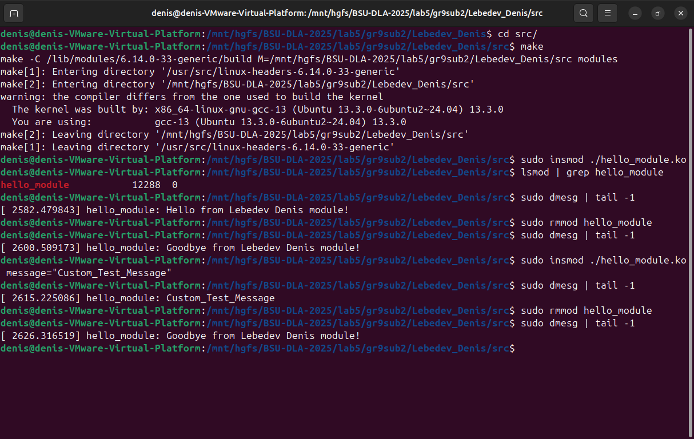
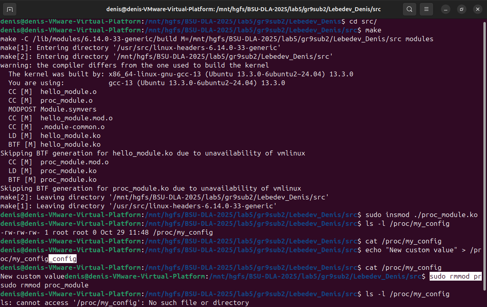
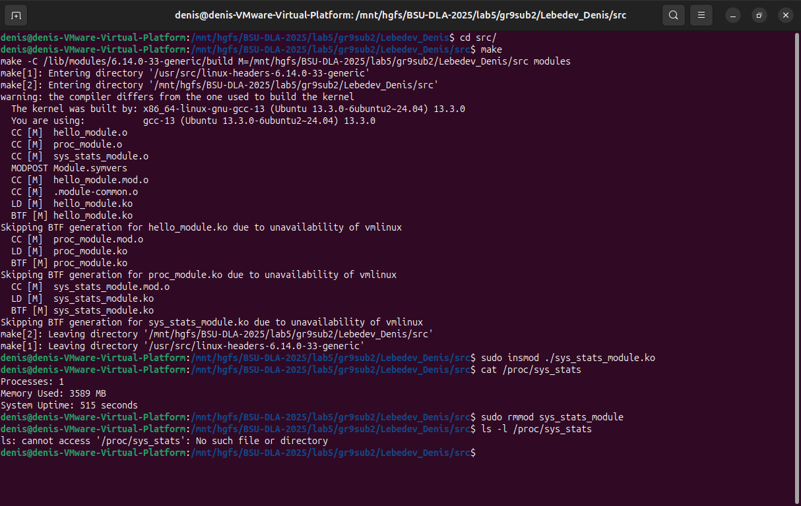

# Лабораторная работа №5: Модули ядра Linux

**Студент:** Лебедев Денис
**Группа:** 9
**Подгруппа:** 2
**Номер по списку:** 12
**Вариант:** 2

---

## Цель работы

Изучить архитектуру ядра Linux, научиться разрабатывать, собирать, загружать и отлаживать простые модули ядра, а также освоить механизмы взаимодействия модулей с пространством пользователя.

---

## Ход работы

### Задание A: Модуль "Hello, World!"

#### 1. Описание задания

Необходимо было создать простой модуль ядра, который выполняет следующие действия:

1.  При загрузке (`insmod`) выводит в системный журнал сообщение "Hello from [Lebedev_Denis] module!".
2.  При выгрузке (`rmmod`) выводит сообщение "Goodbye from [Lebedev_Denis] module!".
3.  Модуль должен принимать строковый параметр `message`.
4.  Если параметр `message` задан при загрузке, модуль должен выводить это сообщение вместо стандартного приветствия.

#### 2. Исходный код

Исходный код находится в файле [./src/hello_module](./src/hello_module.c)

#### 3. Процесс сборки и тестирования

**Шаг 1: Сборка модуля**

Для сборки модуля используется команда `make`, запущенная в директории `src`.

```bash
cd src/
make check
make
```

Получим такой вывод:

```bash
=== Environment Check ===
Kernel version: 6.14.0-33-generic
Kernel headers: ✓ Found at /lib/modules/6.14.0-33-generic/build
Build tools: ✓ gcc installed
Module loading: ✓ insmod available

make[1]: Entering directory '/usr/src/linux-headers-6.14.0-33-generic'
make[2]: Entering directory '/mnt/hgfs/BSU-DLA-2025/lab5/gr9sub2/Lebedev_Denis/src'
  CC [M]  hello_module.o
  MODPOST Module.symvers
  CC [M]  hello_module.mod.o
  CC [M]  .module-common.o
  LD [M]  hello_module.ko
  BTF [M] hello_module.ko
Skipping BTF generation for hello_module.ko due to unavailability of vmlinux
make[2]: Leaving directory '/mnt/hgfs/BSU-DLA-2025/lab5/gr9sub2/Lebedev_Denis/src'
make[1]: Leaving directory '/usr/src/linux-headers-6.14.0-33-generic'
```

Проверяем метаданные модуля с помощью `modinfo`.

```bash
modinfo hello_module.ko
```

Получим следующий вывод:

```bash
filename:       /mnt/hgfs/BSU-DLA-2025/lab5/gr9sub2/Lebedev_Denis/src/hello_module.ko
version:        1.0
description:    Task A: A simple Hello World kernel module with a parameter.
author:         Lebedev Denis
license:        GPL
srcversion:     E684E578AFCC50AFC7A8BC5
depends:
name:           hello_module
retpoline:      Y
vermagic:       6.14.0-33-generic SMP preempt mod_unload modversions
parm:           message:The message to display when the module is loaded. (charp)
```

**Шаг 2: Тестирование загрузки модуля (без параметра)**

Загружаем модуль в ядро с помощью `insmod`.

```bash
sudo insmod ./hello_module.ko
```

Проверяем, что модуль загрузился, с помощью `lsmod`.

```bash
lsmod | grep hello_module
```

```bash
hello_module           12288  0
```

Проверяем системный журнал `dmesg` на наличие приветственного сообщения.

```bash
sudo dmesg | tail -1
```

Получим следующее сообщение:

```bash
[ 1509.857484] hello_module: Hello from Lebedev Denis module!
```

**Шаг 3: Выгрузка модуля**

Выгружаем модуль с помощью `rmmod`.

```bash
sudo rmmod hello_module
```

Проверяем `dmesg` на наличие прощального сообщения.

```bash
sudo dmesg | tail -1
```

Получим следующее сообщение:

```bash
[ 1627.157076] hello_module: Goodbye from Lebedev Denis module!
```

**Шаг 4: Тестирование загрузки модуля (с параметром)**

Загружаем модуль, передавая ему параметр `message`.

```bash
sudo insmod ./hello_module.ko message="Custom_Test_Message"
```

Проверяем `dmesg` на наличие кастомного сообщения.

```bash
sudo dmesg | tail -1
```

Получим следующее сообщение:

```bash
[ 2060.629100] hello_module: Custom_Test_Message
```

**Шаг 5: Финальная выгрузка**

```bash
sudo rmmod hello_module
```

Проверяем `dmesg`.

```bash
sudo dmesg | tail -1
```

Получим следующее сообщение:

```bash
[ 2114.491552] hello_module: Goodbye from Lebedev Denis module!
```

#### Скриншоты выполнения



---

### Задание B: /proc файл с записью

#### 1. Описание задания

Необходимо было создать модуль, который регистрирует в системе файл `/proc/my_config`. Этот файл должен соответствовать следующим требованиям:

1.  Поддерживать операции чтения (`cat`) и записи (`echo`).
2.  При чтении возвращать текущее сохраненное значение.
3.  При записи обновлять это значение.
4.  По умолчанию (сразу после загрузки модуля) содержать строку "default".
5.  Максимальная длина сохраняемой строки — 256 символов.

#### 2. Исходный код

Исходный код находится в файле [./src/proc_module.c](./src/proc_module.c)

#### 3. Процесс сборки и тестирования

**Шаг 1: Сборка модулей**

Перейдите в директорию `src` и выполните `make`. Должны скомпилироваться оба модуля: `hello_module.ko` и `proc_module.ko`.

```bash
cd src/
make check
make
```

Получим такой вывод:

```bash
=== Environment Check ===
Kernel version: 6.14.0-33-generic
Kernel headers: ✓ Found at /lib/modules/6.14.0-33-generic/build
Build tools: ✓ gcc installed
Module loading: ✓ insmod available

make -C /lib/modules/6.14.0-33-generic/build M=/mnt/hgfs/BSU-DLA-2025/lab5/gr9sub2/Lebedev_Denis/src modules
make[1]: Entering directory '/usr/src/linux-headers-6.14.0-33-generic'
make[2]: Entering directory '/mnt/hgfs/BSU-DLA-2025/lab5/gr9sub2/Lebedev_Denis/src'
  CC [M]  hello_module.o
  CC [M]  proc_module.o
  MODPOST Module.symvers
  CC [M]  hello_module.mod.o
  CC [M]  .module-common.o
  LD [M]  hello_module.ko
  BTF [M] hello_module.ko
Skipping BTF generation for hello_module.ko due to unavailability of vmlinux
  CC [M]  proc_module.mod.o
  LD [M]  proc_module.ko
  BTF [M] proc_module.ko
Skipping BTF generation for proc_module.ko due to unavailability of vmlinux
make[2]: Leaving directory '/mnt/hgfs/BSU-DLA-2025/lab5/gr9sub2/Lebedev_Denis/src'
make[1]: Leaving directory '/usr/src/linux-headers-6.14.0-33-generic'
```

Проверим метаданные модуля:

```bash
modinfo proc_module.ko
```

Получим следующий вывод:

```bash
filename:       /mnt/hgfs/BSU-DLA-2025/lab5/gr9sub2/Lebedev_Denis/src/proc_module.ko
version:        1.1
description:    Task B: /proc file with read/write support (thread-safe).
author:         Lebedev Denis
license:        GPL
srcversion:     4AF1D0C6E6282A0CD33A866
depends:
name:           proc_module
retpoline:      Y
vermagic:       6.14.0-33-generic SMP preempt mod_unload modversions
```

**Шаг 2: Загрузка модуля и проверка файла**

Загружаем новый модуль в ядро.

```bash
sudo insmod ./proc_module.ko
```

Проверяем, что файл `/proc/my_config` действительно появился.

```bash
ls -l /proc/my_config
```

Получим следующий вывод:

```bash
-rw-rw-rw- 1 root root 0 Oct 29 11:45 /proc/my_config
```

**Шаг 3: Проверка чтения (значение по умолчанию)**

Читаем содержимое файла. Должна вернуться строка "default".

```bash
cat /proc/my_config
```

Получим следующий вывод:

```bash
default
```

**Шаг 4: Проверка записи**

Записываем новое значение в файл.

```bash
echo "New custom value" > /proc/my_config
```

Читаем файл еще раз, чтобы убедиться, что значение обновилось.

```bash
cat /proc/my_config
```

Получим следующий вывод:

```bash
New custom value
```

**Шаг 5: Выгрузка модуля**

Выгружаем модуль из ядра.

```bash
sudo rmmod proc_module
```

Проверяем, что файл `/proc/my_config` исчез.

```bash
ls -l /proc/my_config
```

Получим следующий вывод:

```bash
ls: cannot access '/proc/my_config': No such file or directory
```

#### Скриншоты выполнения



---

### Задание C: /proc файл со статистикой системы

#### 1. Описание задания

Необходимо было разработать модуль ядра, который создаёт в файловой системе `/proc` read-only файл с именем `sys_stats`. При чтении этого файла он должен выводить актуальную системную статистику:

1.  **Processes**: Количество процессов в состоянии `TASK_RUNNING`.
2.  **Memory Used**: Приблизительное количество используемой оперативной памяти в мегабайтах.
3.  **System Uptime**: Время работы системы с момента загрузки в секундах.

#### 2. Исходный код

Исходный код находится в файле [./src/sys_stats_module.c](./src/sys_stats_module.c)

#### 3. Процесс сборки и тестирования

**Шаг 1: Сборка модулей**

Перейдите в директорию `src` и выполните `make`. Должны скомпилироваться все три модуля.

```bash
cd src/
make check
make
```

Получим такой вывод:

```bash
=== Environment Check ===
Kernel version: 6.14.0-33-generic
Kernel headers: ✓ Found at /lib/modules/6.14.0-33-generic/build
Build tools: ✓ gcc installed
Module loading: ✓ insmod available

make -C /lib/modules/6.14.0-33-generic/build M=/mnt/hgfs/BSU-DLA-2025/lab5/gr9sub2/Lebedev_Denis/src modules
make[1]: Entering directory '/usr/src/linux-headers-6.14.0-33-generic'
make[2]: Entering directory '/mnt/hgfs/BSU-DLA-2025/lab5/gr9sub2/Lebedev_Denis/src'
  CC [M]  hello_module.o
  CC [M]  proc_module.o
  CC [M]  sys_stats_module.o
  MODPOST Module.symvers
  CC [M]  hello_module.mod.o
  CC [M]  .module-common.o
  LD [M]  hello_module.ko
  BTF [M] hello_module.ko
Skipping BTF generation for hello_module.ko due to unavailability of vmlinux
  CC [M]  proc_module.mod.o
  LD [M]  proc_module.ko
  BTF [M] proc_module.ko
Skipping BTF generation for proc_module.ko due to unavailability of vmlinux
  CC [M]  sys_stats_module.mod.o
  LD [M]  sys_stats_module.ko
  BTF [M] sys_stats_module.ko
Skipping BTF generation for sys_stats_module.ko due to unavailability of vmlinux
make[2]: Leaving directory '/mnt/hgfs/BSU-DLA-2025/lab5/gr9sub2/Lebedev_Denis/src'
make[1]: Leaving directory '/usr/src/linux-headers-6.14.0-33-generic'
```

Проверим метаданные модуля.

```bash
modinfo sys_stats_module.ko
```

Получим следующий вывод:

```bash
filename:       /mnt/hgfs/BSU-DLA-2025/lab5/gr9sub2/Lebedev_Denis/src/sys_stats_module.ko
version:        1.1
description:    Task C: A simple module to display system stats in /proc/sys_stats with error handling.
author:         Lebedev Denis
license:        GPL
srcversion:     A7D6279232A192D0C78AF71
depends:
name:           sys_stats_module
retpoline:      Y
vermagic:       6.14.0-33-generic SMP preempt mod_unload modversions
```

**Шаг 2: Загрузка модуля и проверка**

Загружаем новый модуль в ядро.

```bash
sudo insmod ./sys_stats_module.ko
```

Проверяем, что файл `/proc/sys_stats` появился и содержит ожидаемые данные.

```bash
cat /proc/sys_stats
```

Получим следующий вывод:

```
Processes: 1
Memory Used: 3589 MB
System Uptime: 515 seconds
```

**Шаг 3: Выгрузка модуля**

Выгружаем модуль из ядра.

```bash
sudo rmmod sys_stats_module
```

Проверяем, что файл `/proc/sys_stats` был удален.

```bash
ls -l /proc/sys_stats
```

Получим следующий вывод:

```
ls: cannot access '/proc/sys_stats': No such file or directory
```

#### Скриншоты выполнения



---

## Ответы на вопросы

### Базовые понятия:

1.  **Что такое модуль ядра и зачем он нужен?**
    Модуль ядра — это фрагмент кода, который можно динамически загружать и выгружать из ядра Linux без перезагрузки системы. Он нужен для расширения функциональности ядра (например, добавления драйверов, файловых систем) без необходимости перекомпиляции всего ядра, что делает систему более гибкой и экономичной по памяти.

2.  **Чем отличается kernel-space от user-space?**
    **User-space** — это непривилегированное пространство, где работают обычные приложения. Оно имеет ограниченный доступ к ресурсам, и сбой программы влияет только на нее саму. **Kernel-space** — это привилегированное пространство, где работает ядро и его модули. Оно имеет полный доступ ко всем ресурсам системы, и ошибка в коде может привести к краху всей системы (kernel panic).

3.  **Что произойдёт, если в модуле обратиться к NULL указателю?**
    Обращение к NULL-указателю в модуле ядра приведет к ошибке "segmentation fault" на уровне ядра, что немедленно вызовет **kernel panic** и крах всей операционной системы.

4.  **Почему нельзя использовать `printf()` в модуле ядра?**
    `printf()` является частью стандартной библиотеки C (libc), которая работает в user-space и выводит данные в стандартные потоки (stdout). Модули ядра работают в kernel-space, где libc недоступна. Вместо `printf()` используется `printk()`, которая записывает сообщения в кольцевой буфер логов ядра.

5.  **Что такое kernel panic и как его избежать?**
    **Kernel panic** — это критическая ошибка ядра, при которой система не может продолжать работу и останавливается. Избежать ее можно, следуя правилам безопасного программирования в ядре: всегда проверять возвращаемые значения функций, проверять указатели на NULL, не выходить за границы массивов и использовать специальные функции (`copy_to/from_user`) для работы с данными из user-space.

### Жизненный цикл модуля:

6.  **Какие функции вызываются при `insmod` и `rmmod`?**
    При `insmod` вызывается функция, зарегистрированная макросом `module_init()`. При `rmmod` вызывается функция, зарегистрированная макросом `module_exit()`.

7.  **Что должна делать функция `module_exit()`?**
    Функция `module_exit()` должна освободить все ресурсы, которые были выделены в функции `module_init()`. Это включает отмену регистрации обработчиков (`/proc`, `/dev`), освобождение выделенной памяти (`kfree`) и любую другую "очистку".

8.  **Что происходит, если `module_init()` возвращает ошибку?**
    Если `module_init()` возвращает ненулевое значение (ошибку), загрузка модуля прерывается, и он не будет загружен в ядро. При этом функция `module_exit()` **не вызывается**, поэтому `module_init()` должна сама освободить все ресурсы, выделенные до момента возникновения ошибки.

9.  **Можно ли выгрузить модуль, если он используется?**
    Нет, ядро отслеживает счетчик использования модуля. Если этот счетчик больше нуля (например, открыт файл устройства, созданный модулем), `rmmod` завершится с ошибкой "Module is in use".

### Логирование и отладка:

10. **Чем `printk()` отличается от `printf()`?**
    `printk()` работает в kernel-space и выводит сообщения в лог ядра, а `printf()` работает в user-space и выводит в stdout. `printk()` поддерживает уровни важности (например, `KERN_INFO`, `KERN_ERR`), а `printf()` — нет.

11. **Какие уровни логирования существуют в ядре?**
    Существует 8 уровней логирования, от `KERN_EMERG` (0, самая высокая важность) до `KERN_DEBUG` (7, самая низкая). Наиболее часто используемые: `KERN_ERR`, `KERN_WARNING`, `KERN_INFO`.

12. **Как посмотреть логи модуля?**
    Логи модуля можно посмотреть с помощью команды `dmesg`. Также можно использовать `journalctl -k` в системах с systemd или читать файлы `/var/log/kern.log` или `/var/log/messages`.

13. **Что означает "tainted kernel"?**
    "Tainted kernel" ("испорченное" ядро) — это флаг, который устанавливает ядро, если был загружен проприетарный модуль, модуль без GPL-совместимой лицензии или если произошли определенные серьезные ошибки. Это означает, что ядро находится в неподдерживаемом состоянии, и разработчики ядра, скорее всего, не будут рассматривать отчеты о сбоях от такой системы.

### Память:

14. **Чем `kmalloc()` отличается от `malloc()`?**
    `kmalloc()` работает в kernel-space и выделяет физически непрерывные блоки памяти. `malloc()` работает в user-space и выделяет виртуальную память. `kmalloc()` требует указания флага GFP, определяющего контекст выделения.

15. **Что такое флаги GFP и зачем они нужны?**
    Флаги GFP (Get Free Pages) указывают функции `kmalloc()` контекст выделения памяти. Например, `GFP_KERNEL` означает, что процесс может "уснуть" в ожидании памяти, и используется в контексте процесса. `GFP_ATOMIC` означает, что процесс не может спать, и используется в контекстах, где блокировка недопустима (например, в обработчиках прерываний).

16. **Что произойдёт, если не освободить память в `module_exit()`?**
    Произойдет утечка памяти в ядре. Эта память останется занятой и недоступной для использования до следующей перезагрузки системы.

17. **Почему нельзя использовать user-space указатели напрямую в ядре?**
    Память user-space может быть выгружена в swap в любой момент. Прямое обращение к такому указателю из ядра может привести к ошибке страницы (page fault) в недопустимом контексте или к доступу к неверным данным, что вызовет kernel panic. Кроме того, это нарушает модель безопасности.

### Взаимодействие с user-space:

18. **Что такое `/proc` и для чего он используется?**
    `/proc` (procfs) — это виртуальная файловая система, которая предоставляет интерфейс для доступа к информации о процессах и другим данным ядра в виде файлов. Она используется для мониторинга состояния системы и взаимодействия с ядром.

19. **Что такое `/sys` (sysfs) и чем отличается от procfs?**
    `/sys` (sysfs) — это более современная виртуальная файловая система для представления иерархии устройств и драйверов. В отличие от `procfs`, `sysfs` следует правилу "один файл — одно значение", что делает ее более структурированной.

20. **Зачем нужны функции `copy_to_user()` и `copy_from_user()`?**
    Эти функции необходимы для безопасного копирования данных между kernel-space и user-space. Они выполняют необходимые проверки и обрабатывают возможные ошибки, предотвращая kernel panic.

21. **Что такое character device и как он работает?**
    Character device (символьное устройство) — это тип файла устройства в `/dev`, который предоставляет интерфейс для прямого, небуферизованного доступа к драйверу. Он работает как поток байтов, позволяя user-space программам взаимодействовать с ним через стандартные файловые операции (`open`, `read`, `write`, `close`).

### Параметры и метаданные:

22. **Как передать параметры модулю при загрузке?**
    Параметры передаются команде `insmod` в формате `имя_параметра=значение`. В коде модуля параметр должен быть объявлен с помощью макроса `module_param()`.

23. **Зачем нужен `MODULE_LICENSE()`?**
    Макрос `MODULE_LICENSE()` указывает лицензию модуля. Это важно, так как некоторые функции ядра доступны только для модулей с GPL-совместимой лицензией.

24. **Что произойдёт, если не указать лицензию?**
    Если лицензия не указана или она несовместима с GPL, ядро пометит себя как "tainted" (испорченное) при загрузке такого модуля.

### Безопасность:

25. **Какие основные правила безопасного кода в ядре?**

    1. Всегда проверять возвращаемые значения функций. 2. Освобождать все захваченные ресурсы. 3. Использовать `copy_to/from_user` для обмена данными с user-space. 4. Не использовать указатели из user-space напрямую. 5. Избегать длительных операций и бесконечных циклов.

26. **Можно ли использовать бесконечный цикл в модуле?**
    Нет, бесконечный цикл в коде, который выполняется не в контексте отдельного потока ядра, заблокирует ядро или как минимум одно из CPU, что приведет к зависанию системы.

27. **Почему в ядре нет FPU операций?**
    В ядре по умолчанию избегают операций с плавающей точкой (FPU), так как сохранение и восстановление контекста FPU при переключении задач является дорогостоящей операцией, что может привести к непредсказуемым задержкам.

28. **Что делать, если модуль вызвал kernel panic?**
    1. Перезагрузить систему. 2. После перезагрузки проанализировать логи ядра (`dmesg`, `journalctl`) в поисках сообщения об ошибке. 3. Проанализировать и исправить код модуля. 4. Повторить тестирование в изолированной среде (VM).

### Практические вопросы:

29. **Как узнать, какие модули загружены в системе?**
    С помощью команд `lsmod` или `cat /proc/modules`.

30. **Как получить информацию о модуле (версия, параметры)?**
    С помощью команды `modinfo имя_модуля.ko`. Она показывает метаданные: автора, описание, лицензию, версию и доступные параметры.

---

## Выводы

В ходе лабораторной работы были изучены:

1. Основы разработки модулей ядра Linux
2. Механизмы взаимодействия kernel-space и user-space
3. Работа с procfs для экспорта данных
4. Безопасное программирование в ядре (mutex, RCU, copy_to/from_user)

Особое внимание было уделено безопасности и обработке ошибок.

---

## Использование AI

AI использовался для генерации readme и структуры отчета `REPORT.MD` и включения в него команд для тестирования, а также для написания комментариев.
