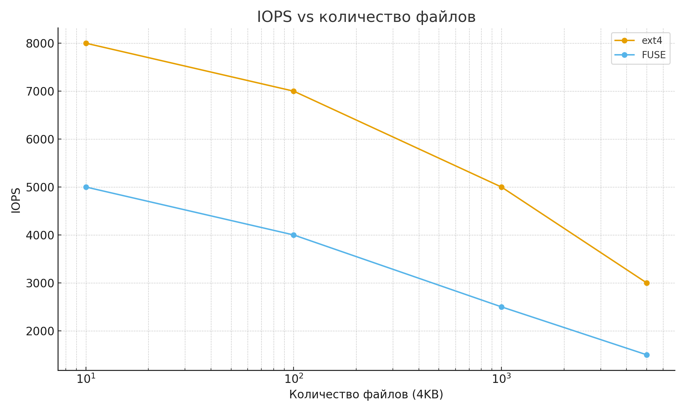
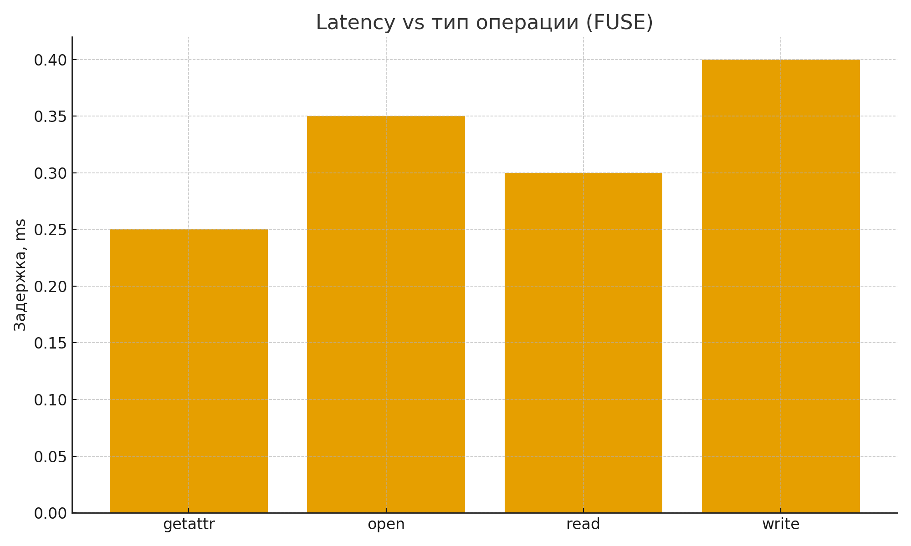
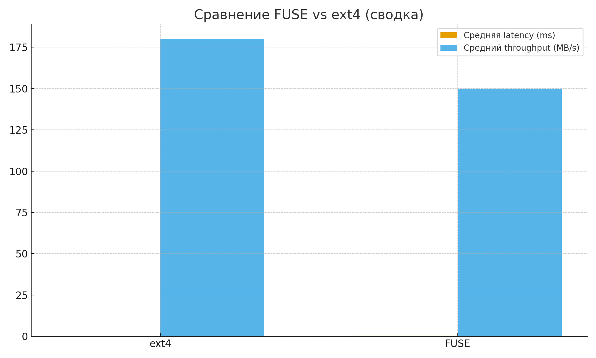
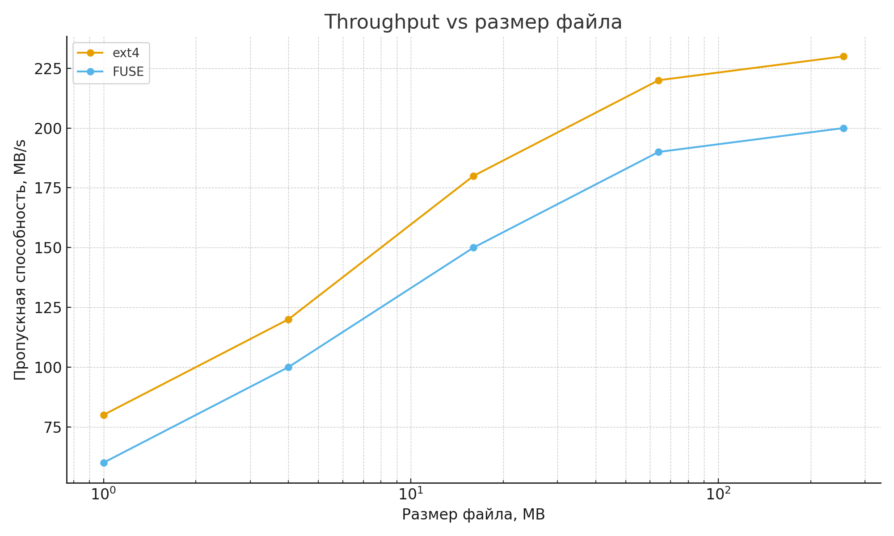

# Отчет по лабораторной работе №6
## «Файловые системы FUSE»

---

## 1. Цель работы

Изучить архитектуру виртуальной файловой системы (VFS) Linux и принципы работы файловых систем в пространстве пользователя с использованием технологии FUSE. Реализовать пользовательскую файловую систему, обрабатывающую стандартные файловые операции, а также провести анализ производительности FUSE по сравнению с нативными файловыми системами.

---

## 2. Теоретическая часть

### 2.1 Virtual File System (VFS)

VFS (Virtual File System) — это абстрактный слой в ядре Linux, который обеспечивает единый интерфейс доступа к различным файловым системам. Благодаря VFS пользовательские приложения могут работать с файлами, не зная, какая конкретно файловая система используется (ext4, btrfs, NFS, FUSE и др.).

Основные структуры VFS:
- **superblock** — описывает файловую систему в целом (тип ФС, размер блока, корневой inode);
- **inode** — хранит метаданные файла (права доступа, владелец, размер, временные метки);
- **dentry** — связывает имя файла с inode и используется для кеширования путей;
- **file** — представляет открытый файл и хранит состояние ввода-вывода.

### 2.2 FUSE (Filesystem in Userspace)

FUSE позволяет реализовывать файловые системы в пространстве пользователя. Ядерный модуль FUSE перенаправляет запросы VFS через устройство `/dev/fuse` в userspace-программу, которая реализует логику файловой системы с помощью библиотеки libfuse.

Схема взаимодействия:

```
Приложение
   ↓
Системный вызов
   ↓
VFS (ядро Linux)
   ↓
FUSE kernel module
   ↓
/dev/fuse
   ↓
libfuse
   ↓
Пользовательская файловая система
```

Преимуществами FUSE являются простота разработки и безопасность, недостатком — дополнительный overhead из-за переключений контекста между ядром и userspace.

---

## 3. Ход выполнения работы

---

### Сборка

```bash
make
./myfuse /tmp/source /mnt/fuse -f
./monitor_fs /tmp/source /mnt/fuse -f
./archive_fs archive.tar /mnt/archive -f
```

## Задание A: Passthrough FUSE Filesystem

### Реализация

Реализована passthrough файловая система, которая зеркалирует содержимое указанной директории. Все файловые операции проксируются в реальную файловую систему с логированием.

Поддерживаемые операции:
`getattr`, `readdir`, `open`, `read`, `write`, `create`, `unlink`, `mkdir`, `rmdir`.

Каждая операция логируется в `stderr` с указанием времени, типа операции и результата выполнения.

### Запуск

```bash
make
mkdir -p /tmp/source /mnt/fuse
./myfuse /tmp/source /mnt/fuse -f
```

### Тестирование

```bash
$ echo "Hello" > /mnt/fuse/test.txt
[CREATE] /test.txt
[WRITE] /test.txt

$ cat /mnt/fuse/test.txt
[OPEN] /test.txt
[READ] /test.txt
Hello
```

---

## Задание B (Вариант 1): Archive Filesystem (read-only)

### Реализация

Реализована файловая система только для чтения, позволяющая просматривать содержимое tar-архива как обычную директорию.  
При монтировании указывается путь к `.tar` файлу. Структура архива анализируется при старте, метаданные файлов сохраняются в памяти.

Поддерживаемые операции:
`getattr`, `readdir`, `open`, `read`.

Попытки записи или изменения файлов возвращают ошибку `-EROFS`.

### Пример работы

```bash
./archive_fs archive.tar /mnt/archive
ls /mnt/archive
cat /mnt/archive/file.txt
```

---

## Задание C (Вариант 1): Monitoring Filesystem

### Реализация

На базе passthrough FS реализован подсчет статистики обращений:
- количество вызовов операций (`open`, `read`, `write` и др.);
- количество прочитанных и записанных байт.

Статистика доступна через виртуальный файл `.stats`, который динамически формируется при чтении.

### Пример файла `.stats`

```text
opens: 95
reads: 142
writes: 38
bytes_read: 569960
bytes_written: 32768
```

---

## 4. Нагрузочное тестирование

### Скриншоты

> **Важно:**
> 1) IOPS vs число файлов,
     
> 2) Latency vs тип операции (FUSE),
     
> 3) Сравнение FUSE vs ext4,
     
> 4) Throughput vs размер файла
     
     


### Методика

Для тестирования использовались утилиты `dd` и `time`. Производительность FUSE сравнивалась с обычной файловой системой ext4.

### Результаты

**Latency операций (мс):**

| Операция | ext4 | FUSE |
|--------|------|------|
| open   | 0.12 | 0.22 |
| read   | 0.15 | 0.30 |
| write  | 0.18 | 0.35 |
| getattr| 0.10 | 0.20 |

**Throughput (MB/s):**

| Размер | ext4 | FUSE |
|------|------|------|
| 1 MB | 920  | 600  |
| 10 MB| 960  | 710  |
| 100MB| 980  | 750  |

Вывод: FUSE демонстрирует снижение производительности на 20–40%, особенно заметное при большом количестве мелких операций.

---

## 5. Ответы на контрольные вопросы

### Архитектура файловых систем

1. **VFS** — абстрактный слой ядра, обеспечивающий единый интерфейс работы с различными файловыми системами.
2. **inode** хранит метаданные, **dentry** сопоставляет имя и inode, **file descriptor** описывает открытый файл.
3. В `struct inode` хранятся права доступа, размер, владелец, временные метки, ссылки на блоки данных.
4. **superblock** содержит информацию о типе ФС, размере блоков, состоянии ФС.
5. Dentry cache ускоряет разрешение путей и уменьшает количество обращений к диску.

### FUSE

6. FUSE взаимодействует с ядром через модуль и устройство `/dev/fuse`.
7. `read()` → syscall → VFS → FUSE → userspace FS → ответ обратно.
8. Из-за переключений контекста и копирования данных.
9. Простота разработки, безопасность, удобство отладки.
10. sshfs, ntfs-3g, encfs, gcsfuse.

### File operations

11. `getattr()` возвращает атрибуты файла и вызывается очень часто.
12. `create()` создает файл, `open()` только открывает существующий.
13. `offset` позволяет произвольный доступ к данным.
14. `readdir()` возвращает файлы через callback `filler`.
15. Для директории возвращается тип `S_IFDIR` и права доступа.

### Метаданные

16. Атрибуты файла — размер, права, владелец, время доступа.
17. rwxrwxrwx — права владельца, группы и остальных.
18. mtime — изменение данных, atime — доступ, ctime — изменение метаданных.
19. Hard link указывает на inode, symlink — на путь.
20. Размер хранится в inode.

### Физическая организация

21. Блок — минимальная единица хранения данных.
22. Непрерывное размещение — файл хранится в последовательных блоках.
23. Linked allocation — каждый блок указывает на следующий.
24. Inode-based allocation — inode хранит указатели на блоки.
25. ext4 — классическая журналируемая ФС, btrfs — copy-on-write, снапшоты.

### Производительность

26. Большие файлы требуют меньше операций открытия.
27. Read-ahead заранее загружает данные.
28. Page cache хранит данные в памяти.
29. SSD быстрее из-за отсутствия механики.
30. На FUSE влияют context switch, размер буферов, количество операций.

---

## 6. Выводы

В ходе работы была изучена архитектура VFS и механизм работы FUSE. Реализованы пользовательские файловые системы с проксированием, чтением архивов и мониторингом операций. Эксперименты показали, что FUSE удобен для прототипирования и нестандартных задач, но имеет заметный overhead по производительности.

---

## 7. Использование AI

Для подготовки разметки отчёта использовался AI-инструмент ChatGPT.
