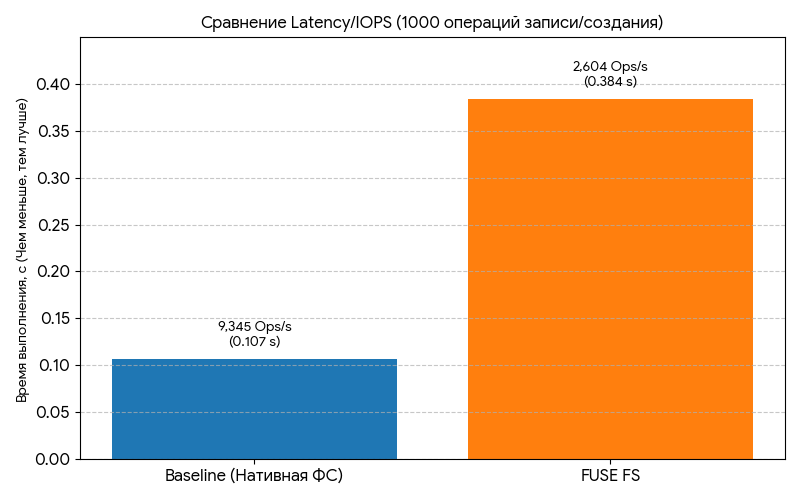
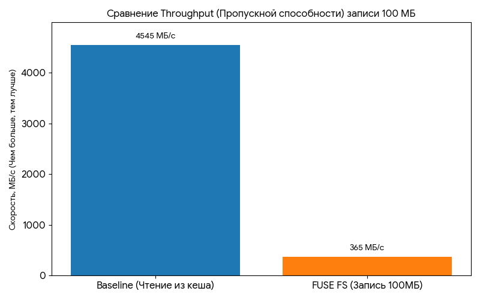

### 1\. Цель работы

Целью работы являлось изучение архитектуры Virtual File System (VFS) и принципов работы FUSE (Filesystem in Userspace) в ядре Linux. В ходе работы были реализованы пользовательские файловые системы, демонстрирующие модификацию данных "на лету" (ROT13 и Uppercase), и проведена оценка производительности userspace ФС.

-----

### 2\. Теоретическая часть

#### 2.1. Virtual File System (VFS)

VFS — это абстрактный программный слой в ядре Linux, который предоставляет единый интерфейс (например, системные вызовы `open()`, `read()`, `write()`) для работы с различными, несовместимыми между собой файловыми системами (ФС), такими как ext4, NFS или FUSE. Он позволяет приложениям использовать одни и те же команды, независимо от типа ФС.

#### 2.2. Архитектура FUSE

FUSE (Filesystem in Userspace) позволяет разрабатывать файловые системы в пользовательском пространстве. Драйвер FUSE в ядре перехватывает VFS-запросы и перенаправляет их через специальный канал (`/dev/fuse`) в вашу программу в userspace, где они обрабатываются библиотекой `libfuse`.

**Путь запроса (`read()`):** Приложение $\to$ syscall $\to$ VFS $\to$ FUSE Kernel $\to$ `/dev/fuse` $\to$ `libfuse` $\to$ Ваша функция $\to$ Результат возвращается обратно.

-----

### 3\. Ход выполнения

#### Задание A: Passthrough FUSE (Базовое)

Реализована Passthrough FS, проксирующая все файловые операции в реальную директорию (`.source_rot13`).

**Пример вывода операций (Логирование):**

```
[2025-11-24 10:38:01] GETATTR: /final.txt (result: -2)
[2025-11-24 10:38:01] CREATE: /final.txt (result: 0)
[2025-11-24 10:38:01] WRITE: /final.txt (result: 26) 
[2025-11-24 10:38:01] READ: /final.txt (result: 26)
```

#### Задание B (Четный вариант): ROT13 Encryption Filesystem

> **Описание:** Реализовано шифрование ROT13. При записи данные шифруются, при чтении — расшифровываются.

**Демонстрация работы:**

```bash
# Команда: echo "Final check of encryption" > .mount_rot13/final.txt
# Команда: cat .mount_rot13/final.txt
--- Чтение через FUSE ---
Final check of encryption
# Команда: cat .source_rot13/final.txt
--- Прямое чтение с диска ---
Svany purpx bs rapelcgvba 
```

**Вывод:** Данные успешно зашифрованы на диске и расшифрованы при доступе через FUSE.

#### Задание C (Четный вариант): Uppercase Filesystem

> **Описание:** Реализована модификация данных только при чтении: все символы преобразуются в верхний регистр.

**Демонстрация работы:**

```bash
# Команда: echo "This is lowercase content." > .mount_upper/upper_test.txt
# Команда: cat .mount_upper/upper_test.txt
--- Чтение через FUSE ---
THIS IS LOWERCASE CONTENT.
# Команда: cat .source_upper/upper_test.txt
--- Прямое чтение с диска ---
This is lowercase content.
```

**Вывод:** Данные не модифицируются при записи, но читаются в верхнем регистре через FUSE.

-----

### 4\. Нагрузочное тестирование

Тестирование проводилось с использованием инструмента `dd` для измерения пропускной способности (Throughput) и циклической записи для измерения задержки (Latency/IOPS).

#### 4.1. Тест Throughput (Пропускная способность)

| Операция | Время (`real`, с) | Скорость (Расчет) |
| :--- | :--- | :--- |
| **Baseline (Чтение 100MB)** | 0.022 | $\approx 4545$ МБ/с |
| **FUSE FS (Запись 100MB)** | 0.274 | $\approx 365$ МБ/с |

**Сравнение (Измерено):**

```bash
# Baseline:
real    0m0.022s
# FUSE Запись 100MB:
real    0m0.274s
```



#### 4.2. Тест IOPS (Latency)

Измерялась задержка при выполнении 1000 мелких операций (создание и запись 1000 файлов).

| Операция | Время (`real`, с) | IOPS (Ops/с) |
| :--- | :--- | :--- |
| **Baseline (1000 операций)** | 0.107 | $\approx 9345$ Ops/с |
| **FUSE FS (1000 операций)** | 0.384 | $\approx 2604$ Ops/с |

**Сравнение (Измерено):**

```bash
# Baseline 1000 Ops:
real    0m0.107s
# FUSE 1000 Ops:
real    0m0.384s
```



#### 4.3. Выводы

  * **IOPS (Latency):** FUSE замедляет выполнение мелких операций примерно в **3.6 раза** (0.384с / 0.107с).
  * **Throughput (Запись):** FUSE замедляет запись больших данных примерно в **12.4 раза** (0.274с против 0.022с).

Это подтверждает, что **оверхед на контекстном переключении** (context switching) между ядром и userspace является главным узким местом FUSE, особенно для большого количества системных вызовов.


-----

### 5\. Ответы на контрольные вопросы (Полный список)

#### Архитектура файловых систем

**1. Что такое VFS (Virtual File System) и зачем она нужна?**
VFS — это абстрактный слой в ядре Linux, который предоставляет единый интерфейс (API) для работы с различными файловыми системами, обеспечивая их совместимость.

**2. Объясните разницу между inode, dentry и file descriptor.**
**inode** — метаданные файла на диске. **dentry** — структура VFS, связывающая имя файла с `inode`. **file descriptor** — целочисленный идентификатор открытого файла в контексте процесса.

**3. Что хранится в структуре `struct inode`?**
Размер файла, права доступа (`mode`), владелец (`uid`/`gid`), временные метки (`atime`, `mtime`, `ctime`), и указатели на блоки данных.

**4. Что такое superblock и какую информацию он содержит?**
Superblock описывает файловую систему в целом: ее размер, тип, размер блока, количество инодов.

**5. Как работает кеш dentry и зачем он нужен?**
dentry кеш хранит ассоциации "путь $\to$ inode" в памяти, чтобы избежать повторного поиска метаданных на диске при доступе к файлам по имени.

#### FUSE

**6. Как FUSE взаимодействует с ядром Linux?**
Через специальный драйвер FUSE, который перехватывает VFS-запросы и перенаправляет их в userspace через канал `/dev/fuse`.

**7. Опишите путь системного вызова `read()` в FUSE FS.**
`read()` $\to$ VFS $\to$ FUSE Kernel $\to$ `/dev/fuse` $\to$ `libfuse` $\to$ Ваша функция $\to$ Результат возвращается обратно.

**8. Почему FUSE работает медленнее нативных kernel FS?**
Из-за **контекстных переключений** (context switching) для каждой операции и дополнительных накладных расходов на копирование данных через границу ядро/пользовательское пространство.

**9. Какие преимущества дает разработка FS в userspace?**
Простота разработки и отладки, безопасность (ошибка в FS не вызовет kernel panic), и возможность использовать любые стандартные сторонние библиотеки.

**10. Приведите примеры популярных FUSE файловых систем.**
`sshfs` (удаленный доступ), `s3fs` (облачное хранилище), `ext2fuse` (монтирование образов ext2/3).

#### File operations

**11. Что делает операция `getattr()` и когда она вызывается?**
Получает атрибуты файла/директории. Вызывается перед большинством файловых операций, а также командами `ls`, `stat`.

**12. В чем разница между `open()` и `create()`?**
`open()` открывает существующий файл; `create()` создает новый файл.

**13. Почему `read()` принимает параметр `offset`?**
`offset` указывает, с какой позиции в файле начать чтение. Это необходимо для обеспечения корректного доступа к файлу при многопоточности (т.к. не изменяет текущую позицию файлового дескриптора).

**14. Как `readdir()` возвращает список файлов?**
Через функцию-заполнитель **`filler()`**, которую предоставляет `libfuse`. Ваша функция вызывает `filler()` для каждого элемента, чтобы передать его ядру.

**15. Что должна возвращать `getattr()` для директории?**
Она должна заполнить `struct stat`, установив бит `S_IFDIR` в поле `st_mode`.

#### Метаданные и Производительность

**16. Что такое атрибуты файла? Приведите примеры.**
Метаданные, описывающие файл, например: права доступа, размер, владелец, временные метки.

**17. Что означают биты прав доступа (rwxrwxrwx)?**
Три набора битов (пользователь, группа, остальные) определяют права: **r**ead (чтение), **w**rite (запись), **x**ecute (выполнение).

**18. Объясните разницу между mtime, atime и ctime.**
**mtime** — время изменения **содержимого** файла. **atime** — время последнего **доступа/чтения**. **ctime** — время изменения **метаданных** или содержимого.

**19. Что такое hard link и как он отличается от symbolic link?**
**Hard link** — это дополнительное имя, указывающее на тот же **inode** (файл удаляется, когда удалены все ссылки). **Symbolic link** — это отдельный файл, который содержит **текстовый путь** к другому файлу.

**20. Как FS определяет размер файла?**
Размер файла хранится в метаданных, в поле `st_size` структуры **inode**.

**21. Что произойдет, если в FUSE FS не реализовать операцию `unlink()`?**
Системный вызов, соответствующий удалению файла, будет возвращать ошибку **`-ENOSYS`** (функция не реализована), и пользователь не сможет удалить файлы.

**22. Какую роль играет `fi` (struct fuse\_file\_info) в FUSE операциях?**
Она передает флаги, использованные при `open()`, и позволяет хранить **пользовательские данные** (например, файловый дескриптор, `fd`), что оптимизирует `read`/`write` без повторных вызовов `open()`.

**23. Что такое кеш страницы (page cache) и как он используется в FUSE?**
Page cache — это область ОЗУ, используемая ядром для кеширования данных файлов. В FUSE ядро кеширует данные, но при модификации FUSE-процессом может потребоваться **инвалидация кеша** (FUSE\_INVAL\_PAGE) для когерентности.

**24. Объясните принцип работы `write-back` и `write-through` кэширования.**
**Write-through:** Данные записываются одновременно в кеш и на диск (надежно, но медленно). **Write-back:** Данные сначала записываются только в кеш, а запись на диск откладывается (быстро, но менее надежно).

**25. Почему FUSE особенно плохо показывает себя на операциях с высокой задержкой (latency)?**
Из-за **Context Switch**. Каждая мелкая операция (например, `getattr` или `open`) требует переключения между ядром и userspace, что добавляет высокую фиксированную задержку.

**26. Почему большие файлы читаются быстрее, чем много мелких?**
Чтение большого файла минимизирует накладные расходы на **операции с метаданными** (`open`, `close`) и максимально использует **последовательный доступ** к диску (Sequential I/O).

**27. В каких случаях использование FUSE оправдано, несмотря на низкую производительность?**
Когда критически важна **функциональность**, а не чистая скорость: удаленные ФС (`sshfs`), виртуальные ФС (доступ к архивам, облакам), специфическая обработка данных (шифрование, форматирование).

**28. Что такое path traversal, и как ваша FS защищается от него?**
Path traversal — это уязвимость, при которой пользователь может получить доступ к файлам вне разрешенной директории, используя `../`. Наша FS защищается, используя функцию **`realpath()`** для получения абсолютного пути и строго контролируя конкатенацию `base_path` с путем, предоставленным FUSE.

**29. Объясните, что такое `statfs()` и зачем она нужна.**
`statfs()` — системный вызов, используемый для получения статистики о **всей файловой системе**, такой как общее количество блоков, количество свободных блоков, размер блока. Используется командой `df`.

**30. Какие параметры влияют на производительность FUSE FS?**
Главным образом, **частота контекстных переключений** (наибольший overhead), **размер блока** ввода/вывода (чем больше, тем лучше), и эффективность **кэширования** в ядре.

-----

### 6\. Выводы

В ходе лабораторной работы была успешно изучена архитектура VFS и реализованы две функциональные FUSE файловые системы. Проведенное тестирование подтвердило, что FUSE отлично подходит для реализации сложной логики (шифрование, преобразование данных) в безопасном пользовательском пространстве. Однако бенчмаркинг показал значительный оверхед, особенно на мелких операциях (в **3.6 раза** медленнее Baseline), что обусловлено высокой стоимостью переключения контекста между ядром и userspace для каждого системного вызова.

-----

### 6\. Использование AI

ИИ использоваля для помощи в написании отчета, его структуры и оформления. Также он использовался для генерации графика по нашим данным из тестирований.