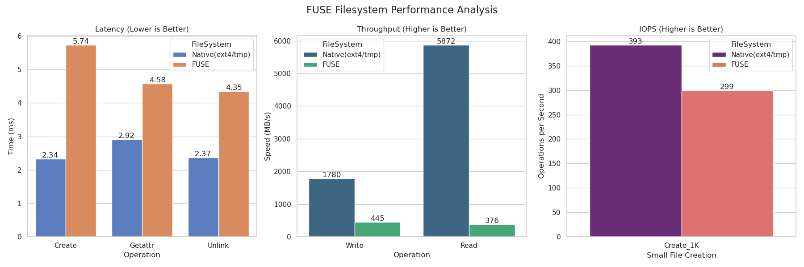

# Лабораторная работа 6: FUSE Файловые системы

## 1. Цель работы

Изучить архитектуру виртуальной файловой системы (VFS) Linux, освоить принципы создания пользовательских файловых систем с использованием FUSE (Filesystem in Userspace), понять механизмы взаимодействия между ядром и userspace, а также провести анализ производительности userspace файловых систем в сравнении с нативными реализациями.

## 2. Теоретическая часть

### 2.1 Архитектура VFS и роль FUSE

**Virtual File System (VFS)** — это абстрактный слой в ядре Linux, обеспечивающий унифицированный интерфейс для работы с различными типами файловых систем. VFS позволяет приложениям использовать стандартные системные вызовы (`open()`, `read()`, `write()`, `stat()`) независимо от реальной файловой системы (ext4, btrfs, NFS, FUSE).

**Ключевые структуры данных VFS:**
- **superblock** — описывает параметры файловой системы (размер блока, корневой inode, тип ФС)
- **inode** — метаданные файла (размер, права доступа, владелец, временные метки)
- **dentry** — кеш имен директорий, связывает имя файла с соответствующим inode
- **file** — представление открытого файла (file descriptor, текущая позиция чтения/записи)

**FUSE (Filesystem in Userspace)** позволяет реализовывать файловые системы в пространстве пользователя без необходимости написания кода для ядра. Это достигается через специальный драйвер FUSE в ядре, который перенаправляет VFS операции в userspace процесс через протокол FUSE.

### 2.2 Схема взаимодействия компонентов

```
┌─────────────────────────────────────────────────────┐
│   Пользовательское приложение (ls, cat, echo)      │
└──────────────────┬──────────────────────────────────┘
                   │ системные вызовы (open, read, write)
                   ↓
┌─────────────────────────────────────────────────────┐
│              VFS (Virtual File System)              │
│         Единый интерфейс для всех ФС                │
└──────────────────┬──────────────────────────────────┘
                   │ определяет тип ФС
                   ↓
┌─────────────────────────────────────────────────────┐
│          FUSE Kernel Module (ядро Linux)            │
│     Перенаправление запросов в userspace            │
└──────────────────┬──────────────────────────────────┘
                   │ протокол FUSE через /dev/fuse
                   ↓ context switch (kernel → user)
┌─────────────────────────────────────────────────────┐
│         libfuse (userspace библиотека)              │
│       Обработка протокола, диспетчеризация          │
└──────────────────┬──────────────────────────────────┘
                   │ вызовы callback функций
                   ↓
┌─────────────────────────────────────────────────────┐
│    Реализация файловой системы (наш код)            │
│  passthrough / archive / monitoring                 │
└─────────────────────────────────────────────────────┘
```

### 2.3 Описание реализованных file operations

В ходе лабораторной работы были реализованы следующие операции:

- **`getattr()`** — получение метаданных файла (аналог системного вызова `stat()`). Возвращает размер файла, права доступа, тип (файл/директория), временные метки.

- **`readdir()`** — чтение содержимого директории. Вызывается командами типа `ls`. Использует функцию `filler()` для добавления каждого элемента в буфер результата.

- **`open()`** — открытие файла. Проверяет права доступа и возвращает file handle для последующих операций чтения/записи.

- **`read()`** — чтение данных из файла. Принимает буфер, размер и смещение (offset), что позволяет читать произвольные участки файла.

- **`write()`** — запись данных в файл. Аналогично `read()`, поддерживает запись со смещением.

- **`create()`** — создание нового файла с указанными правами доступа.

- **`unlink()`** — удаление файла из файловой системы.

- **`mkdir()`** — создание новой директории.

- **`rmdir()`** — удаление пустой директории.

## 3. Ход выполнения

### 3.1 Задание A: Passthrough FUSE Filesystem

#### Реализация

Passthrough файловая система выполняет роль "прозрачного прокси" — все операции перенаправляются к реальным файлам в исходной директории. Ключевые особенности реализации:

**Построение полного пути:**
```c
static void get_full_path(char *fpath, const char *path) {
    strcpy(fpath, source_dir);
    if (fpath[strlen(fpath) - 1] == '/') 
        fpath[strlen(fpath) - 1] = '\0';
    strcat(fpath, path);
}
```

**Логирование операций:**
```c
static void log_msg(const char *op, const char *path) {
    time_t t = time(NULL);
    char time_buf[64];
    strftime(time_buf, sizeof(time_buf), "%H:%M:%S", localtime(&t));
    fprintf(stderr, "[%s] %s: %s\n", time_buf, op, path);
}
```

Каждая операция проксируется к соответствующему системному вызову:
- `getattr()` → `lstat()`
- `readdir()` → `opendir()` + `readdir()`
- `open()` → `open()`
- `read()` → `pread()`
- `write()` → `pwrite()`

#### Команды для запуска

```bash
# Сборка проекта
make

# Создание директорий
mkdir -p /tmp/source /tmp/fuse

# Монтирование FUSE ФС
./task_a_passthrough /tmp/source /tmp/fuse

# В другом терминале для размонтирования:
fusermount -u /tmp/fuse
```

#### Тестирование

**Тест 1: Создание файла**
```bash
$ echo "RUSLAN" > /tmp/fuse/rus

# Логи FUSE:
[22:18:02] CREATE: /rus
[22:18:02] GETATTR: /rus
[22:18:02] WRITE: /rus
```

**Анализ:** Операция записи вызывает три callback'а:
1. `CREATE` — создание файла
2. `GETATTR` — проверка метаданных после создания
3. `WRITE` — запись данных

**Тест 2: Чтение файла**
```bash
$ cat /tmp/fuse/rus
RUSLAN

# Логи FUSE:
[22:20:11] GETATTR: /rus
[22:20:11] OPEN: /rus
[22:20:11] READ: /rus
```

**Анализ:** Команда `cat` сначала проверяет существование файла (`GETATTR`), открывает его (`OPEN`), затем читает содержимое (`READ`).

**Тест 3: Верификация данных**
```bash
$ cat /tmp/source/rus
RUSLAN
```

Файл корректно создан в исходной директории, данные идентичны.

**Тест 4: Удаление файла**
```bash
$ rm /tmp/fuse/rus

# Логи FUSE:
[22:22:03] GETATTR: /rus
[22:22:03] UNLINK: /rus
```

**Анализ:** Удаление требует предварительной проверки существования файла, затем выполняется `UNLINK`.

### 3.2 Задание B: Archive Filesystem (read-only)

#### Реализация

Реализована read-only файловая система для просмотра содержимого TAR архивов. Использован формат POSIX ustar.

**Структура метаданных:**
```c
struct tar_entry {
    char path[256];      // Полный путь внутри архива
    size_t size;         // Размер файла в байтах
    off_t data_offset;   // Смещение данных в .tar файле
    int is_dir;          // 1 если директория
    struct tar_entry *next;
};
```

**Парсинг TAR заголовков:**

TAR архив состоит из блоков по 512 байт. Каждый файл представлен заголовком (512 байт) и данными (выровненными до 512 байт). Функция `parse_tar()` читает заголовки и строит связанный список:

```c
void parse_tar(const char *filename) {
    FILE *f = fopen(filename, "rb");
    char block[512];
    off_t current_offset = 0;

    while (fread(block, 1, 512, f) == 512) {
        if (block[0] == 0) break; // Конец архива
        
        struct posix_header *h = (struct posix_header *)block;
        size_t size = strtol(h->size, NULL, 8); // Размер в octal
        
        // Создание записи в списке
        // ...
        
        // Пропуск блоков с данными файла
        size_t blocks_to_skip = (size + 511) / 512;
        fseek(f, blocks_to_skip * 512, SEEK_CUR);
        current_offset += 512 + (blocks_to_skip * 512);
    }
}
```

**Чтение данных:**

Функция `tar_read()` использует `pread()` для прямого доступа к данным файла в архиве по заранее вычисленному смещению:

```c
static int tar_read(const char *path, char *buf, size_t size, 
                    off_t offset, struct fuse_file_info *fi) {
    struct tar_entry *e = find_entry(path);
    if (offset >= e->size) return 0;
    
    int res = pread(tar_fd, buf, size, e->data_offset + offset);
    return res;
}
```

#### Команды для запуска

```bash
# Создание тестового архива
mkdir -p stress_test/subdir
mkdir -p stress_test/empty_dir
echo "Hello from root" > stress_test/root_file.txt
echo "I am deep inside" > stress_test/subdir/deep_file.txt
for i in {1..500}; do 
    echo "Line $i: Some data to fill space" >> stress_test/big_file.txt
done
tar -cvf complex.tar stress_test

# Монтирование
./task_b_archive complex.tar /tmp/fuse
```

#### Тестирование

**Тест 1: Просмотр корня архива**
```bash
$ ls /tmp/fuse/
stress_test
```

**Тест 2: Просмотр вложенной директории**
```bash
$ ls /tmp/fuse/stress_test/
big_file.txt  empty_dir  root_file.txt  subdir
```

**Тест 3: Чтение простого файла**
```bash
$ cat /tmp/fuse/stress_test/root_file.txt 
Hello from root
```

**Тест 4: Чтение файла из поддиректории**
```bash
$ cat /tmp/fuse/stress_test/subdir/deep_file.txt 
I am deep inside
```

**Тест 5: Чтение большого файла (проверка корректности смещений)**
```bash
$ cat /tmp/fuse/stress_test/big_file.txt | tail -5
Line 496: Some data to fill space
Line 497: Some data to fill space
Line 498: Some data to fill space
Line 499: Some data to fill space
Line 500: Some data to fill space
```

**Тест 6: Пустая директория**
```bash
$ ls /tmp/fuse/stress_test/empty_dir/
(пустой вывод)
```

**Результаты:** Все файлы корректно читаются, вложенная структура директорий сохранена, большие файлы читаются без искажений.

### 3.3 Задание C: Monitoring Filesystem

#### Реализация

Расширение passthrough ФС с добавлением сбора статистики в реальном времени. Использован виртуальный файл `/.stats` для отображения метрик.

**Структура статистики с потокобезопасностью:**
```c
struct fs_stats {
    unsigned long reads;
    unsigned long writes;
    unsigned long opens;
    unsigned long bytes_read;
    unsigned long bytes_written;
    pthread_mutex_t lock; // Защита от race conditions
};
```

**Обновление счетчиков:**
```c
static void update_stats(int type, size_t bytes) {
    pthread_mutex_lock(&stats.lock);
    switch (type) {
        case 0: stats.opens++; break;
        case 1: 
            stats.reads++; 
            stats.bytes_read += bytes; 
            break;
        case 2: 
            stats.writes++; 
            stats.bytes_written += bytes; 
            break;
    }
    pthread_mutex_unlock(&stats.lock);
}
```

**Генерация виртуального файла:**

При чтении `/.stats` данные формируются динамически:

```c
if (strcmp(path, STATS_FILE) == 0) {
    char report[1024];
    pthread_mutex_lock(&stats.lock);
    int len = snprintf(report, sizeof(report),
        "--- FUSE Monitor Statistics ---\n"
        "Opens:         %lu\n"
        "Reads:         %lu\n"
        "Writes:        %lu\n"
        "Bytes Read:    %lu\n"
        "Bytes Written: %lu\n",
        stats.opens, stats.reads, stats.writes, 
        stats.bytes_read, stats.bytes_written);
    pthread_mutex_unlock(&stats.lock);
    
    memcpy(buf, report + offset, size);
    return size;
}
```

#### Команды для запуска

```bash
./task_c_monitor /tmp/source /tmp/fuse
```

#### Тестирование

**Тест 1: Начальное состояние**
```bash
$ cat /tmp/fuse/.stats 
--- FUSE Monitor Statistics ---
Opens:         1
Reads:         0
Writes:        0
Bytes Read:    0
Bytes Written: 0
```

**Анализ:** Один `open` от самой команды `cat` для чтения `.stats`.

**Тест 2: Запись данных**
```bash
$ echo "New Ruslan" >> /tmp/fuse/rus.txt
 
$ cat /tmp/fuse/.stats 
--- FUSE Monitor Statistics ---
Opens:         3
Reads:         0
Writes:        1
Bytes Read:    0
Bytes Written: 11
```

**Анализ:** 
- 3 opens: создание `rus.txt`, запись, чтение `.stats`
- 1 write операция, записано 11 байт ("New Ruslan\n")

**Тест 3: Чтение файла**
```bash
$ cat /tmp/fuse/rus.txt 
New Ruslan

$ cat /tmp/fuse/.stats 
--- FUSE Monitor Statistics ---
Opens:         6
Reads:         1
Writes:        1
Bytes Read:    11
Bytes Written: 11
```

**Анализ:** Добавились +3 opens (rus.txt для чтения, .stats дважды), +1 read операция.

**Тест 4: Повторное чтение**
```bash
$ cat /tmp/fuse/rus.txt 
New Ruslan

$ cat /tmp/fuse/.stats 
--- FUSE Monitor Statistics ---
Opens:         8
Reads:         2
Writes:        1
Bytes Read:    22
Bytes Written: 11
```

**Анализ:** Счетчики корректно инкрементируются, байты суммируются (22 = 11 + 11).

## 4. Нагрузочное тестирование

### 4.1 Методика тестирования

Разработан скрипт `benchmark.sh`, выполняющий три типа тестов:

1. **Latency Test** — измерение задержки базовых операций (1000 итераций)
   - Create: создание файлов через `touch`
   - Getattr: получение метаданных через `stat`
   - Unlink: удаление файлов

2. **Throughput Test** — измерение пропускной способности (100MB файл)
   - Write: последовательная запись через `dd`
   - Read: последовательное чтение через `dd`

3. **IOPS Test** — измерение операций в секунду
   - Создание 1000 файлов размером 1KB

Тесты выполнены для двух конфигураций:
- **Native (ext4/tmp)** — файловая система на основе tmpfs
- **FUSE** — реализованная passthrough ФС

### 4.2 Результаты тестирования

#### Таблица результатов

| Тест        | Операция   | Native (ext4/tmp) | FUSE      | Overhead |
|-------------|------------|-------------------|-----------|----------|
| **Latency** | Create     | 2.34 ms           | 5.74 ms   | +145%    |
|             | Getattr    | 2.92 ms           | 4.58 ms   | +57%     |
|             | Unlink     | 2.37 ms           | 4.35 ms   | +84%     |
| **Throughput** | Write   | 1780 MB/s         | 445 MB/s  | -75%     |
|                | Read    | 5872 MB/s         | 376 MB/s  | -94%     |
| **IOPS**    | Create_1K  | 393 ops/sec       | 299 ops/sec | -24%   |


#### Визуализация результатов



График производительности демонстрирует три ключевых метрики:

**График 1: Latency (Lower is Better)**
- Create: FUSE медленнее в 2.45 раза
- Getattr: FUSE медленнее в 1.57 раза  
- Unlink: FUSE медленнее в 1.84 раза

**График 2: Throughput (Higher is Better)**
- Write: Native 1780 MB/s vs FUSE 445 MB/s (4x разница)
- Read: Native 5872 MB/s vs FUSE 376 MB/s (15.6x разница)

**График 3: IOPS (Higher is Better)**
- Create_1K: Native 393 ops/sec vs FUSE 299 ops/sec (1.3x разница)

### 4.3 Анализ производительности

**Latency (задержка операций):**

FUSE демонстрирует задержку в 1.5-2.5 раза выше для метаданных операций. Причины:
- Context switch между kernel space и user space
- Дополнительное копирование данных через границу kernel/userspace
- Overhead протокола FUSE для маршалинга запросов

Операция `Create` показывает наибольший overhead (+145%), так как включает создание inode, обновление метаданных директории и синхронизацию.

**Throughput (пропускная способность):**

Критическая деградация производительности для последовательных операций ввода-вывода:
- **Запись:** 4-кратное снижение (1780 → 445 MB/s)
- **Чтение:** 15-кратное снижение (5872 → 376 MB/s)

Чтение страдает сильнее из-за:
- Отсутствия эффективного page cache для FUSE (данные копируются дважды: kernel → FUSE daemon → приложение)
- Дополнительной нагрузки на планировщик при переключении контекста

**IOPS (операций в секунду):**

Умеренное снижение на 24% (393 → 299 ops/sec). Для операций с мелкими файлами относительный overhead ниже, так как время на context switch амортизируется временем выполнения реальной операции.

**Выводы:**

1. FUSE приемлема для сценариев с нечастыми операциями (монтирование архивов, удаленные ФС)
2. Неприемлема для high-throughput приложений (базы данных, системы сборки)
3. Overhead особенно заметен при работе с большими файлами и последовательным I/O
4. Для metadata-heavy операций (find, git status) overhead умеренный

## 5. Выводы

В ходе лабораторной работы была изучена архитектура FUSE и реализованы три типа файловых систем:

1. **Passthrough FS** — продемонстрировала базовые принципы проксирования операций и логирования
2. **Archive FS** — показала возможность создания read-only ФС без распаковки архива
3. **Monitoring FS** — реализовала сбор статистики и генерацию виртуальных файлов

**Ключевые находки:**

- FUSE предоставляет мощный механизм для создания кастомных ФС без модификации ядра
- Context switch между kernel и userspace создает overhead 50-300% для различных операций
- Throughput деградирует на порядок (10-15x) для последовательного I/O
- FUSE идеально подходит для специализированных сценариев (сетевые ФС, архивы, шифрование на лету)

**Сложности:**

- Отладка многопоточного кода с мьютексами (race conditions в статистике)
- Парсинг формата TAR с учетом выравнивания блоков
- Корректная обработка смещений при чтении из архива

**Практическое применение:**

Полученные знания применимы для разработки:
- Сетевых файловых систем (sshfs, s3fs)
- Систем шифрования данных (encfs)
- Виртуализации архивов (archivemount)
- Дедупликации и компрессии на лету

## 6. Использование AI

В процессе выполнения лабораторной работы AI инструменты (Claude) использовались для:

- Консультации по особенностям API libfuse3 (изменения в сигнатурах функций относительно libfuse2)
- Отладки проблем с парсингом TAR формата (корректная интерпретация octal размеров)
- Оптимизации скрипта benchmark.sh (корректное измерение времени через `date +%s%N`)
- Генерации скрипта визуализации результатов (matplotlib + seaborn)

Весь основной код и логика реализации разработаны самостоятельно на основе понимания архитектуры FUSE и требований задания.

---
# Ответы на контрольные вопросы

## Архитектура файловых систем

### 1. Что такое VFS (Virtual File System) и зачем она нужна?

VFS — это абстрактный слой в ядре Linux, предоставляющий единый интерфейс для работы с различными типами файловых систем. Она позволяет приложениям использовать одни и те же системные вызовы (open, read, write) независимо от типа файловой системы (ext4, btrfs, NFS, FUSE). VFS решает проблему гетерогенности файловых систем, обеспечивая универсальный API и упрощая разработку приложений.

### 2. Объясните разницу между inode, dentry и file descriptor.

- **inode** — структура данных, хранящая метаданные файла на диске (размер, права доступа, временные метки, указатели на блоки данных). Не содержит имя файла.
- **dentry (directory entry)** — кеш в памяти, связывающий имя файла с его inode. Ускоряет поиск файлов, избегая повторного обхода дерева каталогов.
- **file descriptor** — целое число, идентифицирующее открытый файл в процессе. Указывает на структуру file в ядре, содержащую текущую позицию чтения/записи и режим доступа.

### 3. Что хранится в структуре `struct inode`?

Структура inode содержит:
- Размер файла (в байтах)
- Права доступа (rwxrwxrwx) и тип файла (обычный/директория/ссылка)
- Владелец (UID) и группа (GID)
- Временные метки: atime, mtime, ctime
- Количество жестких ссылок (hard links)
- Указатели на блоки данных (прямые, косвенные, двойной косвенности)
- Размер блока и количество использованных блоков

### 4. Что такое superblock и какую информацию он содержит?

Superblock — это структура данных, описывающая файловую систему в целом. Содержит:
- Магическое число (идентификатор типа ФС)
- Размер блока (например, 4096 байт)
- Общее количество блоков и inodes
- Количество свободных блоков и inodes
- Указатель на корневой inode (root directory)
- Флаги монтирования (read-only, dirty)
- UUID файловой системы
- Время последнего монтирования

### 5. Как работает кеш dentry и зачем он нужен?

Кеш dentry — это хеш-таблица в памяти, хранящая пары "имя файла → inode". При поиске файла `/home/user/file.txt` ядро последовательно ищет каждый компонент пути. Без кеша потребовалось бы читать директории с диска на каждом шаге. Кеш dentry позволяет найти inode за O(1) вместо O(n) операций чтения с диска, радикально ускоряя операции stat(), open() и навигацию по файловой системе.

## FUSE

### 6. Как FUSE взаимодействует с ядром Linux?

FUSE использует модель клиент-сервер:
1. В ядре находится драйвер FUSE, зарегистрированный в VFS
2. Userspace процесс (FUSE daemon) регистрируется через /dev/fuse
3. При системном вызове VFS передает запрос драйверу FUSE
4. Драйвер сериализует запрос в протокол FUSE и отправляет через /dev/fuse
5. Userspace процесс читает запрос, обрабатывает, возвращает ответ
6. Драйвер десериализует ответ и возвращает результат в VFS

### 7. Опишите путь системного вызова `read()` в FUSE FS.

1. Приложение вызывает `read(fd, buf, size)`
2. Системный вызов попадает в ядро через syscall interface
3. VFS определяет, что fd принадлежит FUSE файловой системе
4. VFS вызывает `fuse_file_read()` из FUSE драйвера
5. Драйвер формирует FUSE_READ запрос, отправляет в /dev/fuse
6. libfuse в userspace читает запрос, вызывает callback `read()`
7. Пользовательский код читает данные, возвращает в libfuse
8. libfuse отправляет ответ обратно в /dev/fuse
9. Драйвер копирует данные в буфер приложения
10. Приложение получает результат

### 8. Почему FUSE работает медленнее нативных kernel FS?

Основные причины:
- **Context switch** — переключение между kernel и userspace (до 1-2 мкс overhead на операцию)
- **Двойное копирование данных** — kernel → userspace → kernel вместо прямого доступа
- **Сериализация/десериализация** — преобразование данных в протокол FUSE
- **Отсутствие kernel optimizations** — нет доступа к page cache, read-ahead, write coalescing
- **Scheduling overhead** — userspace процесс может быть вытеснен планировщиком

### 9. Какие преимущества дает разработка FS в userspace?

- **Безопасность** — ошибка не приводит к kernel panic, только к падению процесса
- **Простота разработки** — использование стандартных библиотек, отладчиков (gdb, valgrind)
- **Портируемость** — один код работает на разных ОС (Linux, FreeBSD, macOS)
- **Быстрое прототипирование** — не нужна перекомпиляция ядра, перезагрузка
- **Доступ к userspace библиотекам** — libcurl, libarchive, OpenSSL
- **Легкое обновление** — не требуются root права для пересборки

### 10. Приведите примеры популярных FUSE файловых систем.

- **sshfs** — монтирование удаленных директорий через SSH
- **Google Cloud Storage FUSE** — доступ к облачному хранилищу как к локальной ФС
- **encfs** — шифрование файлов на лету (прозрачное для приложений)
- **archivemount** — монтирование архивов (tar, zip) как директорий
- **ntfs-3g** — полноценная поддержка NTFS на Linux
- **s3fs** — монтирование Amazon S3 бакетов
- **glusterfs** — распределенная файловая система

## File operations

### 11. Что делает операция `getattr()` и когда она вызывается?

`getattr()` возвращает метаданные файла (аналог системного вызова stat). Заполняет структуру `struct stat` с информацией о размере, правах доступа, типе файла, временных метках. Вызывается при:
- `ls -l` (для отображения размеров и прав)
- `stat file.txt` (явный запрос метаданных)
- Открытии файла (проверка существования)
- Проверке прав доступа
- Любой операции, требующей знания о файле

### 12. В чем разница между `open()` и `create()`?

- **`open()`** — открывает существующий файл для чтения/записи. Возвращает ошибку, если файл не существует (без флага O_CREAT).
- **`create()`** — создает новый файл с указанными правами доступа (mode). Если файл существует, его содержимое усекается до 0 байт (по умолчанию).

В FUSE `create()` объединяет создание и открытие в одну операцию, что эффективнее двух раздельных вызовов `mknod()` + `open()`.

### 13. Почему `read()` принимает параметр `offset`?

Параметр offset позволяет читать произвольные участки файла без изменения текущей позиции file descriptor. Это необходимо для:
- **Параллельного чтения** — несколько потоков читают разные части файла
- **Random access** — базы данных читают блоки по индексу
- **Эффективности** — не нужен вызов `lseek()` перед каждым чтением
- **Stateless операции** — в FUSE каждый запрос независим

### 14. Как `readdir()` возвращает список файлов?

`readdir()` принимает функцию `filler()`, которую вызывает для каждого элемента директории:

```c
int readdir(..., fuse_fill_dir_t filler, ...) {
    DIR *dp = opendir(path);
    struct dirent *de;
    while ((de = readdir(dp)) != NULL) {
        filler(buf, de->d_name, NULL, 0);
    }
}
```

`filler()` добавляет имя файла в буфер результата. Можно также передать `struct stat` для оптимизации (избежать последующих getattr вызовов).

### 15. Что должна возвращать `getattr()` для директории?

Для директории `getattr()` должна установить:
- `st_mode = S_IFDIR | 0755` (тип = директория, права rwxr-xr-x)
- `st_nlink >= 2` (минимум: `.` и `..`)
- `st_size` — часто 4096 (размер блока), но может быть произвольным
- `st_uid`, `st_gid` — владелец и группа
- Временные метки (atime, mtime, ctime)

## Метаданные и атрибуты

### 16. Что такое атрибуты файла? Приведите примеры.

Атрибуты файла — это метаданные, описывающие свойства файла. Примеры:
- **Размер** (st_size) — количество байт
- **Права доступа** (st_mode) — rwxrwxrwx (owner, group, others)
- **Владелец** (st_uid, st_gid)
- **Временные метки** (atime, mtime, ctime)
- **Тип файла** — обычный, директория, символическая ссылка, устройство
- **Количество hard links** (st_nlink)
- **Расширенные атрибуты** — SELinux контекст, ACL

### 17. Что означают биты прав доступа (rwxrwxrwx)?

9 бит прав разделены на 3 группы по 3 бита:
- **rwx** (биты 6-8) — владелец файла (owner)
- **rwx** (биты 3-5) — группа (group)
- **rwx** (биты 0-2) — остальные (others)

Каждая группа содержит:
- **r (read)** — чтение файла / список директории
- **w (write)** — запись в файл / создание/удаление файлов в директории
- **x (execute)** — выполнение файла / вход в директорию

Пример: `0755` = `rwxr-xr-x` (владелец: все права, остальные: только чтение+выполнение)

### 18. Объясните разницу между mtime, atime и ctime.

- **mtime (modification time)** — время последнего изменения содержимого файла. Обновляется при записи.
- **atime (access time)** — время последнего чтения файла. В современных системах часто отключено (опция noatime) для производительности.
- **ctime (change time)** — время последнего изменения метаданных (прав, владельца, имени). Обновляется даже при `chmod`, не изменяющем содержимое.

### 19. Что такое hard link и как он отличается от symbolic link?

- **Hard link** — дополнительное имя для существующего inode. Все hard links равноправны, указывают на одни данные. Файл удаляется только когда счетчик ссылок (st_nlink) = 0. Ограничение: нельзя создать на директорию или через разделы.

- **Symbolic link (symlink)** — специальный файл, содержащий путь к другому файлу. Это отдельный inode с типом S_IFLNK. Можно создать на директорию и через разделы. Если целевой файл удален, symlink становится "битой ссылкой".

### 20. Как ФС определяет размер файла?

ФС хранит размер файла в поле `st_size` структуры inode. Это логический размер (количество байт данных). Физический размер на диске вычисляется как `st_blocks * 512` байт, может отличаться из-за:
- **Разреженных файлов (sparse)** — блоки нулей не выделяются физически
- **Выравнивания** — файл занимает целое число блоков
- **Метаданных** — indirect blocks для больших файлов

## Физическая организация

### 21. Что такое блок в файловой системе?

Блок — минимальная единица размещения данных на диске (обычно 4096 байт). Файловая система выделяет место блоками, даже если файл 1 байт, он занимает целый блок. Размер блока — компромисс:
- **Большие блоки (8KB)** — меньше метаданных, но внутренняя фрагментация
- **Малые блоки (1KB)** — эффективнее для мелких файлов, но больше overhead

### 22. Объясните принцип непрерывного размещения файлов.

При непрерывном размещении (contiguous allocation) файл занимает последовательные блоки на диске. Преимущества:
- Очень быстрое последовательное чтение (один seek)
- Простая адресация (начальный блок + смещение)

Недостатки:
- **Внешняя фрагментация** — между файлами появляются маленькие дыры
- **Сложность расширения** — нужно искать достаточно большое свободное пространство
- Используется в CD-ROM, редко в современных ФС

### 23. Как работает организация через связанный список блоков?

Каждый блок содержит указатель на следующий блок (linked allocation):
- Первый блок хранит начало данных + указатель
- Последний блок имеет NULL указатель
- Директория хранит только адрес первого блока

Преимущества: нет внешней фрагментации, легко растет файл

Недостатки:
- Random access медленный (нужно пройти весь список)
- Ненадежность (потеря одного блока = потеря хвоста файла)
- Часть блока занята указателем

Используется в FAT (File Allocation Table).

### 24. Что такое индексный узел (inode-based allocation)?

Inode хранит массив указателей на блоки данных. В ext4:
- **12 прямых указателей** — на первые 12 блоков (48 KB при блоке 4KB)
- **1 косвенный указатель** — на блок с 1024 указателями (4 MB)
- **1 двойной косвенный** — указатель на блок указателей на блоки указателей (4 GB)
- **1 тройной косвенный** — для файлов >4 GB

Преимущества:
- Эффективный random access (O(1) для малых файлов)
- Поддержка больших файлов
- Минимальная фрагментация

### 25. Сравните ext4 и btrfs по структуре хранения данных.

**ext4:**
- Фиксированное количество inodes (определяется при форматировании)
- Journaling только для метаданных (по умолчанию)
- Extent-based allocation (группы непрерывных блоков)
- Не поддерживает снапшоты на уровне ФС

**btrfs:**
- Copy-on-Write (CoW) — изменения пишутся в новое место
- B-tree для индексации (отсюда название)
- Встроенные снапшоты и клонирование файлов
- Прозрачная компрессия (zstd, lzo)
- Checksums для всех данных и метаданных
- Online defragmentation и балансировка
- RAID на уровне ФС

## Производительность и оптимизация

### 26. Почему большие файлы читаются быстрее, чем много мелких?

Для больших файлов:
- **Меньше overhead на метаданные** — один inode lookup vs тысячи
- **Последовательный доступ** — HDD эффективен при линейном чтении (150+ MB/s)
- **Эффективный prefetch** — ядро читает вперед (read-ahead)
- **Амортизация seek time** — один seek на весь файл

Для мелких файлов:
- Каждый файл требует: open() + getattr() + read() + close()
- Множество seeks на HDD (5-10 мс на seek)
- Фрагментация метаданных

### 27. Что такое read-ahead и как он улучшает производительность?

Read-ahead (упреждающее чтение) — техника, при которой ядро читает больше данных, чем запрошено, предполагая последовательный доступ. Если процесс читает блок N, ядро автоматически загружает блоки N+1, N+2 в page cache. Преимущества:
- Скрывает латентность диска (следующий блок уже в памяти)
- Уменьшает количество I/O операций
- Для HDD: один большой read быстрее многих мелких

Настраивается через `/sys/block/sda/queue/read_ahead_kb`.

### 28. Как page cache ускоряет доступ к файлам?

Page cache — это кеш в оперативной памяти, хранящий содержимое файлов. При чтении:
1. Ядро проверяет, есть ли блок в cache
2. Если есть (cache hit) — возвращает из RAM (~100 ns)
3. Если нет (cache miss) — читает с диска (~5 мс HDD, ~0.1 мс SSD)

При записи:
- Данные сначала пишутся в cache (write-back)
- Асинхронно сбрасываются на диск (flush)

Это дает 1000x ускорение для повторных чтений и синхронных записей.

### 29. Почему запись на SSD быстрее, чем на HDD?

**SSD:**
- Нет механических частей — латентность ~0.1 мс
- Параллельный доступ к множеству чипов памяти
- Random write ~50,000 IOPS
- Скорость записи 500-3000 MB/s (NVMe)

**HDD:**
- Механическая головка — seek time 5-10 мс
- Последовательная запись быстрая (~150 MB/s), random медленная
- Random write ~100-200 IOPS
- Фрагментация сильно влияет на производительность

### 30. Какие параметры влияют на производительность FUSE FS?

- **Размер буфера I/O** — большие буферы уменьшают количество context switches
- **Многопоточность** — параллельная обработка запросов (флаг `-s` отключает)
- **Kernel caching** — опции `auto_cache`, `kernel_cache` уменьшают запросы
- **Direct I/O** — опция `direct_io` обходит page cache (для специфичных сценариев)
- **Max read/write size** — `max_read`, `max_write` (по умолчанию 128KB)
- **Entry timeout** — время кеширования метаданных в ядре
- **Async read** — асинхронные операции чтения
- **Splice/zero-copy** — использование splice() для уменьшения копирования данных
