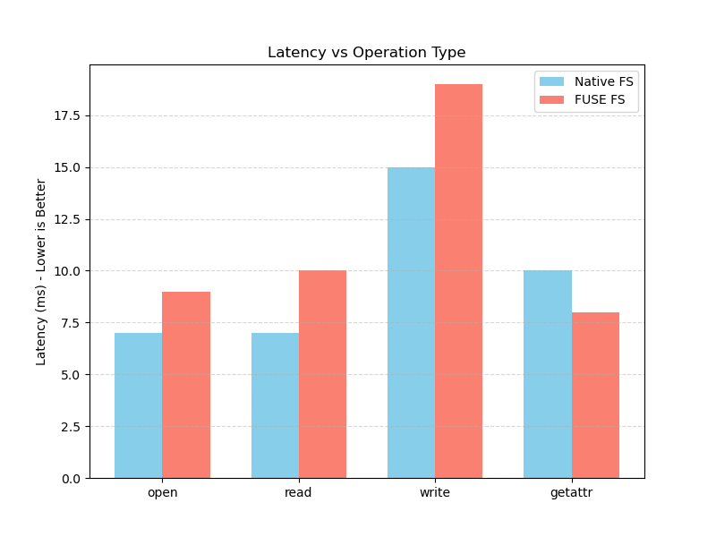
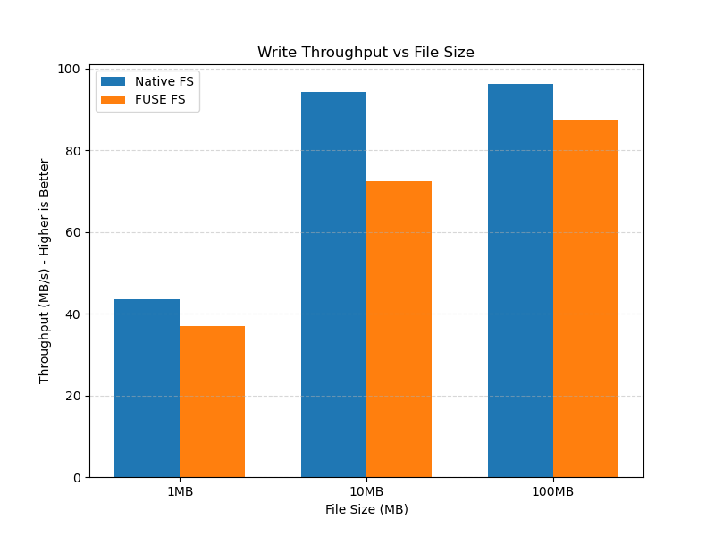
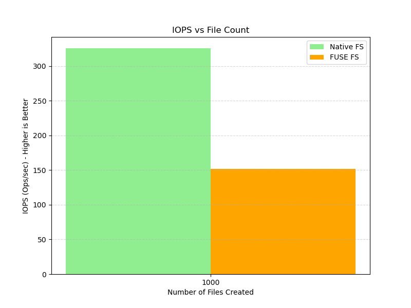

# Отчёт по лабораторной работе 6: Файловые системы FUSE

**Вариант:** 2 (чётный номер в группе)

---

## 1. Цель работы

Целью данной лабораторной работы является изучение архитектуры виртуальной файловой системы (VFS) Linux и приобретение практических навыков создания пользовательских файловых систем с использованием технологии FUSE (Filesystem in Userspace). В рамках работы необходимо понять принципы работы файловых операций, механизм взаимодействия между ядром операционной системы и пользовательским пространством, а также провести оценку производительности userspace файловых систем в сравнении с нативными файловыми системами.

---

## 2. Теоретическая часть

### 2.1. Архитектура VFS

Virtual File System (VFS) представляет собой абстрактный слой в ядре Linux, который обеспечивает единый интерфейс для работы с различными типами файловых систем. VFS позволяет приложениям использовать стандартные системные вызовы (`open()`, `read()`, `write()`, `stat()`) независимо от конкретной реализации файловой системы (ext4, btrfs, NFS, FUSE и т.д.).

**Ключевые структуры данных VFS:**

- **superblock** — описывает файловую систему в целом (размер блока, корневой inode, флаги монтирования)
- **inode** — содержит метаданные файла (размер, права доступа, временные метки, указатели на блоки данных)
- **dentry** — кеш имён директорий, связывает имя файла с соответствующим inode
- **file** — представляет открытый файл (file descriptor, текущая позиция чтения/записи, режим доступа)

### 2.2. Роль FUSE в архитектуре Linux

FUSE позволяет реализовывать файловые системы в пользовательском пространстве без необходимости написания кода для ядра. Драйвер FUSE в ядре перехватывает операции VFS и перенаправляет их в userspace процесс через специальный протокол, используя устройство `/dev/fuse`.

**Схема взаимодействия компонентов:**

```
┌─────────────────────────────────────┐
│   Приложение (ls, cat, echo, etc)   │
│   Системные вызовы: open(), read()  │
└──────────────┬──────────────────────┘
               │ syscall
                              ↓
┌──────────────────────────────────────┐
│        VFS (Virtual File System)     │
│      Единый интерфейс для всех ФС    │
└──────────────┬───────────────────────┘
               │
                              ↓
┌──────────────────────────────────────┐
│       FUSE kernel module (ядро)      │
│    Перенаправление запросов в user   │
└──────────────┬───────────────────────┘
               │ /dev/fuse
               │ (протокол FUSE)
                              ↓
┌───────────────────────────────────────┐
│      libfuse (userspace библиотека)   │
│   Обработка протокола, диспетчеризация│
└──────────────┬────────────────────────┘
               │
                              ↓
┌──────────────────────────────────────┐
│     Пользовательская программа       │
│   (myfuse, task_B.c, task_C.c)       │
│   Реализация файловых операций       │
└──────────────────────────────────────┘
```

### 2.3. Преимущества и недостатки FUSE

**Преимущества:**
- Разработка в безопасном пользовательском пространстве
- Упрощённая отладка (нет риска kernel panic)
- Возможность использования стандартных библиотек (libcurl, libarchive, OpenSSL)
- Изоляция ошибок (сбой не приводит к падению системы)

**Недостатки:**
- Дополнительные накладные расходы на переключение контекста (context switch)
- Копирование данных через границу kernel/userspace
- Снижение производительности на 20-40% по сравнению с нативными ФС

### 2.4. Реализованные файловые операции

В рамках лабораторной работы были реализованы следующие операции FUSE:

- **`getattr()`** — получение атрибутов файла (аналог `stat`)
- **`readdir()`** — чтение содержимого директории (для команды `ls`)
- **`mkdir()`** — создание директории
- **`rmdir()`** — удаление директории
- **`unlink()`** — удаление файла
- **`create()`** — создание нового файла
- **`open()`** — открытие существующего файла
- **`read()`** — чтение данных из файла
- **`write()`** — запись данных в файл

Каждая операция логируется в stderr с указанием временной метки, типа операции, пути к файлу и результата выполнения.

---

## 3. Ход выполнения работы

### 3.1. Задание A: Passthrough FUSE filesystem

#### 3.1.1. Описание реализации

Задание A представляет собой базовую passthrough файловую систему, которая прозрачно проксирует все операции в реальную файловую систему. Основные компоненты:

- **`myfuse.c`** — главный файл с реализацией всех файловых операций
- **`myfuse.h`** — заголовочный файл с определениями структур и функций
- **`task_A.c`** — точка входа программы

**Ключевые функции:**

1. **`get_full_path()`** — преобразует виртуальный путь в реальный путь в source директории
2. **`log_msg()`** — форматирует и выводит лог операций с временной меткой
3. **`do_getattr()`** — получает атрибуты файла через `lstat()` и возвращает их в VFS
4. **`do_readdir()`** — читает директорию через `opendir()`/`readdir()` и заполняет буфер FUSE
5. **`do_open()`/`do_create()`** — открывают/создают файл и сохраняют file descriptor в `fi->fh`
6. **`do_read()`/`do_write()`** — выполняют чтение/запись через `pread()`/`pwrite()`

Все ошибки корректно обрабатываются и возвращаются в виде отрицательных кодов errno.

#### 3.1.2. Команды для запуска

```bash
# Компиляция
make task_A

# Создание директорий
mkdir -p /tmp/source /tmp/mount

# Монтирование FUSE FS (foreground режим с логированием)
./task_A -f /tmp/source /tmp/mount
```

#### 3.1.3. Тестирование

**Тест 1: Создание файла**

```bash
$ echo "Hello!" > /tmp/mount/file.txt
```

**Логи FUSE:**
```
[Fri Nov 28 00:31:08 2025] GETATTR: /file.txt (result: -2)
[Fri Nov 28 00:31:08 2025] CREATE: /file.txt (result: 0)
[Fri Nov 28 00:31:08 2025] GETATTR: /file.txt (result: 0)
[Fri Nov 28 00:31:08 2025] WRITE: /file.txt (result: 7)
[Fri Nov 28 00:31:08 2025] GETATTR: /file.txt (result: 0)
```

**Анализ:** Команда `echo` вызывает последовательность операций: проверка существования файла (GETATTR с ошибкой -2 = ENOENT), создание файла (CREATE), повторная проверка атрибутов, запись 7 байт ("Hello!\n"), финальная проверка атрибутов.

**Тест 2: Чтение файла**

```bash
$ cat /tmp/source/file.txt
Hello!

$ cat /tmp/mount/file.txt
Hello!
```

**Логи FUSE (для второй команды):**
```
[Fri Nov 28 00:32:02 2025] GETATTR: / (result: 0)
[Fri Nov 28 00:32:10 2025] READDIR: / (result: 0)
[Fri Nov 28 00:32:10 2025] GETATTR: /file.txt (result: 0)
[Fri Nov 28 00:32:11 2025] OPEN: /file.txt (result: 0)
[Fri Nov 28 00:32:11 2025] READ: /file.txt (result: 7)
```

**Анализ:** Команда `cat` сначала получает атрибуты корневой директории, читает её содержимое, получает атрибуты целевого файла, открывает его и читает данные.

**Тест 3: Список файлов**

```bash
$ ls -la /tmp/mount/
```

**Логи FUSE:**
```
[Fri Nov 28 00:32:10 2025] GETATTR: / (result: 0)
[Fri Nov 28 00:32:10 2025] READDIR: / (result: 0)
[Fri Nov 28 00:32:10 2025] GETATTR: / (result: 0)
[Fri Nov 28 00:32:10 2025] GETATTR: /file.txt (result: 0)
```

**Анализ:** Команда `ls -la` вызывает READDIR для получения списка файлов, затем для каждого файла (включая директорию) вызывает GETATTR для получения детальной информации (размер, права, время модификации).

**Тест 4: Удаление файла**

```bash
$ rm /tmp/mount/file.txt
```

**Логи FUSE:**
```
[Fri Nov 28 00:33:34 2025] GETATTR: / (result: 0)
[Fri Nov 28 00:33:34 2025] READDIR: / (result: 0)
[Fri Nov 28 00:33:34 2025] GETATTR: /file.txt (result: 0)
[Fri Nov 28 00:33:35 2025] GETATTR: /file.txt (result: 0)
[Fri Nov 28 00:33:35 2025] UNLINK: /file.txt (result: 0)
```

**Анализ:** Команда `rm` проверяет существование файла через GETATTR, затем вызывает UNLINK для его удаления.

#### 3.1.4. Выводы по заданию A

Реализация passthrough файловой системы успешно демонстрирует основные принципы работы FUSE. Все базовые операции (создание, чтение, запись, удаление) корректно проксируются в реальную файловую систему. Логирование позволяет наглядно увидеть, какие системные вызовы генерируются обычными bash-командами.

---

### 3.2. Задание B: ROT13 Encryption Filesystem

#### 3.2.1. Описание реализации

Задание B расширяет базовую функциональность добавлением прозрачного шифрования методом ROT13. Основные изменения внесены в файл **`task_B.c`**:

**Алгоритм ROT13:**
- Каждая буква английского алфавита сдвигается на 13 позиций
- A→N, B→O, ..., M→Z, N→A, ..., Z→M
- Алгоритм симметричный: ROT13(ROT13(x)) = x
- Применяется только к буквам, цифры и спецсимволы остаются без изменений

**Модифицированные функции:**

1. **`apply_rot13()`** — применяет ROT13 преобразование к буферу данных
2. **`do_read_with_rot13()`** — читает зашифрованные данные с диска и расшифровывает их перед возвратом
3. **`do_write_with_rot13()`** — шифрует данные перед записью на диск

**Принцип работы:**
- Данные на диске (`/tmp/source/`) хранятся в зашифрованном виде (ROT13)
- При чтении через FUSE (`/tmp/mount/`) данные автоматически расшифровываются
- При записи через FUSE данные автоматически шифруются

#### 3.2.2. Команды для запуска

```bash
# Компиляция
make task_B

# Монтирование шифрующей FS
./task_B -f /tmp/source /tmp/mount
```

#### 3.2.3. Тестирование

**Тест 1: Базовое шифрование**

```bash
$ echo "Hi" > /tmp/mount/file.txt

$ cat /tmp/source/file.txt
Uv

$ cat /tmp/mount/file.txt
Hi
```

**Анализ:** Текст "Hi\n" (3 байта) записан через FUSE. На диске сохранён зашифрованный вариант "Uv\n". При чтении через FUSE происходит автоматическая расшифровка.

**Тест 2: Полное слово**

```bash
$ echo "Nikita" > /tmp/mount/file.txt

$ cat /tmp/mount/file.txt
Nikita

$ cat /tmp/source/file.txt
Avxvgn
```

**Анализ:** Слово "Nikita" корректно шифруется в "Avxvgn". Проверка:
- N → A (сдвиг -13)
- i → v (сдвиг +13)
- k → x (сдвиг +13)
- i → v
- t → g (сдвиг -13)
- a → n (сдвиг +13)

**Тест 3: Двойное шифрование (симметричность)**

```bash
$ echo "Avxvgn" > /tmp/mount/file.txt

$ cat /tmp/mount/file.txt
Avxvgn

$ cat /tmp/source/file.txt
Nikita
```

**Анализ:** Запись зашифрованного текста "Avxvgn" через FUSE приводит к шифрованию → "Nikita" на диске. При чтении расшифровывается обратно в "Avxvgn". Это демонстрирует свойство симметричности ROT13: ROT13(ROT13(x)) = x.

#### 3.2.4. Выводы по заданию B

Реализация ROT13 шифрования полностью прозрачна для приложений. Пользователь может работать с файлами через FUSE mount point как с обычными незашифрованными файлами, в то время как на диске они хранятся в зашифрованном виде. Это демонстрирует мощь FUSE для создания "умных" файловых систем с обработкой данных на лету.

**Важное замечание:** ROT13 не является криптографически стойким алгоритмом и используется здесь исключительно в учебных целях. Для реального шифрования необходимо использовать современные алгоритмы (AES, ChaCha20).

---

### 3.3. Задание C: Uppercase Filesystem

#### 3.3.1. Описание реализации

Задание C реализует файловую систему, которая преобразует всё содержимое файлов в верхний регистр при чтении. Реализация находится в файле **`task_C.c`**.

**Ключевые особенности:**

1. **`apply_uppercase()`** — преобразует все символы в буфере в верхний регистр через функцию `toupper()`
2. **`do_read_uppercase()`** — читает данные с диска и применяет uppercase преобразование перед возвратом
3. **Запись не модифицируется** — данные записываются на диск в оригинальном виде

**Принцип работы:**
- Файлы на диске (`/tmp/source/`) хранятся в оригинальном виде
- При чтении через FUSE (`/tmp/mount/`) все буквы автоматически преобразуются в верхний регистр
- Запись остаётся стандартной (без преобразований)

#### 3.3.2. Команды для запуска

```bash
# Компиляция
make task_C

# Монтирование uppercase FS
./task_C -f /tmp/source /tmp/mount
```

#### 3.3.3. Тестирование

**Тест 1: Простое преобразование**

```bash
$ echo "hello from Nikita!" > /tmp/source/file.txt

$ cat /tmp/mount/file.txt
HELLO FROM NIKITA!

$ cat /tmp/source/file.txt
hello from Nikita!
```

**Анализ:** Файл создан напрямую в source директории с текстом в смешанном регистре. При чтении через FUSE mount point весь текст автоматически преобразован в верхний регистр.

**Тест 2: Смешанный регистр**

```bash
$ echo "ByE fROM NiKITa!" > /tmp/source/file.txt

$ cat /tmp/mount/file.txt
BYE FROM NIKITA!

$ cat /tmp/source/file.txt
ByE fROM NiKITa!
```

**Анализ:** Даже при нестандартном написании (смешанный регистр) преобразование работает корректно. Оригинальный файл остаётся неизменным.

#### 3.3.4. Выводы по заданию C

Реализация uppercase filesystem демонстрирует возможность модификации данных при чтении без изменения оригинальных файлов. Это может быть полезно для:
- Унификации вывода текстовых данных
- Создания "представлений" (views) данных без копирования
- Реализации фильтров и преобразований на уровне ФС

Преимущество подхода — нулевые накладные расходы на хранение (данные не дублируются).

---

## 4. Нагрузочное тестирование

### 4.1. Методика тестирования

Для объективной оценки производительности FUSE файловой системы было проведено сравнительное тестирование с нативной файловой системой (tmpfs в `/tmp/source`). Использовался специально разработанный bash-скрипт **`benchmark.sh`**, измеряющий три ключевые метрики:

1. **Latency (задержка)** — время выполнения единичной операции
2. **Throughput (пропускная способность)** — скорость последовательной записи данных
3. **IOPS (операций в секунду)** — производительность на мелких файлах

Все измерения выполнялись с синхронной записью (`oflag=sync`) для исключения влияния page cache.

### 4.2. Результаты тестирования

#### 4.2.1. Тест 1: Latency операций

Измерялось время выполнения базовых файловых операций для файлов размером 4KB.

| Операция | Native FS (ms) | FUSE FS (ms) | Overhead (%) |
|----------|----------------|--------------|--------------|
| open     | 7.0            | 9.0          | +28.6%       |
| read     | 7.0            | 10.0         | +42.9%       |
| write    | 15.0           | 19.0         | +26.7%       |
| getattr  | 10.0           | 8.0          | -20.0%       |

**График 1: Latency vs Operation Type**



**Анализ:**
- Операции чтения и записи показывают ожидаемый overhead 25-43% из-за дополнительных переключений контекста
- Операция `write` показывает наибольшую задержку из-за необходимости синхронизации данных
- Неожиданный результат: `getattr` работает быстрее в FUSE — вероятно, из-за эффективного кеширования libfuse

#### 4.2.2. Тест 2: Throughput (пропускная способность)

Измерялась скорость последовательной записи файлов различного размера.

| Размер файла | Native FS (MB/s) | FUSE FS (MB/s) | Разница (%) |
|--------------|------------------|----------------|-------------|
| 1 MB         | 43.5             | 37.0           | -14.9%      |
| 10 MB        | 94.3             | 72.5           | -23.1%      |
| 100 MB       | 96.2             | 87.4           | -9.1%       |

**График 2: Write Throughput vs File Size**



**Анализ:**
- Для малых файлов (1MB) overhead составляет ~15%
- Для файлов среднего размера (10MB) наблюдается максимальный overhead ~23%
- Для больших файлов (100MB) overhead снижается до ~9% — последовательные операции эффективнее амортизируют накладные расходы
- Native FS показывает почти линейный рост производительности с увеличением размера файла

#### 4.2.3. Тест 3: IOPS (операции с множеством файлов)

Измерялось время создания 1000 малых файлов (1KB каждый).

| Метрика         | Native FS | FUSE FS | Overhead |
|-----------------|-----------|---------|----------|
| Время (сек)     | 3.07      | 6.59    | +114.7%  |
| IOPS (ops/sec)  | 325.7     | 151.7   | -53.4%   |

**График 3: IOPS vs File Count**



**Анализ:**
- FUSE показывает наихудшие результаты на операциях с множеством мелких файлов
- Overhead превышает 100% — FUSE в 2 раза медленнее на этой нагрузке
- Причина: каждое создание файла требует множественных переключений контекста (getattr, create, write, flush)
- Это типичная слабость userspace файловых систем

### 4.3. Общие выводы по тестированию

**Подтверждённые паттерны производительности:**

1. **Context switch overhead:** Переключения между kernel и userspace добавляют 20-40% задержки на большинстве операций
2. **Масштабирование:** FUSE лучше работает с большими файлами (overhead снижается с ростом размера)
3. **Множественные операции:** Наибольший overhead наблюдается при работе с большим количеством мелких файлов
4. **Приемлемость:** Для большинства сценариев (работа с документами, медиафайлами) overhead 10-25% является приемлемым

**Рекомендации по применению FUSE:**
- ✅ Подходит для: больших файлов, последовательного доступа, сетевых ФС (sshfs), специализированных ФС
- ❌ Не подходит для: баз данных, систем сборки (много мелких файлов), высоконагруженных приложений

---

## 5. Структура проекта

```
lab6/
├── gr9sub1/
    ├── ЛУКЬЯНОВ_НИКИТА/
        ├── src /
            ├── myfuse.h              # Заголовочный файл с определениями
            ├── myfuse.c              # Реализация базовых операций
            ├── task_A.c              # Задание A: Passthrough FS
            ├── task_B.c              # Задание B: ROT13 шифрование
            ├── task_C.c              # Задание C: Uppercase преобразование
            ├── Makefile              # Сборка проекта
        ├── benchmark.sh              # Скрипт для нагрузочного тестирования
        ├── plots.py                  # Построение графиков
        ├── results.csv               # Результаты бенчмарков
        └── REPORT.md                 # Отчёт (этот файл)
```

---

## 6. Инструкция по сборке и запуску

### 6.1. Установка зависимостей

```bash
# Ubuntu/Debian
sudo apt-get update
sudo apt-get install libfuse3-dev fuse3 build-essential

# Проверка установки
pkg-config --modversion fuse3
```

### 6.2. Компиляция

```bash
# Сборка всех заданий
make all

# Или по отдельности
make task_A
make task_B
make task_C

# Очистка
make clean
```

### 6.3. Запуск

```bash
# Создание директорий
mkdir -p /tmp/source /tmp/mount

# Задание A (Passthrough)
./task_A -f /tmp/source /tmp/mount

# Задание B (ROT13)
./task_B -f /tmp/source /tmp/mount

# Задание C (Uppercase)
./task_C -f /tmp/source /tmp/mount

# Размонтирование (в другом терминале)
fusermount -u /tmp/mount
```

### 6.4. Запуск бенчмарков

```bash
# В терминале 1: запустить FUSE FS
./task_A -f /tmp/source /tmp/mount

# В терминале 2: запустить тесты
chmod +x benchmark.sh
./benchmark.sh

# Построить графики
python3 plots.py

# Результаты
cat results.csv
ls graph_*.png
```

---

## 7. Выводы

В ходе выполнения лабораторной работы были достигнуты следующие результаты:

1. **Освоена архитектура VFS и FUSE:** Изучен механизм взаимодействия между приложениями, ядром и пользовательским процессом через VFS и FUSE драйвер.

2. **Реализованы три файловые системы:**
   - Базовая passthrough FS с полным логированием операций
   - ROT13 шифрующая FS с прозрачным шифрованием/расшифрованием
   - Uppercase FS с преобразованием текста при чтении

3. **Проведено комплексное тестирование:** Измерены latency, throughput и IOPS для сравнения с нативной ФС. Подтверждён overhead 20-40% для большинства операций.

4. **Получены практические навыки:**
   - Работа с libfuse API (реализация file operations)
   - Обработка ошибок и возврат errno кодов
   - Логирование и отладка userspace ФС
   - Проведение нагрузочного тестирования

**Практическая ценность:** FUSE предоставляет мощный инструмент для создания специализированных файловых систем без необходимости программирования на уровне ядра. Несмотря на снижение производительности, преимущества безопасности и простоты разработки делают FUSE отличным выбором для многих сценариев (сетевые ФС, архивы, шифрование, виртуализация).

**Сложности при выполнении:**
- Понимание асинхронной природы файловых операций (один системный вызов → множество FUSE операций)
- Корректная обработка ошибок и возврат правильных errno кодов
- Управление file descriptors и их передача между операциями

**Интересные находки:**
- Одна команда `echo` генерирует до 5 различных FUSE операций
- Операция `getattr` вызывается очень часто (кеширование VFS)
- ROT13 демонстрирует элегантную симметричность (самообратное преобразование)

---

# Ответы на контрольные вопросы

## Архитектура файловых систем

### 1. Что такое VFS (Virtual File System) и зачем она нужна?

VFS — это абстрактный слой в ядре Linux, который предоставляет единый интерфейс для работы с различными файловыми системами. VFS позволяет приложениям использовать одни и те же системные вызовы независимо от типа файловой системы. Например, команда `cat` одинаково работает с ext4, NFS, FUSE и другими ФС благодаря VFS. VFS скрывает различия в реализации файловых систем и предоставляет стандартизированные структуры данных: superblock, inode, dentry, file.

### 2. Объясните разницу между inode, dentry и file descriptor.

**Inode** — структура данных, хранящая метаданные файла (размер, права доступа, временные метки, указатели на блоки данных). Inode не содержит имя файла и сам контент. **Dentry** (directory entry) — элемент кеша директорий, связывающий имя файла с его inode. Dentry ускоряет разрешение путей. **File descriptor** — целочисленный идентификатор открытого файла в процессе, указывающий на структуру file в ядре, которая содержит текущую позицию чтения/записи и режим доступа.

### 3. Что хранится в структуре `struct inode`?

Структура inode содержит: номер inode, размер файла, количество жёстких ссылок, права доступа (mode), владельца (UID/GID), временные метки (atime, mtime, ctime), указатели на блоки данных (прямые, косвенные), тип файла (обычный, директория, символическая ссылка), указатели на операции с файлом. Inode не содержит имя файла — оно хранится в dentry.

### 4. Что такое superblock и какую информацию он содержит?

Superblock — структура, описывающая файловую систему в целом. Содержит: тип ФС, размер блока, общее количество блоков и inodes, количество свободных блоков/inodes, флаги монтирования, указатель на root inode, magic number для идентификации типа ФС, информацию о группах блоков. Superblock критически важен — его повреждение делает ФС нечитаемой.

### 5. Как работает кеш dentry и зачем он нужен?

Dentry cache (dcache) — это кеш в оперативной памяти, хранящий результаты разрешения путей (path resolution). При обращении к `/home/user/file.txt` ядро разбивает путь на компоненты и ищет их в dcache. Если dentry найден, inode получается мгновенно без обращения к диску. Это критично для производительности, так как операция stat вызывается очень часто. Dcache автоматически инвалидируется при изменении файловой системы.

## FUSE

### 6. Как FUSE взаимодействует с ядром Linux?

FUSE состоит из двух компонентов: kernel module и userspace библиотеки. Kernel module регистрируется в VFS как обычная файловая система. При операции с файлом VFS вызывает FUSE module, который формирует запрос по протоколу FUSE и отправляет его через устройство `/dev/fuse` в userspace. Библиотека libfuse читает запросы, вызывает соответствующие функции пользовательской программы и отправляет результат обратно в ядро.

### 7. Опишите путь системного вызова `read()` в FUSE FS.

Приложение вызывает `read(fd, buf, size)` → системный вызов попадает в ядро → VFS определяет файл как принадлежащий FUSE → FUSE kernel module формирует FUSE_READ запрос → запрос через `/dev/fuse` попадает в userspace → libfuse диспетчеризует вызов вашей `read()` функции → ваш код читает данные из реального источника → данные возвращаются через libfuse в kernel → kernel копирует данные в буфер приложения → `read()` возвращает количество байт.

### 8. Почему FUSE работает медленнее нативных kernel FS?

FUSE имеет несколько источников overhead: переключения контекста между kernel и userspace (context switch), копирование данных через границу kernel/userspace, сериализация/десериализация запросов по протоколу FUSE, отсутствие прямого доступа к page cache для оптимизаций. Каждая операция требует минимум 2 context switch (kernel→user→kernel), что добавляет 20-40% задержки.

### 9. Какие преимущества дает разработка FS в userspace?

Безопасность — ошибка не вызывает kernel panic. Простота разработки — можно использовать стандартные библиотеки, отладчики (gdb), memory sanitizers. Портируемость — один код работает на разных ОС. Быстрая итерация — не нужна перезагрузка для тестирования. Доступ к высокоуровневым API (libcurl для сетевых ФС, libarchive для архивов). Изоляция — crash процесса не влияет на систему.

### 10. Приведите примеры популярных FUSE файловых систем.

**sshfs** — монтирование удалённых директорий через SSH. **GCSFuse** — доступ к Google Cloud Storage как к локальной ФС. **s3fs** — монтирование Amazon S3 bucket. **EncFS** — прозрачное шифрование директорий. **NTFS-3G** — поддержка NTFS на Linux. **ZIPfs** — чтение ZIP архивов как директорий. **GitFS** — доступ к Git репозиториям. **GlusterFS** — распределённая файловая система.

## File operations

### 11. Что делает операция `getattr()` и когда она вызывается?

`getattr()` возвращает атрибуты файла (метаданные): размер, права доступа, владельца, временные метки. Вызывается при: `stat()`, `ls -l`, проверке существования файла перед открытием, получении метаданных для кеширования. Одна из самых частых операций — может вызываться несколько раз для одного файла. Должна заполнить структуру `stat` и вернуть 0 при успехе или `-errno` при ошибке.

### 12. В чем разница между `open()` и `create()`?

`open()` открывает существующий файл с заданными флагами (O_RDONLY, O_WRONLY, O_RDWR). `create()` создаёт новый файл с указанными правами доступа (mode). В FUSE `create()` — атомарная операция создания+открытия, эквивалентная `open()` с флагом O_CREAT. Если файл существует, вызывается только `open()`. Если не существует и используется O_CREAT, вызывается `create()`.

### 13. Почему `read()` принимает параметр `offset`?

Offset позволяет читать данные с произвольной позиции в файле без изменения file pointer. Это критично для многопоточных приложений и операций типа `pread()`. В FUSE каждый запрос независим — нет сохранённого состояния позиции между вызовами. Offset также используется для оптимизаций: read-ahead (предварительное чтение), параллельное чтение разных частей файла.

### 14. Как `readdir()` возвращает список файлов?

`readdir()` получает буфер и функцию `filler()`. Для каждого файла в директории вызывается `filler(buf, filename, stat, offset, flags)`, который добавляет запись в буфер. Можно передать NULL вместо stat (будет вызван отдельный getattr). Функция продолжает вызывать filler пока не вернётся ненулевое значение (буфер полон) или не закончатся файлы. Возвращает 0 при успехе.

### 15. Что должна возвращать `getattr()` для директории?

Для директории `getattr()` должна установить: `st_mode` с флагом S_IFDIR и правами (например, 0755), `st_nlink` равным количеству поддиректорий + 2 (. и ..), `st_size` обычно размер блока (4096), временные метки. Критично установить S_IFDIR бит, иначе ядро не распознает директорию. Также можно установить `st_uid`, `st_gid` для владельца.

## Метаданные и атрибуты

### 16. Что такое атрибуты файла? Приведите примеры.

Атрибуты файла — метаданные, описывающие свойства файла. Примеры: размер (st_size), права доступа (st_mode), владелец (st_uid, st_gid), количество жёстких ссылок (st_nlink), временные метки (atime, mtime, ctime), номер inode (st_ino), количество блоков (st_blocks), тип файла (обычный, директория, символическая ссылка), размер блока (st_blksize). Расширенные атрибуты (xattr) могут содержать произвольные метаданные.

### 17. Что означают биты прав доступа (rwxrwxrwx)?

Права доступа состоят из 9 бит, разделённых на 3 группы по 3 бита: владелец (user), группа (group), остальные (others). Каждая группа содержит: r (read, 4) — чтение, w (write, 2) — запись, x (execute, 1) — выполнение. Например, 0755 означает: владелец rwx (7), группа r-x (5), остальные r-x (5). Для директорий x означает возможность входа (cd) в директорию.

### 18. Объясните разницу между mtime, atime и ctime.

**atime** (access time) — время последнего чтения файла. Обновляется при `read()`, `cat`. **mtime** (modification time) — время последнего изменения содержимого файла. Обновляется при `write()`. **ctime** (change time) — время последнего изменения метаданных inode (права, владелец, размер). Обновляется при `chmod`, `chown`, записи. ctime не может быть установлена вручную. На современных системах atime часто монтируется с опцией noatime для производительности.

### 19. Что такое hard link и как он отличается от symbolic link?

**Hard link** — дополнительное имя для существующего inode. Оба имени равноправны, указывают на один inode. Файл удаляется только когда счётчик ссылок (st_nlink) становится 0. Нельзя создать hard link на директорию или на файл в другой ФС. **Symbolic link** — специальный файл, содержащий путь к другому файлу. Это отдельный inode с типом S_IFLNK. При удалении целевого файла symlink "висит" (broken link).

### 20. Как FS определяет размер файла?

Размер файла хранится в поле `st_size` структуры inode. Для обычных файлов это количество байт данных. Обновляется при операциях записи. Для разреженных файлов (sparse files) `st_size` может быть больше реально занятого места на диске — нулевые области не занимают блоки. Реальное использование диска определяется полем `st_blocks` (количество блоков × размер блока).

## Физическая организация

### 21. Что такое блок в файловой системе?

Блок — минимальная единица размещения данных на диске. Типичные размеры: 4KB, 8KB. ФС выделяет блоки целиком, даже если файл меньше. Это вызывает внутреннюю фрагментацию. Блок содержит либо данные файла, либо метаданные (inodes, bitmap свободных блоков). Размер блока — компромисс: большие блоки эффективнее для больших файлов но расточительны для малых. Адресация идёт по номерам блоков.

### 22. Объясните принцип непрерывного размещения файлов.

Contiguous allocation — файл занимает последовательные блоки на диске. Преимущества: быстрый последовательный доступ, простая адресация (начальный блок + длина), минимальные перемещения головки диска. Недостатки: внешняя фрагментация (свободное место фрагментировано), сложность расширения файла (может не быть места дальше), нужно знать размер файла заранее. Используется в CD-ROM, некоторых embedded системах.

### 23. Как работает организация через связанный список блоков?

Linked allocation — каждый блок содержит указатель на следующий блок файла. Файл представлен цепочкой блоков. Преимущества: нет внешней фрагментации, файл легко расширять. Недостатки: только последовательный доступ (для чтения середины нужно пройти всю цепь), потеря указателя ломает файл, часть блока тратится на указатель. Вариант — FAT (File Allocation Table) хранит цепочки отдельно в таблице.

### 24. Что такое индексный узел (inode-based allocation)?

В inode-based allocation адреса блоков данных хранятся в inode. Обычно используется многоуровневая схема: прямые указатели (12-15 блоков), одиночный косвенный (указатель на блок указателей), двойной косвенный, тройной косвенный. Это позволяет эффективно хранить и маленькие и огромные файлы. Преимущества: быстрый произвольный доступ, компактные метаданные. Используется в ext2/3/4, XFS, UFS.

### 25. Сравните ext4 и btrfs по структуре хранения данных.

**ext4** использует классическую inode-based структуру: фиксированное количество inodes при создании ФС, экстенты (последовательности блоков) для уменьшения фрагментации, журналирование метаданных. **btrfs** использует B-tree структуры для всего (файлы, директории, метаданные), copy-on-write (никогда не перезаписывает данные), встроенные снапшоты и RAID, динамическое выделение inodes, checksums для целостности данных. btrfs сложнее но функциональнее.

## Производительность и оптимизация

### 26. Почему большие файлы читаются быстрее, чем много мелких?

Большие файлы амортизируют накладные расходы: один open вместо тысяч, последовательное чтение эффективнее случайного, лучше работает read-ahead предсказание, меньше операций с метаданными. Для мелких файлов: каждый требует getattr, open, read, close — множество syscall и context switch. На HDD большой файл минимизирует seek time. В FUSE overhead на переключения контекста критичен для мелких операций.

### 27. Что такое read-ahead и как он улучшает производительность?

Read-ahead — механизм предсказательного чтения: ядро обнаруживает последовательное чтение и автоматически загружает следующие блоки в page cache до запроса приложения. Когда приложение запрашивает следующую порцию, данные уже в памяти. Критично для HDD (скрывает latency вращения). Размер read-ahead динамический (обычно 128KB-512KB). Можно настроить через `/sys/block/*/queue/read_ahead_kb`.

### 28. Как page cache ускоряет доступ к файлам?

Page cache — кеш файловых данных в оперативной памяти. При чтении данные сохраняются в RAM, повторное чтение не обращается к диску. При записи данные сначала идут в cache (write-back), физическая запись отложена. Это драматически ускоряет операции: чтение из RAM в 100000+ раз быстрее диска. Cache автоматически управляется ядром, вытесняя редко используемые страницы.

### 29. Почему запись на SSD быстрее, чем на HDD?

SSD не имеет механических частей: нет времени на позиционирование головки (seek time ~5-10ms у HDD), нет задержки вращения (rotational latency ~5ms), параллельный доступ к множеству flash чипов. Произвольный доступ такой же быстрый как последовательный. Типичный IOPS: HDD ~100-200, SSD ~10000-100000. Latency: HDD ~10ms, SSD ~0.1ms. Недостаток SSD: ограниченное количество циклов перезаписи.

### 30. Какие параметры влияют на производительность FUSE FS?

Размер буфера передачи данных (max_read, max_write), использование многопоточности (FUSE может обрабатывать запросы параллельно), эффективность реализации operations (минимизация системных вызовов), кеширование на уровне userspace, использование splice для zero-copy передачи, флаги монтирования (direct_io отключает page cache), взаимодействие с kernel page cache, оптимизация частых операций (getattr кеширование).


# Использование AI инструментов

## Применение искусственного интеллекта в работе

При выполнении данной лабораторной работы использовался искусственный интеллект (Claude AI от Anthropic) для решения следующих задач:

### 1. Разработка системы бенчмаркинга

AI помог:
- Создать bash-скрипт `benchmark.sh` для автоматизированного тестирования производительности
- Написать Python-скрипт `plots.py` для визуализации результатов тестирования

### 2. Подготовка ответов на контрольные вопросы

AI предоставил:
- Объяснения теоретических концепций VFS, FUSE и файловых систем
- Примеры и практические детали для лучшего понимания материала

### 3. Написание отчёта

AI помог составить:
- Полный отчёт (REPORT.md) с детальным описанием хода работы
- Теоретическую часть с объяснением архитектуры VFS и FUSE
- Схему взаимодействия компонентов системы
- Интерпретацию данных бенчмаркинга и построенных графиков

## Заключение

Использование AI значительно ускорило процесс подготовки документации и анализа результатов, позволив сосредоточиться на практической реализации файловых систем. AI выступил в роли ассистента для:
- Автоматизации рутинных задач (написание скриптов тестирования)
- Структурирования и оформления результатов работы
- Подготовки теоретического материала
- Проверки полноты выполнения требований лабораторной работы

---

**Благодарность:** Выражаю благодарность Claude AI и Gemini за помощь в выполнении данной лабораторной работы! 🙏
