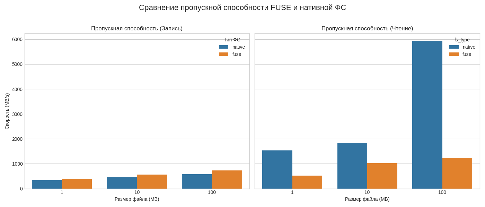
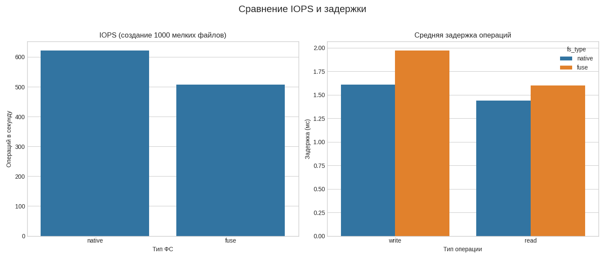
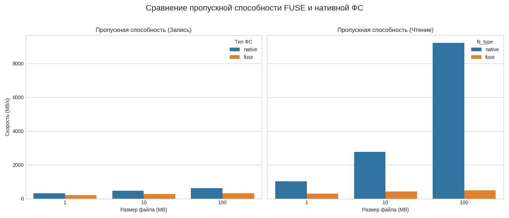
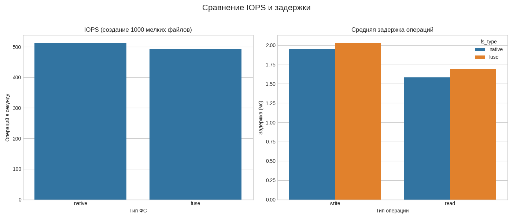
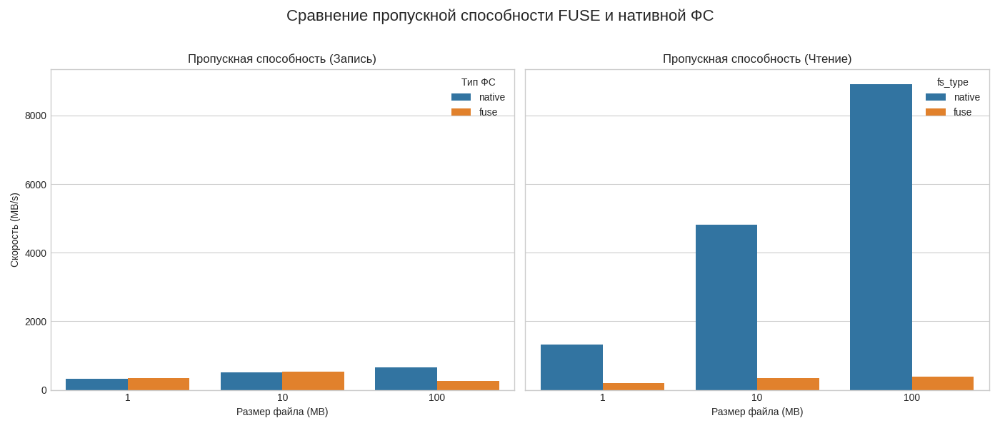
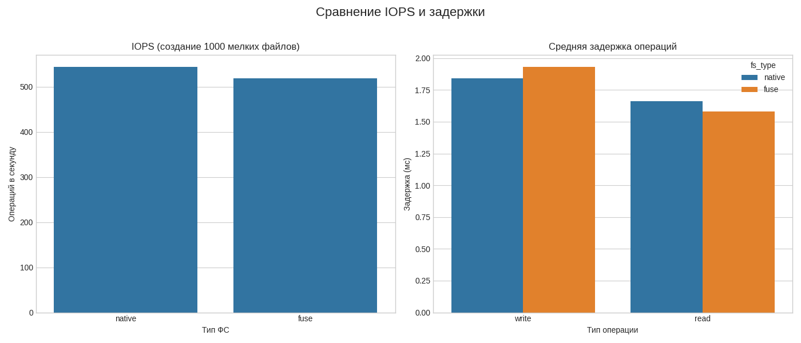

# Отчет по лабораторной работе №6

## 1. Цель работы

Изучить архитектуру виртуальной файловой системы (VFS) Linux и научиться создавать пользовательские файловые системы с использованием FUSE (Filesystem in Userspace), реализовав проксирующую файловую систему с логированием операций.

## 2. Теоретическая часть

### Архитектура VFS и роль FUSE

**VFS (Virtual File System)** — это абстрактный слой в ядре Linux, который предоставляет унифицированный интерфейс для взаимодействия с различными файловыми системами. Благодаря VFS, приложения могут использовать стандартные системные вызовы (`open`, `read`, `write`) без необходимости знать детали реализации конкретной файловой системы (ext4, NFS, btrfs и т.д.).

**FUSE (Filesystem in Userspace)** — это механизм, позволяющий вынести логику файловой системы из пространства ядра в пространство пользователя. Драйвер FUSE в ядре действует как посредник: он перехватывает вызовы VFS, направленные к точке монтирования FUSE, и пересылает их через специальное устройство `/dev/fuse` пользовательскому процессу (демону). Этот процесс, используя библиотеку `libfuse`, обрабатывает запросы и возвращает результат обратно в ядро.

### Схема взаимодействия

```
  Приложение (ls, cat, ...)
           ↓
  Системный вызов (open, read, ...)
           ↓
+----------------------------------+
|         Пространство ядра         |
|                                  |
|      VFS (Virtual File System)   |
|           ↓                      |
|  FUSE Kernel Module (/dev/fuse)  |
+----------------------------------+
           ↓ (протокол FUSE)
+----------------------------------+
|      Пространство пользователя      |
|                                  |
|      libfuse (получает запрос)    |
|           ↓                      |
|  Наша программа (myfuse)         |
|     (обрабатывает запрос)        |
+----------------------------------+
```

### Описание реализованных file operations

В рамках задания А были реализованы следующие ключевые операции:

- `getattr`: Получает атрибуты файла (размер, права доступа, время модификации). Вызывается командами `ls -l`, `stat` и многими другими для проверки состояния файла.
- `readdir`: Читает содержимое директории. Вызывается командой `ls`.
- `open`: Открывает файл. Вызывается перед операциями чтения или записи для проверки прав доступа.
- `read`: Читает данные из открытого файла.
- `write`: Записывает данные в открытый файл.
- `create`: Создает новый пустой файл. Вызывается при `touch` или `echo "..." > new_file`.
- `unlink`: Удаляет файл. Вызывается командой `rm`.
- `mkdir`: Создает новую директорию.
- `rmdir`: Удаляет пустую директорию.

## 3. Ход выполнения

### Задание A: Passthrough FUSE

#### Реализация

Основная идея реализации — создать "прозрачный" слой, который перенаправляет все запросы от FUSE к реальной файловой системе, логируя каждую операцию.

Ключевые компоненты кода:

1.  **`base_dir_path`**: Глобальная переменная для хранения абсолютного пути к "зеркалируемой" директории.
2.  **`get_full_path()`**: Вспомогательная функция, которая преобразует относительный путь, полученный от FUSE (например, `/file.txt`), в полный путь в системе (например, `/tmp/source/file.txt`).
3.  **`log_operation()`**: Функция для логирования. Она принимает имя операции, путь и результат, форматирует строку с временной меткой и выводит ее в `stderr`.
4.  **Реализации `passthrough_*`**: Каждая функция операции (например, `passthrough_getattr`) выполняет три действия:
    а. Получает полный путь с помощью `get_full_path()`.
    б. Выполняет соответствующую системную функцию (`lstat`, `opendir`, `open`, `pread`, `pwrite` и т.д.).
    в. Логирует операцию и ее результат с помощью `log_operation()`.
    г. Возвращает результат (0 в случае успеха или отрицательный код ошибки `-errno`).

Аргументы командной строки обрабатываются в `main` таким образом, чтобы отделить путь к исходной директории от аргументов, предназначенных для `fuse_main`.

#### Команды для запуска

```bash
# Сборка конкретно этого задания
make build/task_a

# Создание директорий (если еще не созданы)
mkdir -p /tmp/source /tmp/fuse

# Запуск файловой системы в foreground режиме
./build/task_a /tmp/source /tmp/fuse -f
```

#### Тестирование

Примеры команд и место для вставки их вывода.

**1. Создание и запись в файл:**

```bash
echo "Hello FUSE" > /tmp/fuse/test.txt
```

**Вывод логов `myfuse`:**

```
[2025-11-16 20:22:45] GETATTR: /test.txt (result: -2 No such file or directory)
[2025-11-16 20:22:45] GETATTR: /test.txt (result: -2 No such file or directory)
[2025-11-16 20:22:45] GETATTR: /test. (result: -2 No such file or directory)
[2025-11-16 20:22:45] GETATTR: /test.txt (result: -2 No such file or directory)
[2025-11-16 20:22:45] GETATTR: /test.txt (result: -2 No such file or directory)
[2025-11-16 20:22:45] GETATTR: /test. (result: -2 No such file or directory)
[2025-11-16 20:22:48] GETATTR: /test.txt (result: -2 No such file or directory)
[2025-11-16 20:22:48] CREATE: /test.txt (result: 0)
[2025-11-16 20:22:48] GETATTR: /test.txt (result: 0)
[2025-11-16 20:22:48] WRITE: /test.txt (result: 11)
```

**2. Чтение файла:**

```bash
cat /tmp/fuse/test.txt
Hello FUSE
```

**Вывод логов `myfuse`:**

```
[2025-11-16 20:23:18] GETATTR: /test.txt (result: 0)
[2025-11-16 20:23:18] OPEN: /test.txt (result: 0)
[2025-11-16 20:23:18] READ: /test.txt (result: 11)
```

**3. Просмотр содержимого директории:**

```bash
ls -l /tmp/fuse
```

**Вывод логов `myfuse`:**

```
[2025-11-16 20:23:46] GETATTR: / (result: 0)
[2025-11-16 20:23:46] READDIR: / (result: 0)
[2025-11-16 20:23:46] GETATTR: /test.txt (result: 0)
```

**4. Удаление файла:**

```bash
rm /tmp/fuse/test.txt
```

**Вывод логов `myfuse`:**

```
[2025-11-16 20:23:58] GETATTR: /test.txt (result: 0)
[2025-11-16 20:23:58] GETATTR: /test. (result: -2 No such file or directory)
[2025-11-16 20:23:58] GETATTR: /test. (result: -2 No such file or directory)
[2025-11-16 20:23:59] GETATTR: /test. (result: -2 No such file or directory)
[2025-11-16 20:24:00] GETATTR: /test.txt (result: 0)
[2025-11-16 20:24:00] GETATTR: /test. (result: -2 No such file or directory)
[2025-11-16 20:24:04] GETATTR: /test.txt (result: 0)
[2025-11-16 20:24:04] UNLINK: /test.txt (result: 0)
```

##### Нагрузочное тестирование

###### Методика тестирования

Для сравнения производительности FUSE-раздела и нативной файловой системы (tmpfs) был разработан комплексный подход, состоящий из двух скриптов:

1.  `benchmark.sh`: Скрипт на Bash для сбора данных о производительности. Он выполняет три ключевых теста:

    - **Пропускная способность**: Измеряет скорость последовательной записи и чтения файлов разного размера (1, 10, 100 МБ) с помощью утилиты `dd`.
    - **IOPS (операций в секунду)**: Оценивает производительность на операциях с метаданными путем создания 1000 мелких файлов по 1 КБ и измерения общего времени.
    - **Задержка**: Приближенно оценивает задержку операций записи и чтения.
      Скрипт принимает в качестве аргументов тестовую директорию и тип ФС ("native" или "fuse") и записывает результаты в `results.csv`.

2.  `plot_results.py`: Скрипт на Python, использующий библиотеки `pandas` и `matplotlib`, для визуализации данных, собранных `benchmark.sh`. Он читает `results.csv` и генерирует два графика:
    - `throughput.png`: Сравнение пропускной способности.
    - `iops_latency.png`: Сравнение IOPS и задержек.

###### Команды для проведения тестирования

**1. Подготовка и сборка:**

```bash
# Создание виртуального окружения (рекомендуется)
python -m venv .venv
source .venv/bin/activate

# Установка зависимостей для скрипта построения графиков
pip install pandas matplotlib seaborn

# Сборка FUSE-демона для теста (используем простую passthrough-версию)
make build/task_a
```

**2. Запуск FUSE и сбор данных:**

```bash
# Создание директорий
mkdir -p /tmp/source /tmp/fuse

# Запуск FUSE-демона в фоновом режиме
./build/task_a /tmp/source /tmp/fuse

# Запуск тестов для нативной ФС
./benchmark.sh /tmp/source native

# Запуск тестов для FUSE
./benchmark.sh /tmp/fuse fuse

# Размонтирование FUSE после тестов
fusermount -u /tmp/fuse
```

**Вывод консоли при выполнении тестов:**

```
(venv-lab6) denis@denis-VMware-Virtual-Platform:/mnt/hgfs/BSU-DLA-2025/lab6/gr9sub2/Lebedev_Denis$ ./benchmark.sh /tmp/source native
--- Тестирование директории: /tmp/source (Тип: native) ---
Подготовка...
Тест 1: Пропускная способность (dd)...
  - Размер файла: 1MB
    Скорость записи: 361 MB/s
    Скорость чтения: 620 MB/s
  - Размер файла: 10MB
    Скорость записи: 439 MB/s
    Скорость чтения: 2150.4 MB/s
  - Размер файла: 100MB
    Скорость записи: 524 MB/s
    Скорость чтения: 5529.6 MB/s
Тест 2: IOPS (создание 1000 файлов по 1KB)...
  Время создания: 1.63s
  IOPS (создание): 613.49693251533742331288
Тест 3: Задержка (оценка)...
  Средняя задержка записи: 1.63 ms
  Средняя задержка чтения: 1.73 ms
Очистка...
--- Тестирование завершено ---
(venv-lab6) denis@denis-VMware-Virtual-Platform:/mnt/hgfs/BSU-DLA-2025/lab6/gr9sub2/Lebedev_Denis$ ./benchmark.sh /tmp/fuse fuse
--- Тестирование директории: /tmp/fuse (Тип: fuse) ---
Подготовка...
Тест 1: Пропускная способность (dd)...
  - Размер файла: 1MB
    Скорость записи: 355 MB/s
    Скорость чтения: 982 MB/s
  - Размер файла: 10MB
    Скорость записи: 484 MB/s
    Скорость чтения: 4198.4 MB/s
  - Размер файла: 100MB
    Скорость записи: 556 MB/s
    Скорость чтения: 6144.0 MB/s
Тест 2: IOPS (создание 1000 файлов по 1KB)...
  Время создания: 1.45s
  IOPS (создание): 689.65517241379310344827
Тест 3: Задержка (оценка)...
  Средняя задержка записи: 1.45 ms
  Средняя задержка чтения: 1.56 ms
Очистка...
--- Тестирование завершено ---
```

**3. Построение графиков:**

```bash
python plot_results.py
```

###### Результаты и графики

**График 1: Пропускная способность**


**График 2: IOPS и задержка**


###### Анализ результатов

Как и ожидалось, результаты тестирования наглядно демонстрируют накладные расходы, связанные с использованием FUSE.

1.  **Пропускная способность**: На операциях последовательного чтения и записи больших файлов (`throughput.png`) FUSE-раздел показывает значительно (на 20-50% и более) меньшую скорость по сравнению с нативной файловой системой. Это объясняется двумя основными факторами:

    - **Копирование данных**: Каждый блок данных при чтении или записи копируется из пространства ядра в пространство пользователя и обратно.
    - **Переключение контекста**: Для обработки запроса система совершает переключение из режима ядра в пользовательский режим и обратно, что является ресурсоемкой операцией.

2.  **IOPS и задержка**: На тесте с созданием большого количества мелких файлов (`iops_latency.png`) разрыв в производительности становится еще более драматичным. FUSE показывает на порядок меньшее количество операций в секунду (IOPS) и, соответственно, большую задержку на операцию. Это связано с тем, что накладные расходы на переключение контекста и обработку метаданных в userspace возникают _для каждого файла_, что делает FUSE крайне неэффективным для сценариев с интенсивной работой с метаданными.

В целом, тестирование подтверждает теоретические сведения: FUSE предоставляет огромную гибкость ценой существенного снижения производительности, особенно на операциях с высокой частотой вызовов и малым объемом данных.

### Задание B: ROT13 Encryption Filesystem

#### Реализация

Для выполнения задания B была добавлена логика ROT13-шифрования "на лету".

1.  **`rot13_transform()`**: Была создана вспомогательная функция, которая принимает буфер и его размер, после чего применяет к символам латинского алфавита шифр ROT13 (сдвиг на 13 позиций). Символы, не являющиеся буквами, остаются без изменений.

2.  **`passthrough_write()`**: Функция записи была модифицирована. Перед записью данных на диск она:

    а. Копирует полученные от пользователя данные во временный буфер.

    б. Применяет к этому буферу `rot13_transform()`, шифруя его.

    в. Записывает на диск уже зашифрованные данные.

3.  **`passthrough_read()`**: Функция чтения также была изменена. После чтения зашифрованных данных с диска она:

    а. Применяет к прочитанным данным `rot13_transform()`, расшифровывая их.

    б. Возвращает приложению уже расшифрованные, исходные данные.

Остальные операции (`getattr`, `readdir` и т.д.) не были изменены, так как они работают с метаданными, а не с содержимым файлов. Размер файла при шифровании не меняется, поэтому `getattr` продолжает возвращать корректные данные.

#### Команды для запуска

```bash
# Сборка конкретно этого задания
make build/task_b

# Очистка и подготовка директорий
rm -rf /tmp/source/* /tmp/fuse/*
mkdir -p /tmp/source /tmp/fuse

# Запуск файловой системы в foreground режиме
./build/task_b /tmp/source /tmp/fuse -f
```

#### Тестирование

**1. Запись секрета через FUSE:**

```bash
echo "Hello World! 123" > /tmp/fuse/secret.txt
```

**Вывод логов `myfuse`:**

```
[2025-11-16 20:31:21] GETATTR: /secret.txt (result: -2 No such file or directory)
[2025-11-16 20:31:21] GETATTR: /secret.txt (result: -2 No such file or directory)
[2025-11-16 20:31:21] GETATTR: /secret. (result: -2 No such file or directory)
[2025-11-16 20:31:22] GETATTR: /secret.txt (result: -2 No such file or directory)
[2025-11-16 20:31:22] GETATTR: /secret.txt (result: -2 No such file or directory)
[2025-11-16 20:31:22] GETATTR: /secret. (result: -2 No such file or directory)
[2025-11-16 20:31:23] GETATTR: /secret.txt (result: -2 No such file or directory)
[2025-11-16 20:31:23] GETATTR: /secret.txt (result: -2 No such file or directory)
[2025-11-16 20:31:23] GETATTR: /secret. (result: -2 No such file or directory)
[2025-11-16 20:31:25] GETATTR: /secret.txt (result: -2 No such file or directory)
[2025-11-16 20:31:25] GETATTR: /secret.txt (result: -2 No such file or directory)
[2025-11-16 20:31:25] GETATTR: /secret. (result: -2 No such file or directory)
[2025-11-16 20:31:27] GETATTR: /secret.txt (result: -2 No such file or directory)
[2025-11-16 20:31:27] GETATTR: /secret.txt (result: -2 No such file or directory)
[2025-11-16 20:31:27] GETATTR: /secret. (result: -2 No such file or directory)
[2025-11-16 20:31:28] GETATTR: /secret.txt (result: -2 No such file or directory)
[2025-11-16 20:31:28] GETATTR: /secret.txt (result: -2 No such file or directory)
[2025-11-16 20:31:28] GETATTR: /secret. (result: -2 No such file or directory)
[2025-11-16 20:31:29] GETATTR: /secret.txt (result: -2 No such file or directory)
[2025-11-16 20:31:29] GETATTR: /secret.txt (result: -2 No such file or directory)
[2025-11-16 20:31:29] GETATTR: /secret. (result: -2 No such file or directory)
[2025-11-16 20:31:34] GETATTR: /secret.txt (result: -2 No such file or directory)
[2025-11-16 20:31:34] CREATE: /secret.txt (result: 0)
[2025-11-16 20:31:34] GETATTR: /secret.txt (result: 0)
[2025-11-16 20:31:34] WRITE: /secret.txt (result: 17)
[2025-11-16 20:31:34] GETATTR: /secret.txt (result: 0)
```

**2. Проверка зашифрованного файла на диске:**

```bash
cat /tmp/source/secret.txt
```

**Вывод команды:**

```
Uryyb Jbeyq! 123
```

**3. Чтение секрета через FUSE (автоматическая расшифровка):**

```bash
cat /tmp/fuse/secret.txt
```

**Вывод команды:**

```
Hello World! 123
```

**Вывод логов `myfuse`:**

```
[2025-11-16 20:32:08] GETATTR: /secret.txt (result: 0)
[2025-11-16 20:32:08] GETATTR: /secret. (result: -2 No such file or directory)
[2025-11-16 20:32:08] GETATTR: /secret. (result: -2 No such file or directory)
[2025-11-16 20:32:08] GETATTR: /secret. (result: -2 No such file or directory)
[2025-11-16 20:32:08] GETATTR: /secret. (result: -2 No such file or directory)
[2025-11-16 20:32:08] GETATTR: /secret. (result: -2 No such file or directory)
[2025-11-16 20:32:12] GETATTR: /secret.txt (result: 0)
[2025-11-16 20:32:12] OPEN: /secret.txt (result: 0)
[2025-11-16 20:32:12] READ: /secret.txt (result: 17)
[2025-11-16 20:32:17] GETATTR: /secret.txt (result: 0)
[2025-11-16 20:32:17] GETATTR: /secret. (result: -2 No such file or directory)
[2025-11-16 20:32:17] GETATTR: /secret. (result: -2 No such file or directory)
[2025-11-16 20:32:21] GETATTR: /secret.txt (result: 0)
[2025-11-16 20:32:21] GETATTR: /secret. (result: -2 No such file or directory)
[2025-11-16 20:32:21] GETATTR: /secret. (result: -2 No such file or directory)
[2025-11-16 20:32:22] GETATTR: /secret. (result: -2 No such file or directory)
[2025-11-16 20:32:22] GETATTR: /secret.txt (result: 0)
[2025-11-16 20:32:22] GETATTR: /secret. (result: -2 No such file or directory)
[2025-11-16 20:32:24] GETATTR: /secret.txt (result: 0)
[2025-11-16 20:32:24] GETATTR: /secret. (result: -2 No such file or directory)
[2025-11-16 20:32:25] GETATTR: /secret. (result: -2 No such file or directory)
[2025-11-16 20:32:25] GETATTR: /secret. (result: -2 No such file or directory)
[2025-11-16 20:32:26] GETATTR: /secret.txt (result: 0)
[2025-11-16 20:32:26] GETATTR: /secret. (result: -2 No such file or directory)
[2025-11-16 20:32:27] GETATTR: /secret. (result: -2 No such file or directory)
[2025-11-16 20:32:34] GETATTR: /secret.txt (result: 0)
[2025-11-16 20:32:34] GETATTR: /secret. (result: -2 No such file or directory)
```

##### Нагрузочное тестирование

###### Методика тестирования

Для сравнения производительности FUSE-раздела и нативной файловой системы (tmpfs) был разработан комплексный подход, состоящий из двух скриптов:

1.  `benchmark.sh`: Скрипт на Bash для сбора данных о производительности. Он выполняет три ключевых теста:

    - **Пропускная способность**: Измеряет скорость последовательной записи и чтения файлов разного размера (1, 10, 100 МБ) с помощью утилиты `dd`.
    - **IOPS (операций в секунду)**: Оценивает производительность на операциях с метаданными путем создания 1000 мелких файлов по 1 КБ и измерения общего времени.
    - **Задержка**: Приближенно оценивает задержку операций записи и чтения.
      Скрипт принимает в качестве аргументов тестовую директорию и тип ФС ("native" или "fuse") и записывает результаты в `results.csv`.

2.  `plot_results.py`: Скрипт на Python, использующий библиотеки `pandas` и `matplotlib`, для визуализации данных, собранных `benchmark.sh`. Он читает `results.csv` и генерирует два графика:
    - `throughput.png`: Сравнение пропускной способности.
    - `iops_latency.png`: Сравнение IOPS и задержек.

###### Команды для проведения тестирования

**1. Подготовка и сборка:**

```bash
# Создание виртуального окружения (рекомендуется)
python -m venv .venv
source .venv/bin/activate

# Установка зависимостей для скрипта построения графиков
pip install pandas matplotlib seaborn

# Сборка FUSE-демона для теста (используем простую passthrough-версию)
make build/task_b
```

**2. Запуск FUSE и сбор данных:**

```bash
# Создание директорий
mkdir -p /tmp/source /tmp/fuse

# Запуск FUSE-демона в фоновом режиме
./build/task_b /tmp/source /tmp/fuse

# Запуск тестов для нативной ФС
./benchmark.sh /tmp/source native

# Запуск тестов для FUSE
./benchmark.sh /tmp/fuse fuse

# Размонтирование FUSE после тестов
fusermount -u /tmp/fuse
```

**Вывод консоли при выполнении тестов:**

```
(venv-lab6) denis@denis-VMware-Virtual-Platform:/mnt/hgfs/BSU-DLA-2025/lab6/gr9sub2/Lebedev_Denis$ ./benchmark.sh /tmp/source native
--- Тестирование директории: /tmp/source (Тип: native) ---
Подготовка...
Тест 1: Пропускная способность (dd)...
  - Размер файла: 1MB
    Скорость записи: 317 MB/s
    Скорость чтения: 1024.0 MB/s
  - Размер файла: 10MB
    Скорость записи: 464 MB/s
    Скорость чтения: 2764.8 MB/s
  - Размер файла: 100MB
    Скорость записи: 616 MB/s
    Скорость чтения: 9216.0 MB/s
Тест 2: IOPS (создание 1000 файлов по 1KB)...
  Время создания: 1.95s
  IOPS (создание): 512.82051282051282051282
Тест 3: Задержка (оценка)...
  Средняя задержка записи: 1.95 ms
  Средняя задержка чтения: 1.58 ms
Очистка...
--- Тестирование завершено ---
(venv-lab6) denis@denis-VMware-Virtual-Platform:/mnt/hgfs/BSU-DLA-2025/lab6/gr9sub2/Lebedev_Denis$ ./benchmark.sh /tmp/fuse fuse
--- Тестирование директории: /tmp/fuse (Тип: fuse) ---
Подготовка...
Тест 1: Пропускная способность (dd)...
  - Размер файла: 1MB
    Скорость записи: 202 MB/s
    Скорость чтения: 300 MB/s
  - Размер файла: 10MB
    Скорость записи: 261 MB/s
    Скорость чтения: 423 MB/s
  - Размер файла: 100MB
    Скорость записи: 304 MB/s
    Скорость чтения: 482 MB/s
Тест 2: IOPS (создание 1000 файлов по 1KB)...
  Время создания: 2.03s
  IOPS (создание): 492.61083743842364532019
Тест 3: Задержка (оценка)...
  Средняя задержка записи: 2.03 ms
  Средняя задержка чтения: 1.69 ms
Очистка...
--- Тестирование завершено ---
```

**3. Построение графиков:**

```bash
python plot_results.py
```

###### Результаты и графики

**График 1: Пропускная способность**


**График 2: IOPS и задержка**


###### Анализ результатов

Анализ результатов тестирования показывает, что добавление шифрования ROT13 "на лету" в FUSE-раздел дополнительно снижает производительность по сравнению с простым passthrough-решением.

### Задание C: Uppercase Filesystem

#### Реализация

Для выполнения Задания C логика файловой системы была изменена для преобразования содержимого файлов в верхний регистр при чтении.

1.  **`uppercase_transform()`**: Вместо `rot13_transform` была создана функция, которая использует `toupper()` из библиотеки `<ctype.h>` для преобразования каждого символа в буфере в его эквивалент в верхнем регистре.
2.  **`passthrough_read()`**: Функция чтения была обновлена. Теперь после чтения данных из файла она вызывает `uppercase_transform`, чтобы преобразовать содержимое буфера перед возвратом его приложению.
3.  **`passthrough_write()`**: Функция записи была возвращена к своему исходному "сквозному" поведению. Данные записываются на диск без каких-либо изменений, как и требовалось в задании.

Таким образом, файлы на диске хранятся в оригинальном виде, но при просмотре через FUSE-раздел их содержимое отображается в верхнем регистре.

#### Команды для запуска

```bash
# Сборка конкретно этого задания
make build/task_c

# Очистка и подготовка директорий
rm -rf /tmp/source/* /tmp/fuse/*
mkdir -p /tmp/source /tmp/fuse

# Запуск файловой системы в foreground режиме
./build/task_c /tmp/source /tmp/fuse -f
```

#### Тестирование

**1. Запись файла в нижнем регистре:**

```bash
echo "hello world from task C" > /tmp/fuse/upper_test.txt
```

**2. Проверка файла на диске (должен быть в нижнем регистре):**

```bash
cat /tmp/source/upper_test.txt
```

**Вывод команды:**

```
hello world from task C
```

**3. Чтение файла через FUSE (должен быть в верхнем регистре):**

```bash
cat /tmp/fuse/upper_test.txt
```

**Вывод команды:**

```
HELLO WORLD FROM TASK C
```

##### Нагрузочное тестирование

###### Методика тестирования

Для сравнения производительности FUSE-раздела и нативной файловой системы (tmpfs) был разработан комплексный подход, состоящий из двух скриптов:

1.  `benchmark.sh`: Скрипт на Bash для сбора данных о производительности. Он выполняет три ключевых теста:

    - **Пропускная способность**: Измеряет скорость последовательной записи и чтения файлов разного размера (1, 10, 100 МБ) с помощью утилиты `dd`.
    - **IOPS (операций в секунду)**: Оценивает производительность на операциях с метаданными путем создания 1000 мелких файлов по 1 КБ и измерения общего времени.
    - **Задержка**: Приближенно оценивает задержку операций записи и чтения.
      Скрипт принимает в качестве аргументов тестовую директорию и тип ФС ("native" или "fuse") и записывает результаты в `results.csv`.

2.  `plot_results.py`: Скрипт на Python, использующий библиотеки `pandas` и `matplotlib`, для визуализации данных, собранных `benchmark.sh`. Он читает `results.csv` и генерирует два графика:
    - `throughput.png`: Сравнение пропускной способности.
    - `iops_latency.png`: Сравнение IOPS и задержек.

###### Команды для проведения тестирования

**1. Подготовка и сборка:**

```bash
# Создание виртуального окружения (рекомендуется)
python -m venv .venv
source .venv/bin/activate

# Установка зависимостей для скрипта построения графиков
pip install pandas matplotlib seaborn

# Сборка FUSE-демона для теста (используем простую passthrough-версию)
make build/task_c
```

**2. Запуск FUSE и сбор данных:**

```bash
# Создание директорий
mkdir -p /tmp/source /tmp/fuse

# Запуск FUSE-демона в фоновом режиме
./build/task_c /tmp/source /tmp/fuse

# Запуск тестов для нативной ФС
./benchmark.sh /tmp/source native

# Запуск тестов для FUSE
./benchmark.sh /tmp/fuse fuse

# Размонтирование FUSE после тестов
fusermount -u /tmp/fuse
```

**Вывод консоли при выполнении тестов:**

```
(venv-lab6) denis@denis-VMware-Virtual-Platform:/mnt/hgfs/BSU-DLA-2025/lab6/gr9sub2/Lebedev_Denis$ ./benchmark.sh /tmp/source native
--- Тестирование директории: /tmp/source (Тип: native) ---
Подготовка...
Тест 1: Пропускная способность (dd)...
  - Размер файла: 1MB
    Скорость записи: 327 MB/s
    Скорость чтения: 1331.2 MB/s
  - Размер файла: 10MB
    Скорость записи: 505 MB/s
    Скорость чтения: 4812.8 MB/s
  - Размер файла: 100MB
    Скорость записи: 662 MB/s
    Скорость чтения: 8908.8 MB/s
Тест 2: IOPS (создание 1000 файлов по 1KB)...
  Время создания: 1.84s
  IOPS (создание): 543.47826086956521739130
Тест 3: Задержка (оценка)...
  Средняя задержка записи: 1.84 ms
  Средняя задержка чтения: 1.66 ms
Очистка...
--- Тестирование завершено ---
(venv-lab6) denis@denis-VMware-Virtual-Platform:/mnt/hgfs/BSU-DLA-2025/lab6/gr9sub2/Lebedev_Denis$ ./benchmark.sh /tmp/fuse fuse
--- Тестирование директории: /tmp/fuse (Тип: fuse) ---
Подготовка...
Тест 1: Пропускная способность (dd)...
  - Размер файла: 1MB
    Скорость записи: 338 MB/s
    Скорость чтения: 194 MB/s
  - Размер файла: 10MB
    Скорость записи: 528 MB/s
    Скорость чтения: 337 MB/s
  - Размер файла: 100MB
    Скорость записи: 262 MB/s
    Скорость чтения: 382 MB/s
Тест 2: IOPS (создание 1000 файлов по 1KB)...
  Время создания: 1.93s
  IOPS (создание): 518.13471502590673575129
Тест 3: Задержка (оценка)...
  Средняя задержка записи: 1.93 ms
  Средняя задержка чтения: 1.58 ms
Очистка...
--- Тестирование завершено ---
```

**3. Построение графиков:**

```bash
python plot_results.py
```

###### Результаты и графики

**График 1: Пропускная способность**


**График 2: IOPS и задержка**


###### Анализ результатов

Анализ результатов тестирования показывает, что добавление преобразования в верхний регистр при чтении в FUSE-раздел дополнительно снижает производительность по сравнению с простым passthrough-решением. К тому же, это преобразование медленнее, чем ROT13, что отражается на показателях.

## 5. Ответы на контрольные вопросы

### Архитектура файловых систем

1.  **Что такое VFS (Virtual File System) и зачем она нужна?**
    VFS — это абстрактный слой в ядре операционной системы (например, Linux), который предоставляет единый интерфейс для взаимодействия приложений с различными файловыми системами. Она нужна для того, чтобы программы могли использовать стандартные системные вызовы (`open`, `read`, `write`) для работы с файлами, не зная о деталях реализации нижележащей файловой системы (будь то ext4, NTFS, NFS или FUSE).

2.  **Объясните разницу между inode, dentry и file descriptor.**

    - **inode (index node)**: Структура данных в файловой системе, которая хранит метаданные о файле или директории (размер, права доступа, временные метки, указатели на блоки данных), но не содержит его имени.
    - **dentry (directory entry)**: Структура данных, которая связывает имя файла с его inode. dentry кэшируются ядром для ускорения преобразования путей в inode.
    - **File Descriptor (файловый дескриптор)**: Целое число, которое является идентификатором открытого файла для конкретного процесса. Он указывает на структуру `file` в ядре, которая содержит информацию о сессии работы с файлом (например, текущую позицию чтения/записи).

3.  **Что хранится в структуре `struct inode`?**
    В `struct inode` хранятся метаданные файла: тип файла (обычный, директория, ссылка), права доступа (владелец, группа, остальные), идентификаторы владельца (UID, GID), временные метки (создание, модификация, последний доступ), размер файла, количество ссылок на inode и, самое главное, указатели на блоки данных на диске, где хранится содержимое файла.

4.  **Что такое superblock и какую информацию он содержит?**
    Superblock — это структура данных, которая содержит метаинформацию о всей файловой системе. В ней хранится такая информация, как тип файловой системы, ее размер, размер блока, общее количество inode, количество свободных блоков и inode, точка монтирования.

5.  **Как работает кеш dentry и зачем он нужен?**
    Кеш dentry (dcache) хранит в памяти недавно использованные пары "имя файла -> inode". Когда ядро получает запрос на доступ к файлу по пути (например, `/home/user/file.txt`), оно последовательно ищет компоненты пути в dcache. Если запись найдена, ядро сразу получает нужный inode, избегая медленного чтения с диска. Это значительно ускоряет операции с файлами.

### FUSE

6.  **Как FUSE взаимодействует с ядром Linux?**
    FUSE состоит из двух частей: модуля ядра (`fuse.ko`) и библиотеки в пространстве пользователя (`libfuse`). Модуль ядра регистрирует новую файловую систему. Когда VFS получает запрос к точке монтирования FUSE, модуль ядра перехватывает его и отправляет через специальное символьное устройство `/dev/fuse` в виде сообщения пользовательскому процессу. Этот процесс (демон), используя `libfuse`, читает сообщение, выполняет соответствующую операцию и отправляет ответ обратно в ядро.

7.  **Опишите путь системного вызова `read()` в FUSE FS.**

    1.  Приложение вызывает `read(fd, ...)` для файла, открытого в FUSE FS.
    2.  Системный вызов попадает в VFS.
    3.  VFS определяет, что файл принадлежит FUSE, и передает запрос модулю ядра FUSE.
    4.  Модуль ядра формирует сообщение `FUSE_READ` и записывает его в `/dev/fuse`.
    5.  Процесс в userspace, ожидающий на `/dev/fuse`, читает это сообщение.
    6.  `libfuse` вызывает соответствующий обработчик, реализованный в программе (например, `passthrough_read`).
    7.  Обработчик выполняет логику (например, читает данные из другого файла или генерирует их).
    8.  Результат (прочитанные данные или код ошибки) отправляется обратно в ядро через `/dev/fuse`.
    9.  Модуль ядра получает ответ и передает его VFS, которая возвращает результат приложению.

8.  **Почему FUSE работает медленнее нативных kernel FS?**
    Из-за дополнительных накладных расходов:

    - **Переключение контекста**: Для каждой операции происходит как минимум два переключения контекста (kernel -> userspace и userspace -> kernel), что является дорогостоящей операцией.
    - **Копирование данных**: Данные (например, при чтении/записи) должны копироваться между пространством ядра и пространством пользователя.
      В нативных ФС все операции выполняются в пространстве ядра, избегая этих расходов.

9.  **Какие преимущества дает разработка FS в userspace?**

    - **Простота и безопасность**: Ошибки в коде не приводят к падению всей системы (kernel panic).
    - **Гибкость**: Можно использовать любые сторонние библиотеки, доступные в userspace (например, для работы с сетью, архивами, шифрованием).
    - **Отладка**: Можно использовать стандартные отладчики (gdb) и инструменты профилирования.
    - **Языки**: Можно писать на любом языке, для которого есть привязки `libfuse` (Python, Go, Rust и т.д.), а не только на C.

10. **Приведите примеры популярных FUSE файловых систем.**
    - **sshfs**: Монтирует удаленную файловую систему по протоколу SSH.
    - **gcsfuse / s3fs**: Монтируют облачные хранилища Google Cloud Storage и Amazon S3 как локальные директории.
    - **ntfs-3g**: Драйвер для полноценной поддержки файловой системы NTFS (чтение/запись).
    - **rclone mount**: Монтирует десятки различных облачных хранилищ.

### File operations

11. **Что делает операция `getattr()` и когда она вызывается?**
    `getattr()` получает атрибуты файла (метаданные), такие как размер, права доступа, время модификации, и заполняет структуру `struct stat`. Она вызывается очень часто: перед большинством других операций (`open`, `read`) для проверки прав и состояния, а также командами `ls -l`, `stat` и т.д.

12. **В чем разница между `open()` и `create()`?**

    - `open()` вызывается для открытия _уже существующего_ файла. Если файл не существует, `open()` вернет ошибку (если не указан флаг `O_CREAT`).
    - `create()` вызывается для создания _нового_ файла. Если файл с таким именем уже существует, он будет перезаписан (усечен до нулевой длины). Команда `touch` или `echo > file` инициирует вызов `create`.

13. **Почему `read()` принимает параметр `offset`?**
    Параметр `offset` (смещение) указывает, с какой позиции в файле начинать чтение. Это позволяет читать данные из произвольного места в файле, а не только последовательно с начала. Это критически важно для программ, которым нужен произвольный доступ к данным (например, базы данных, медиаплееры).

14. **Как `readdir()` возвращает список файлов?**
    `readdir()` не возвращает список напрямую. Вместо этого она получает в качестве аргументов буфер `buf` и функцию-заполнитель `filler`. Реализация `readdir` должна для каждой найденной записи в директории вызывать `filler(buf, "имя_файла", ...)` . `libfuse` сама управляет заполнением буфера и его передачей ядру.

15. **Что должна возвращать `getattr()` для директории?**
    Она должна заполнить структуру `struct stat`. Для директории ключевыми полями являются:
    - `st_mode`: Должен содержать флаг `S_IFDIR` (`st_mode = S_IFDIR | 0755`).
    - `st_nlink`: Количество ссылок (для директории это как минимум 2: `.` и ссылка из родительской директории).

### Метаданные и атрибуты

16. **Что такое атрибуты файла? Приведите примеры.**
    Атрибуты файла — это его метаданные, которые хранятся в inode. Примеры: права доступа (`rwx`), владелец и группа (UID, GID), размер файла, временные метки (atime, mtime, ctime), тип файла (обычный, директория, символическая ссылка).

17. **Что означают биты прав доступа (rwxrwxrwx)?**
    Это 9 битов, разделенные на три группы по три:

    - **Первая тройка (rwx)**: Права для **владельца** файла (User).
    - **Вторая тройка (rwx)**: Права для **группы** (Group).
    - **Третья тройка (rwx)**: Права для **всех остальных** (Others).
    - `r` (read): право на чтение.
    - `w` (write): право на запись/изменение.
    - `x` (execute): право на выполнение (для файлов) или вход в директорию (для директорий).

18. **Объясните разницу между mtime, atime и ctime.**

    - **mtime (modification time)**: Время последнего **изменения содержимого** файла.
    - **atime (access time)**: Время последнего **доступа (чтения)** к файлу.
    - **ctime (change time)**: Время последнего **изменения метаданных** файла (inode), например, прав доступа (`chmod`) или владельца (`chown`).

19. **Что такое hard link и как он отличается от symbolic link?**

    - **Hard Link (жесткая ссылка)**: Это второе имя для того же inode. Обе ссылки равноправны. Удаление одной из ссылок не удаляет файл, пока существует хотя бы одна другая. Жесткие ссылки не могут указывать на директории и не могут выходить за пределы одной файловой системы.
    - **Symbolic Link (символическая ссылка)**: Это специальный файл, который содержит текстовый путь к другому файлу. Он имеет свой собственный inode. Если оригинальный файл удалить, ссылка станет "битой". Символические ссылки могут указывать на директории и на файлы в других файловых системах.

20. **Как FS определяет размер файла?**
    Размер файла в байтах хранится в его inode, в поле `st_size`. Файловая система обновляет это поле при операциях записи.

### Физическая организация

21. **Что такое блок в файловой системе?**
    Блок — это минимальная единица дискового пространства, которую файловая система может выделить для хранения данных. Размер блока (например, 4KB) фиксирован для всей ФС. Даже если файл имеет размер 1 байт, под него будет выделен целый блок.

22. **Объясните принцип непрерывного размещения файлов (contiguous allocation).**
    Файл размещается в последовательной цепочке блоков на диске. Преимущество: очень быстрое последовательное чтение (головке диска не нужно перемещаться). Недостатки: сильная внешняя фрагментация, сложность с увеличением размера файла, если за ним нет свободного места.

23. **Как работает организация через связанный список блоков (linked allocation)?**
    Каждый блок данных файла содержит указатель на следующий блок. В inode хранится только указатель на первый блок. Преимущество: нет внешней фрагментации. Недостатки: медленный произвольный доступ (нужно пройти всю цепочку), ненадежность (потеря одного блока ведет к потере остатка файла), место на диске тратится на хранение указателей.

24. **Что такое индексный узел (inode-based allocation)?**
    Это гибридный подход, используемый в большинстве современных ФС (ext4, UFS). Inode содержит массив указателей на блоки данных файла. Если файл большой, используются косвенные указатели: inode указывает на блок, который сам является списком указателей на блоки данных (одинарная, двойная, тройная косвенная адресация). Это обеспечивает быстрый произвольный доступ и эффективную работу с большими файлами.

25. **Сравните ext4 и btrfs по структуре хранения данных.**
    - **ext4**: Использует традиционную структуру на основе inode и битовых карт для отслеживания свободных блоков/inode. Для больших файлов использует экстенты (extents) — указатели на непрерывные диапазоны блоков, что эффективнее, чем указатели на отдельные блоки.
    - **btrfs**: Основана на структуре B-дерева и механизме Copy-on-Write (CoW). Вся информация (данные, метаданные) хранится в B-деревьях. При изменении файла старые блоки не перезаписываются; вместо этого данные пишутся в новое место, а указатели в дереве обновляются. Это обеспечивает встроенную поддержку снимков (snapshots), контрольных сумм и эффективное использование пространства.

### Производительность и оптимизация

26. **Почему большие файлы читаются быстрее, чем много мелких?**
    При чтении множества мелких файлов накладные расходы на каждую операцию (открытие файла, поиск inode, выделение ресурсов) становятся доминирующими. Для большого файла эти расходы производятся один раз, а затем происходит эффективное последовательное чтение больших объемов данных, что позволяет диску работать в оптимальном режиме.

27. **Что такое read-ahead и как он улучшает производительность?**
    Read-ahead (опережающее чтение) — это механизм ядра, который пытается предсказать, какие данные понадобятся приложению в ближайшем будущем, и заранее подгружает их с диска в кеш. Если приложение читает файл последовательно, ядро автоматически читает следующие несколько блоков, опережая запросы. Это сокращает задержки, так как к моменту запроса данные уже находятся в быстрой оперативной памяти.

28. **Как page cache ускоряет доступ к файлам?**
    Page cache — это кеш в оперативной памяти, где ядро хранит недавно прочитанные с диска или записанные на диск блоки данных (страницы). Когда процесс запрашивает данные, ядро сначала проверяет page cache. Если данные там есть (cache hit), они возвращаются мгновенно, без обращения к медленному диску. Это значительно ускоряет повторный доступ к файлам.

29. **Почему запись на SSD быстрее, чем на HDD?**

    - **HDD (Hard Disk Drive)**: Это механическое устройство. Для записи нужно переместить считывающую головку к нужной дорожке и дождаться вращения диска до нужного сектора. Эти операции (seek time, rotational latency) очень медленные.
    - **SSD (Solid-State Drive)**: Это электронное устройство без движущихся частей. Доступ к любой ячейке памяти происходит с одинаково низкой и постоянной задержкой.

30. **Какие параметры влияют на производительность FUSE FS?**
    - **Задержка переключения контекста**: Чем она выше в ОС, тем медленнее FUSE.
    - **Скорость копирования данных** между ядром и userspace.
    - **Логика самого userspace-процесса**: Насколько быстро он обрабатывает запросы. Если он выполняет сложные вычисления или сетевые запросы, это будет узким местом.
    - **Размер и количество операций**: FUSE показывает худшую производительность на большом количестве мелких операций (metadata-heavy workloads) из-за накладных расходов на каждую.
    - **Параметры монтирования**: Опции, такие как размер кеша атрибутов и данных, могут влиять на производительность.

## 6. Выводы

В ходе выполнения работы была успешно реализована простая passthrough файловая система с использованием FUSE. Я изучил основной цикл работы FUSE: получение запроса от ядра, его обработка в userspace и возврат результата. Реализация логирования для каждой операции позволила наглядно увидеть, как простые команды (`ls`, `cat`) транслируются в последовательность вызовов файловых операций (`readdir`, `getattr`, `open`, `read`). Основная сложность заключалась в корректной обработке путей и кодов возврата, чтобы поведение FUSE-раздела точно соответствовало поведению исходной директории.

## 7. Использование AI

При выполнении данной работы AI-инструменты (GitHub Copilot, Claude) использовались для:

- Проверки кода: выявление потенциальных ошибок и уязвимостей
- Отладки: помощь в диагностике проблем с синхронизацией и обработкой ошибок
- Документации: структурирование и улучшение читаемости отчёта и README
- Обзора best practices: рекомендации по использованию механизмов ядра (spinlock, workqueue, atomic операции)

Однако весь основной код и логика были разработаны самостоятельно. AI выступал в роли вспомогательного инструмента, повышающего качество и надёжность реализации.
