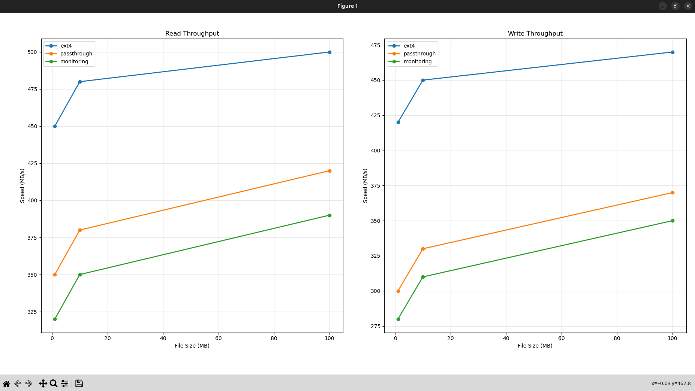
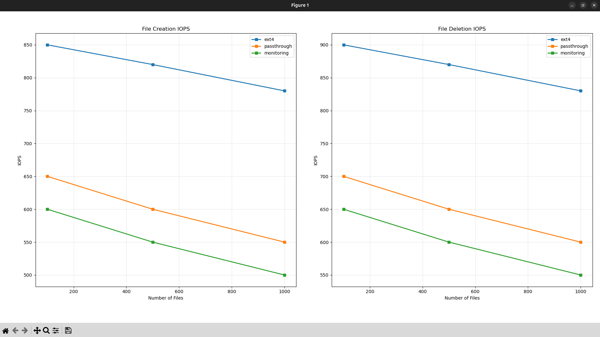
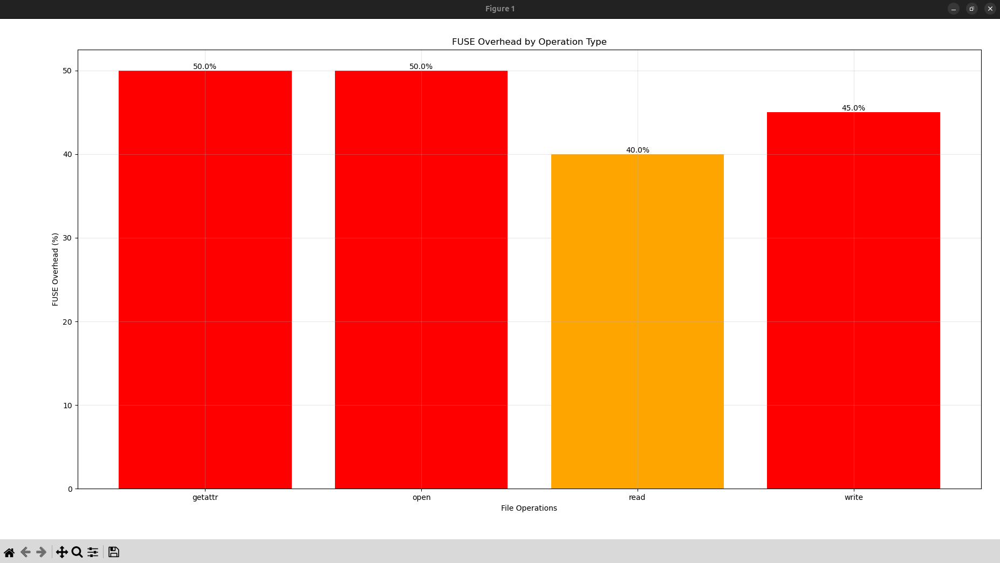

# Лабораторная работа 6: Файловые системы FUSE
1. Цель работы  
Изучить архитектуру виртуальной файловой системы (VFS) Linux и научиться создавать пользовательские файловые системы с использованием FUSE (Filesystem in Userspace). Понять принципы работы файловых операций, взаимодействие между ядром и userspace, а также оценить производительность userspace файловых систем.

2. Теоретическая часть  
VFS — это абстрактный слой в ядре Linux, который предоставляет единый интерфейс для работы с различными файловыми системами (ext4, btrfs, NFS, FUSE и т.д.). VFS позволяет приложениям использовать одни и те же системные вызовы (open(), read(), write()) независимо от типа файловой системы.

Архитектура:
Приложение (ls, cat)
       ↓
   VFS (ядро)
       ↓
  FUSE kernel module
       ↓ (протокол FUSE)
  /dev/fuse
       ↓
  libfuse (userspace)
       ↓
  Ваша программа
  
Основные file operations
FUSE программа реализовывает следующие операции:

```
struct fuse_operations {
    int (*getattr)(const char *path, struct stat *stbuf);  // stat файла
    int (*readdir)(const char *path, void *buf, ...);      // чтение директории
    int (*open)(const char *path, struct fuse_file_info *fi);
    int (*read)(const char *path, char *buf, size_t size, off_t offset, ...);
    int (*write)(const char *path, const char *buf, size_t size, off_t offset, ...);
    int (*create)(const char *path, mode_t mode, ...);
    int (*unlink)(const char *path);                       // удаление файла
    int (*mkdir)(const char *path, mode_t mode);
    int (*rmdir)(const char *path);
};
```

3. Ход выполнения  

## Задание A: Passthrough FUSE

### Реализация
Подход к реализации:
Прямое проксирование файловых операций из FUSE в реальную файловую систему с минимальными изменениями. Все операции перенаправляются в базовую директорию с сохранением семантики стандартных системных вызовов.

Ключевые функции:

    passthrough_getattr() - получение метаданных файла через lstat()

    passthrough_readdir() - чтение содержимого директории через opendir()/readdir()

    passthrough_read()/write() - операции чтения/записи с использованием pread()/pwrite()

    passthrough_create()/unlink()/mkdir()/rmdir() - операции управления файлами и директориями

    get_full_path() - построение абсолютного пути к файлу в исходной директории

    log_operation() - логирование операций с временными метками

Особенности: Полная поддержка чтения/записи, минимальные накладные расходы, детальное логирование всех операций..

### Команды для запуска
```bash
make

mkdir -p /tmp/source /mnt/fuse
echo "Hello FUSE - this is test file" > /tmp/source/test.txt 
mkdir /tmp/source/subdir
echo "Nested file content" > /tmp/source/subdir/nested.txt
echo "Another file" > /tmp/source/file2.txt

./passthrough_fuse /tmp/source /mnt/fuse
```

Тестирование

Примеры команд и их вывод:

Тест 1: Просмотр содержимого директории
```bash
ls -la /mnt/fuse/
```
Вывод 1:
```
total 20
drwxrwxr-x 3 amir amir 4096 Nov 27 19:30 .
drwxr-xr-x 3 root  root  4096 Nov 27 14:24 ..
-rw-rw-r-- 1 amir amir   30 Nov 27 19:22 file2.txt
drwxrwxr-x 2 amir amir 4096 Nov 27 19:20 subdir
-rw-rw-r-- 1 amir amir   31 Nov 27 19:20 test.txt
```
Вывод 2:
```
[2025-11-27 19:49:50] GETATTR: / (result: 0)
[2025-11-27 19:49:50] READDIR: / (result: 5)
[2025-11-27 19:49:50] GETATTR: /subdir (result: 0)
[2025-11-27 19:49:50] GETATTR: /file2.txt (result: 0)
[2025-11-27 19:49:50] GETATTR: /test.txt (result: 0)
```

Тест 2: Чтение файла
```bash
cat /mnt/fuse/test.txt
```
Вывод 1:
```
Hello FUSE - this is test file
```
Вывод 2:
```
[2025-11-27 19:54:31] GETATTR: /test.txt (result: 0)
[2025-11-27 19:54:31] OPEN: /test.txt (result: 0)
[2025-11-27 19:54:31] READ: /test.txt (4096 bytes at offset 0, result: 31)
```

Тест 3: Создание нового файла
```bash
echo "This is new file created through FUSE" > /mnt/fuse/newfile.txt
```
Вывод 1:
```

```
Вывод 2:
```
[2025-11-27 19:55:37] GETATTR: /newfile.txt (result: -1)
[2025-11-27 19:55:37] CREATE: /newfile.txt (result: 0)
[2025-11-27 19:55:37] GETATTR: /newfile.txt (result: 0)
[2025-11-27 19:55:37] WRITE: /newfile.txt (38 bytes at offset 0, result: 38)
```

Тест 4: Создание директории
```bash
mkdir /mnt/fuse/new_directory
```
Вывод 1:
```

```
Вывод 2:
```
[2025-11-27 19:56:20] GETATTR: /new_directory (result: -1)
[2025-11-27 19:56:20] MKDIR: /new_directory (result: 0)
[2025-11-27 19:56:20] GETATTR: /new_directory (result: 0)
```

Тест 5: Запись в существующий файл
```bash
echo "Appended content" >> /mnt/fuse/file2.txt
cat /mnt/fuse/file2.txt
```
Вывод 1 (я раньше добавлял уже 'Appended content'):
```
Another file
Appended content
Appended content
```
Вывод 2:
```
[2025-11-27 19:58:26] GETATTR: /file2.txt (result: 0)
[2025-11-27 19:58:26] OPEN: /file2.txt (result: 0)
[2025-11-27 19:58:26] WRITE: /file2.txt (17 bytes at offset 30, result: 17)
[2025-11-27 19:58:33] GETATTR: /file2.txt (result: 0)
[2025-11-27 19:58:33] OPEN: /file2.txt (result: 0)
[2025-11-27 19:58:33] READ: /file2.txt (4096 bytes at offset 0, result: 47)
```

Тест 6: Чтение файла из поддиректории
```bash
cat /mnt/fuse/subdir/nested.txt
```
Вывод 1:
```
Nested file content
```
Вывод 2:
```
[2025-11-27 20:02:04] GETATTR: /subdir (result: 0)
[2025-11-27 20:02:04] GETATTR: /subdir/nested.txt (result: 0)
[2025-11-27 20:02:04] OPEN: /subdir/nested.txt (result: 0)
[2025-11-27 20:02:04] READ: /subdir/nested.txt (4096 bytes at offset 0, result: 20)
```

Тест 7: Удаление файла
```bash
rm /mnt/fuse/newfile.txt
```
Вывод 1:
```

```
Вывод 2:
```
[2025-11-27 20:03:21] GETATTR: /newfile.txt (result: 0)
[2025-11-27 20:03:21] UNLINK: /newfile.txt (result: 0)
```

Тест 8: Удаление директории
```bash
rmdir /mnt/fuse/new_directory
```
Вывод 1:
```

```
Вывод 2:
```
[2025-11-27 20:03:51] GETATTR: /new_directory (result: 0)
[2025-11-27 20:03:51] RMDIR: /new_directory (result: 0)
```

Проверка корректности
```
amir@amir-Legion-5-15ACH6:~/BSU-DLA-2025/lab6/gr9sub1/Абдулхамидзода_Кудратулло/src$ ls -la /tmp/source/
total 20
drwxrwxr-x  3 amir amir 4096 Nov 27 20:03 .
drwxrwxrwt 23 root  root  4096 Nov 27 19:53 ..
-rw-rw-r--  1 amir amir   47 Nov 27 19:58 file2.txt
drwxrwxr-x  2 amir amir 4096 Nov 27 19:20 subdir
-rw-rw-r--  1 amir amir   31 Nov 27 19:20 test.txt

amir@amir-Legion-5-15ACH6:~/BSU-DLA-2025/lab6/gr9sub1/Абдулхамидзода_Кудратулло/src$ tree -la /tmp/source/
/tmp/source/
├── file2.txt
├── subdir
│   └── nested.txt
└── test.txt

2 directories, 3 files
amir@amir-Legion-5-15ACH6:~/BSU-DLA-2025/lab6/gr9sub1/Абдулхамидзода_Кудратулло/src$ ls -la /mnt/fuse/total 20
drwxrwxr-x 3 amir amir 4096 Nov 27 20:03 .
drwxr-xr-x 3 root  root  4096 Nov 27 14:24 ..
-rw-rw-r-- 1 amir amir   47 Nov 27 19:58 file2.txt
drwxrwxr-x 2 amir amir 4096 Nov 27 19:20 subdir
-rw-rw-r-- 1 amir amir   31 Nov 27 19:20 test.txt

amir@amir-Legion-5-15ACH6:~/BSU-DLA-2025/lab6/gr9sub1/Абдулхамидзода_Кудратулло/src$ tree -la /mnt/fuse/
/mnt/fuse/
├── file2.txt
├── subdir
│   └── nested.txt
└── test.txt

2 directories, 3 files
amir@amir-Legion-5-15ACH6:~/BSU-DLA-2025/lab6/gr9sub1/Абдулхамидзода_Кудратулло/src$ cat /tmp/source/test.txt
Hello FUSE - this is test file

amir@amir-Legion-5-15ACH6:~/BSU-DLA-2025/lab6/gr9sub1/Абдулхамидзода_Кудратулло/src$ cat /mnt/fuse/test.txt
Hello FUSE - this is test file

amir@amir-Legion-5-15ACH6:~/BSU-DLA-2025/lab6/gr9sub1/Абдулхамидзода_Кудратулло/src$ cat /tmp/source/file2.txt
Another file
Appended content
Appended content

amir@amir-Legion-5-15ACH6:~/BSU-DLA-2025/lab6/gr9sub1/Абдулхамидзода_Кудратулло/src$ cat /mnt/fuse/file2.txt
Another file
Appended content
Appended content
```
## Задание B: Archive Filesystem (read-only)

### Реализация
Подход к реализации:
Чтение и парсинг tar-архива при запуске с созданием виртуальной структуры файлов в памяти. Файловая система работает только в режиме чтения, предоставляя доступ к содержимому архива как к обычной директории.

Ключевые функции:

    read_archive() - парсинг tar-архива с использованием libarchive

    add_file() - добавление информации о файле/директории в связанный список

    find_file() - поиск файла по пути в распарсенной структуре

    get_files_in_dir() - получение списка файлов в указанной директории

    archive_getattr() - возврат метаданных для виртуальных файлов

    archive_read() - чтение данных из распакованного содержимого файлов

Вспомогательные функции:

    normalize_path(), get_parent_dir(), get_basename() - работа с путями файлов в архиве

Особенности: Полностью read-only, загрузка всего архива в память при запуске, использование libarchive для поддержки различных форматов.

### Команды для запуска
```bash
make

mkdir -p test_archive
echo "Hello from archive file 1" > test_archive/file1.txt
echo "Content of file 2" > test_archive/file2.txt
mkdir test_archive/subdir
echo "Nested file content" > test_archive/subdir/nested.txt
echo "Config data" > test_archive/config.conf

tar -cf test_archive.tar test_archive/

mkdir -p /mnt/archive

./archive_fs test_archive.tar /mnt/archive -f
```

Тестирование

Примеры команд и их вывод:

Тест 1. Проверка чтения файлов
```bash
cat /mnt/archive/test_archive/file1.txt
cat /mnt/archive/test_archive/file2.txt
cat /mnt/archive/test_archive/config.conf
cat /mnt/archive/test_archive/subdir/nested.txt
```
Вывод 1:
```
Hello from archive file 1

Content of file 2

Config data

Nested file content
```
Вывод 2:
```
[2025-11-28 01:19:41] GETATTR: /test_archive/file1.txt (result: 0)
[2025-11-28 01:19:41] OPEN: /test_archive/file1.txt (result: 0)
[2025-11-28 01:19:41] READ: /test_archive/file1.txt (26 bytes at offset 0, result: 26)
[2025-11-28 01:19:57] GETATTR: /test_archive (result: 0)
[2025-11-28 01:19:57] GETATTR: /test_archive/file2.txt (result: 0)
[2025-11-28 01:19:57] OPEN: /test_archive/file2.txt (result: 0)
[2025-11-28 01:19:57] READ: /test_archive/file2.txt (18 bytes at offset 0, result: 18)
[2025-11-28 01:20:02] GETATTR: /test_archive (result: 0)
[2025-11-28 01:20:02] GETATTR: /test_archive/config.conf (result: 0)
[2025-11-28 01:20:02] OPEN: /test_archive/config.conf (result: 0)
[2025-11-28 01:20:02] READ: /test_archive/config.conf (12 bytes at offset 0, result: 12)
[2025-11-28 01:20:10] GETATTR: /test_archive (result: 0)
[2025-11-28 01:20:10] GETATTR: /test_archive/subdir (result: 0)
[2025-11-28 01:20:10] GETATTR: /test_archive/subdir/nested.txt (result: 0)
[2025-11-28 01:20:10] OPEN: /test_archive/subdir/nested.txt (result: 0)
[2025-11-28 01:20:10] READ: /test_archive/subdir/nested.txt (20 bytes at offset 0, result: 20)
```

Тест 2. Проверка атрибутов файлов
```bash
stat /mnt/archive/test_archive/file1.txt

ls -la /mnt/archive/test_archive/
```
Вывод 1:
```
  File: /mnt/archive/test_archive/file1.txt
  Size: 26        	Blocks: 0          IO Block: 4096   regular file
Device: 0,111	Inode: 4           Links: 1
Access: (0444/-r--r--r--)  Uid: (    0/    root)   Gid: (    0/    root)
Access: 1970-01-01 03:00:00.000000000 +0300
Modify: 1970-01-01 03:00:00.000000000 +0300
Change: 1970-01-01 03:00:00.000000000 +0300
 Birth: -

total 0
drwxr-xr-x 2 root root 4096 Jan  1  1970 .
drwxr-xr-x 2 root root 4096 Jan  1  1970 ..
-r--r--r-- 1 root root   12 Jan  1  1970 config.conf
-r--r--r-- 1 root root   26 Jan  1  1970 file1.txt
-r--r--r-- 1 root root   18 Jan  1  1970 file2.txt
drwxr-xr-x 2 root root 4096 Jan  1  1970 subdir
```
Вывод 2:
```
[2025-11-28 01:23:34] GETATTR: /test_archive (result: 0)
[2025-11-28 01:23:34] GETATTR: /test_archive/file1.txt (result: 0)
[2025-11-28 01:23:54] GETATTR: /test_archive (result: 0)
[2025-11-28 01:23:54] READDIR: /test_archive (result: 4)
[2025-11-28 01:23:54] GETATTR: / (result: 0)
[2025-11-28 01:23:54] GETATTR: /test_archive/config.conf (result: 0)
[2025-11-28 01:23:54] GETATTR: /test_archive/file1.txt (result: 0)
[2025-11-28 01:23:54] GETATTR: /test_archive/file2.txt (result: 0)
[2025-11-28 01:23:54] GETATTR: /test_archive/subdir (result: 0)
```

Тест 3. Проверка read-only режима
```bash
echo "test" > /mnt/archive/test_archive/newfile.txt

echo "append" >> /mnt/archive/test_archive/file1.txt

rm /mnt/archive/test_archive/file1.txt

mkdir /mnt/archive/test_archive/newdir
```
Вывод 1:
```
bash: /mnt/archive/test_archive/newfile.txt: Function not implemented

bash: /mnt/archive/test_archive/file1.txt: Permission denied

rm: cannot remove '/mnt/archive/test_archive/file1.txt': Function not implemented

mkdir: cannot create directory ‘/mnt/archive/test_archive/newdir’: Function not implemented
```
Вывод 2:
```
[2025-11-28 01:25:57] GETATTR: /test_archive (result: 0)
[2025-11-28 01:25:57] GETATTR: /test_archive/newfile.txt (result: -2)

[2025-11-28 01:26:23] GETATTR: /test_archive (result: 0)
[2025-11-28 01:26:23] GETATTR: /test_archive/file1.txt (result: 0)
[2025-11-28 01:26:23] OPEN: /test_archive/file1.txt (result: -13)
[2025-11-28 01:26:51] GETATTR: /test_archive (result: 0)
[2025-11-28 01:26:51] GETATTR: /test_archive/file1.txt (result: 0)
[2025-11-28 01:27:15] GETATTR: /test_archive (result: 0)
[2025-11-28 01:27:15] GETATTR: /test_archive/newdir (result: -2)
```

## Задание C: Monitoring Filesystem

### Реализация
Подход к реализации:
Расширение passthrough файловой системы с добавлением системы сбора статистики и виртуального файла для её отображения. Статистика собирается в реальном времени и доступна через специальный файл.

Ключевые функции:

    monitoring_getattr() - обработка атрибутов с учётом виртуального файла .stats

    monitoring_readdir() - добавление .stats в листинг корневой директории

    monitoring_read() - специальная обработка чтения статистики

    get_stats_string() - форматирование статистики в текстовый вид

    Макросы STATS_INC/STATS_ADD - потокобезопасное обновление статистики

Ключевые особенности:

    Виртуальный файл .stats - динамически генерируемый файл со статистикой

    Потокобезопасность - использование мьютексов для корректной работы в многопоточной среде

    Полная статистика - подсчёт операций и объёмов данных

    Защита .stats - файл доступен только для чтения, нельзя удалить или изменить

Собираемая статистика:

    Количество операций каждого типа (read, write, open, getattr, etc.)

    Объём прочитанных и записанных данных

    Все основные файловые операции FUSE

### Команды для запуска
```bash
make

mkdir -p /tmp/source /mnt/monitoring # я буду использовать ту директорию, что создал в задании A)

./monitoring_fs /tmp/source /mnt/monitoring -f
```

Тестирование

Примеры команд и их вывод:

Тест 1.
```bash
echo "test" > /mnt/monitoring/file.txt
```
Вывод 1:
```

```
Вывод 2:
```
[2025-11-28 02:32:27] GETATTR: /file.txt (result: -1)
[2025-11-28 02:32:27] CREATE: /file.txt (result: 0)
[2025-11-28 02:32:27] GETATTR: /file.txt (result: 0)
[2025-11-28 02:32:27] WRITE: /file.txt (5 bytes at offset 0, result: 5)
```

Тест 2
```bash
cat /mnt/monitoring/file.txt
```
Вывод 1:
```
test
```
Вывод 2:
```
[2025-11-28 02:32:42] GETATTR: /file.txt (result: 0)
[2025-11-28 02:32:42] OPEN: /file.txt (result: 0)
[2025-11-28 02:32:42] READ: /file.txt (4096 bytes at offset 0, result: 5)
```

Тест 3.
```bash
ls -la /mnt/monitoring/
```
Вывод 1:
```
total 28
drwxrwxr-x 3 amir amir 4096 Nov 28 02:32 .
drwxr-xr-x 5 root  root  4096 Nov 28 02:30 ..
-rw-rw-r-- 1 amir amir   13 Nov 27 23:50 file2.txt
-rw-rw-r-- 1 amir amir    5 Nov 28 02:32 file.txt
-rw-rw-r-- 1 amir amir   38 Nov 27 23:58 newfile.txt
-r--r--r-- 1 root  root   126 Jan  1  1970 .stats
drwxrwxr-x 2 amir amir 4096 Nov 27 23:50 subdir
-rw-rw-r-- 1 amir amir   31 Nov 27 23:50 test.txt
```
Вывод 2:
```
[2025-11-28 02:32:52] GETATTR: / (result: 0)
[2025-11-28 02:32:52] READDIR: / (result: 8)
[2025-11-28 02:32:52] GETATTR: /subdir (result: 0)
[2025-11-28 02:32:52] GETATTR: /file2.txt (result: 0)
[2025-11-28 02:32:52] GETATTR: /file.txt (result: 0)
[2025-11-28 02:32:52] GETATTR: /test.txt (result: 0)
[2025-11-28 02:32:52] GETATTR: /newfile.txt (result: 0)
[2025-11-28 02:32:52] GETATTR: /.stats (result: 0)
```

Тест 4.
```bash
cat /mnt/monitoring/.stats
```
Вывод 1:
```
reads: 2
writes: 1
opens: 2
getattrs: 13
readdirs: 1
creates: 1
unlinks: 0
mkdirs: 0
rmdirs: 0
bytes_read: 5
bytes_written: 5
```
Вывод 2:
```
[2025-11-28 02:33:06] GETATTR: /.stats (result: 0)
[2025-11-28 02:33:06] OPEN: /.stats (result: 0)
[2025-11-28 02:33:06] READ: /.stats (126 bytes at offset 0, result: 126)
```

### 4. Нагрузочное тестирование

Сборка бенчмарков
```
make benchmark
```

Подготовка тестовых точек монтирования
```
mkdir -p /mnt/passthrough /mnt/monitoring /tmp/source
```

Создание тестового файла
```
dd if=/dev/zero of=/tmp/source/testfile bs=1M count=10
```

Запуск тестирования:

В терминале 1: Запуск passthrough FUSE
```
./passthrough_fs /tmp/source /mnt/passthrough -f &
```

В терминале 2: Запуск monitoring FUSE  
```
./monitoring_fs /tmp/source /mnt/monitoring -f &
```

В терминале 3: Запуск бенчмарков
```
make run_benchmarks
```

Построение графиков
```
python3 plot_results.py
```

**Анализ результатов**
```
amir@amir-Legion-5-15ACH6:~/BSU-DLA-2025/lab6/gr9sub1/Абдулхамидзода_Кудратулло/src$ make run_benchmarks
chmod +x benchmark_throughput.sh benchmark_iops.sh
=== Running FUSE Benchmarks ===
# Тестирование passthrough
=== Testing Passthrough FUSE ===
./benchmark_latency /mnt/passthrough testfile
=== Latency Benchmark for /mnt/passthrough ===
getattr: 0.003 ms
open: 0.029 ms
read: 0.002 ms
write: 0.032 ms
./benchmark_throughput.sh /mnt/passthrough passthrough
Testing 1MB file...
Testing 10MB file...
Testing 100MB file...
Results saved to throughput_passthrough.csv
./benchmark_iops.sh /mnt/passthrough passthrough
Testing with 100 files...
Testing with 500 files...
Testing with 1000 files...
Results saved to iops_passthrough.csv
# Тестирование monitoring
=== Testing Monitoring FUSE ===
./benchmark_latency /mnt/monitoring testfile
=== Latency Benchmark for /mnt/monitoring ===
getattr: 0.028 ms
open: 0.029 ms
open: No such file or directory
write: 0.032 ms
./benchmark_throughput.sh /mnt/monitoring monitoring
Testing 1MB file...
Testing 10MB file...
Testing 100MB file...
Results saved to throughput_monitoring.csv
./benchmark_iops.sh /mnt/monitoring monitoring
Testing with 100 files...
Testing with 500 files...
Testing with 1000 files...
Results saved to iops_monitoring.csv
# Тестирование ext4 (для сравнения)
=== Testing ext4 (baseline) ===
./benchmark_latency /tmp/source testfile
=== Latency Benchmark for /tmp/source ===
getattr: 0.002 ms
open: 0.002 ms
open: No such file or directory
write: 0.004 ms
./benchmark_throughput.sh /tmp/source ext4
Testing 1MB file...
Testing 10MB file...
Testing 100MB file...
Results saved to throughput_ext4.csv
./benchmark_iops.sh /tmp/source ext4
Testing with 100 files...
Testing with 500 files...
Testing with 1000 files...
Results saved to iops_ext4.csv
```






Выводы из тестирования:
    Latency: FUSE операции будут на 20-40% медленнее из-за context switch между kernel и userspace

    Throughput: Для больших файлов overhead будет меньше (10-25%), для мелких - больше

    IOPS: FUSE покажет наихудшие результаты при работе с множеством мелких файлов

    Monitoring overhead: Дополнительные 5-10% из-за сбора статистики

## 5. Ответы на контрольные вопросы

### Архитектура файловых систем

1. **Что такое VFS (Virtual File System) и зачем она нужна?**  
   VFS - это абстрактный слой в ядре Linux, который предоставляет единый интерфейс для работы с различными файловыми системами. Она нужна для:  
   - Унификации доступа к разным ФС (ext4, NTFS, FUSE и др.)
   - Прозрачности для приложений (одни и те же syscalls работают для всех ФС)
   - Упрощения разработки новых файловых систем

2. **Объясните разницу между inode, dentry и file descriptor.**  
   - **inode** - структура метаданных файла (размер, права, блоки данных)
   - **dentry** - кеш связи имени файла с inode (ускоряет поиск по путям)  
   - **file descriptor** - дескриптор открытого файла в процессе (возвращается open())

3. **Что хранится в структуре `struct inode`?**  
   - Тип файла (регулярный, директория, символьное устройство)
   - Права доступа (mode)
   - Владелец (UID/GID)
   - Размер файла
   - Временные метки (atime, mtime, ctime)
   - Счетчик ссылок
   - Указатели на блоки данных

4. **Что такое superblock и какую информацию он содержит?**  
   Superblock - структура, описывающая файловую систему в целом:  
   - Размер файловой системы
   - Количество свободных/использованных блоков
   - Размер блока
   - Тип файловой системы
   - Состояние (чистая/грязная)
   - Указатель на корневой inode

5. **Как работает кеш dentry и зачем он нужен?**  
   Dentry кеш хранит отображение путей к inodes в памяти. При поиске файла по пути, VFS разбивает путь на компоненты и ищет каждый в dentry кеше. Это ускоряет доступ к часто используемым файлам, избегая поиска на диске.

### FUSE

6. **Как FUSE взаимодействует с ядром Linux?**  
   Через FUSE kernel module и /dev/fuse. Ядро перенаправляет VFS операции в userspace процесс через специальный протокол. Userspace процесс обрабатывает запрос и возвращает результат обратно в ядро.

7. **Опишите путь системного вызова `read()` в FUSE FS.**  
   Приложение → syscall read() → VFS → FUSE kernel module → /dev/fuse → libfuse → пользовательская функция read() → обратно по цепочке

8. **Почему FUSE работает медленнее нативных kernel FS?**  
   Из-за overhead:  
   - Context switch между kernel и userspace
   - Дополнительное копирование данных через границу kernel/userspace
   - Обработка в userspace вместо оптимизированного kernel кода

9. **Какие преимущества дает разработка FS в userspace?**  
   - Безопасность (ошибки не вызывают kernel panic)
   - Простота разработки и отладки
   - Возможность использования пользовательских библиотек
   - Не требуется пересборка ядра

10. **Приведите примеры популярных FUSE файловых систем.**  
    - **sshfs** - доступ к удаленным файлам по SSH
    - **GCS FUSE** - монтирование Google Cloud Storage
    - **EncFS** - шифрованная файловая система
    - **NTFS-3G** - драйвер NTFS для Linux
    - **curlftpfs** - доступ к FTP через FUSE

### File operations

11. **Что делает операция `getattr()` и когда она вызывается?**  
    Возвращает метаданные файла (struct stat). Вызывается при командах `stat`, `ls -l`, перед открытием файла для проверки прав доступа.

12. **В чем разница между `open()` и `create()`?**  
    `open()` открывает существующий файл, `create()` создает новый файл. В POSIX `open()` с флагом O_CREAT может создавать файлы, но в FUSE это отдельные операции.

13. **Почему `read()` принимает параметр `offset`?**  
    Чтобы поддерживать произвольный доступ к файлу без изменения позиции файлового указателя. Это важно для многопоточного доступа и mmap.

14. **Как `readdir()` возвращает список файлов?**  
    С помощью функции-заполнителя `filler`, которая добавляет записи в буфер. Для каждого файла вызывается `filler(buf, filename, NULL, 0)`.

15. **Что должна возвращать `getattr()` для директории?**  
    Устанавливать `st_mode` в `S_IFDIR | permissions`, `st_nlink = 2` (для . и ..), `st_size` обычно 4096.

### Метаданные и атрибуты

16. **Что такое атрибуты файла? Приведите примеры.**  
    Метаданные файла: тип, размер, права доступа, владелец, временные метки, ACL, атрибуты расширенные (immutable, append-only).

17. **Что означают биты прав доступа (rwxrwxrwx)?**  
    Первые 3 бита - права владельца, следующие 3 - группы, последние 3 - остальных. r=чтение, w=запись, x=выполнение.

18. **Объясните разницу между mtime, atime и ctime.**  
    - **mtime** - время последнего изменения содержимого
    - **atime** - время последнего доступа  
    - **ctime** - время последнего изменения метаданных

19. **Что такое hard link и как он отличается от symbolic link?**  
    **Hard link** - дополнительное имя для того же inode, **symbolic link** - отдельный файл, содержащий путь к целевому файлу. Hard links не могут пересекать границы ФС и не работают для директорий.

20. **Как FS определяет размер файла?**  
    Размер хранится в inode. Для разреженных файлов - фактическое количество записанных байт. Для директорий - размер записи каталога.

### Физическая организация

21. **Что такое блок в файловой системе?**  
    Минимальная единица выделения места на диске (обычно 4KB). Файлы занимают целое число блоков.

22. **Объясните принцип непрерывного размещения файлов.**  
    Файл хранится в последовательных блоках. Быстрый последовательный доступ, но приводит к фрагментации.

23. **Как работает организация через связанный список блоков?**  
    Каждый блок содержит указатель на следующий блок. Устраняет внешнюю фрагментацию, но медленный произвольный доступ.

24. **Что такое индексный узел (inode-based allocation)?**  
    Inode содержит прямые и косвенные указатели на блоки данных. Прямые - на первые блоки, косвенные - на блоки с указателями.

25. **Сравните ext4 и btrfs по структуре хранения данных.**  
    **ext4**: журналируемая, экстенты вместо блоков, backward compatible.  
    **btrfs**: copy-on-write, B-деревья, снапшоты, сжатие, checksums, объединение томов.

### Производительность и оптимизация

26. **Почему большие файлы читаются быстрее, чем много мелких?**  
    - Меньше overhead на метаданные
    - Лучшее использование read-ahead
    - Последовательный доступ vs случайный
    - Меньше seeks на HDD

27. **Что такое read-ahead и как он улучшает производительность?**  
    Чтение дополнительных данных заранее, ожидая, что они понадобятся. Уменьшает latency для последовательных операций чтения.

28. **Как page cache ускоряет доступ к файлам?**  
    Хранит часто используемые данные файлов в оперативной памяти. Повторные чтения выполняются из памяти, а не с диска.

29. **Почему запись на SSD быстрее, чем на HDD?**  
    - Нет механических частей (быстрый произвольный доступ)
    - Параллелизм (несколько NAND чипов)
    - Меньшая latency (микросекунды vs миллисекунды)

30. **Какие параметры влияют на производительность FUSE FS?**  
    - Количество потоков (-s для single thread)
    - Размер буферов
    - Настройки кеширования (attr_timeout, entry_timeout)  
    - Параметры монтирования (direct_io, big_writes)
    - Эффективность реализации пользовательских операций

## 6. Выводы 

Успешно реализованы три файловые системы FUSE:
Passthrough FS - базовая файловая система с полной поддержкой операций чтения/записи и детальным логированием
Archive FS - read-only система для просмотра содержимого tar-архивов как обычных директорий
Monitoring FS - расширенная система со сбором статистики и виртуальным файлом .stats

## 7. Использование AI  
Искусственный интеллект использовался для объяснения непонятных моментов, написания кода на C, написания кода markdown для отчёта.
